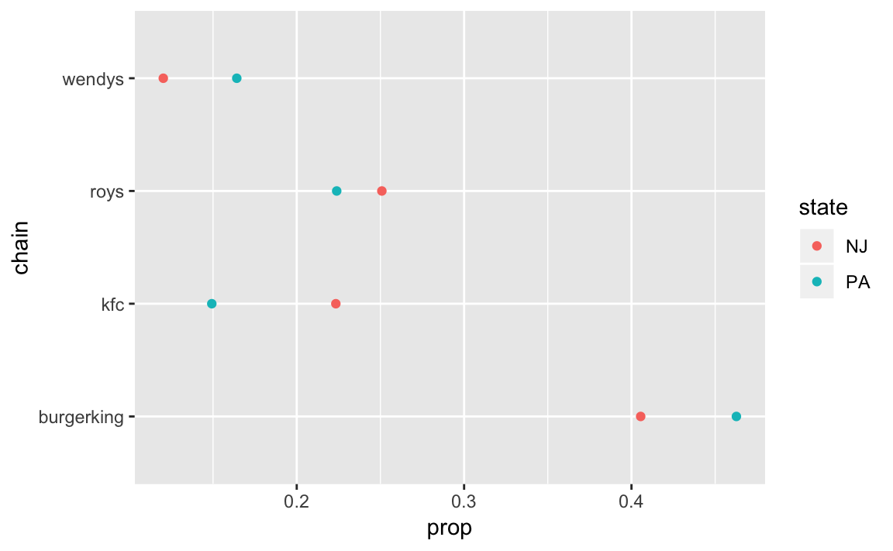
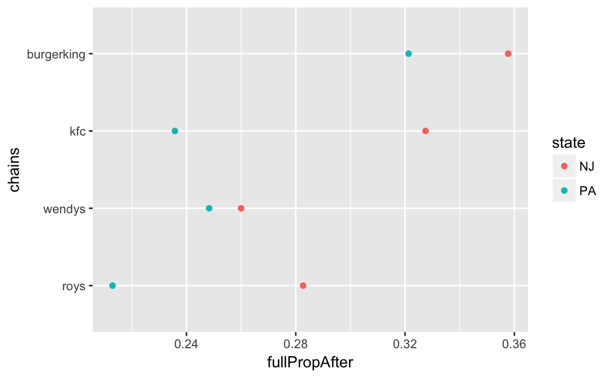
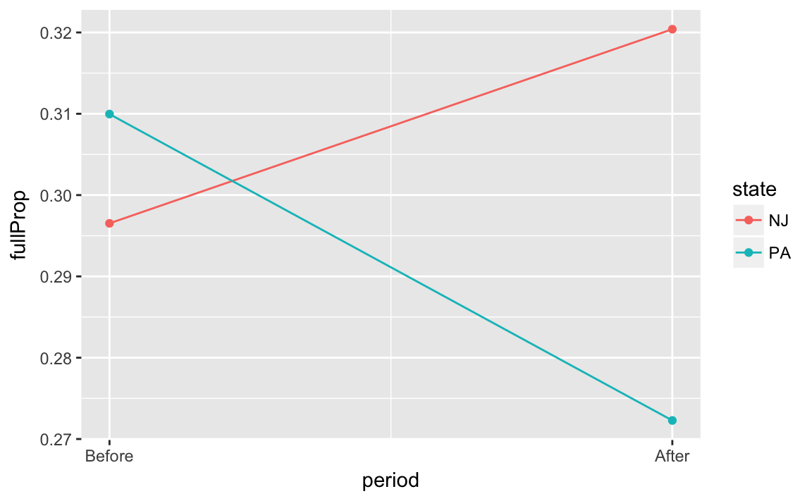

---
output: html_document
editor_options: 
  chunk_output_type: console
---
# Causality

## Prerequisites {-}


```r
library("tidyverse")
library("stringr")
```

## Racial Discrimination in the Labor Market

Load the data from the **qss** package.

```r
data("resume", package = "qss")
```

In addition to the `dim()`, `summary()`, and `head()` functions shown in the text,

```r
dim(resume)
#> [1] 4870    4
summary(resume)
#>   firstname             sex                race                call     
#>  Length:4870        Length:4870        Length:4870        Min.   :0.00  
#>  Class :character   Class :character   Class :character   1st Qu.:0.00  
#>  Mode  :character   Mode  :character   Mode  :character   Median :0.00  
#>                                                           Mean   :0.08  
#>                                                           3rd Qu.:0.00  
#>                                                           Max.   :1.00
head(resume)
#>   firstname    sex  race call
#> 1   Allison female white    0
#> 2   Kristen female white    0
#> 3   Lakisha female black    0
#> 4   Latonya female black    0
#> 5    Carrie female white    0
#> 6       Jay   male white    0
```
we can also use `glimpse()` to get a quick understanding of the variables in the data frame:

```r
glimpse(resume)
#> Observations: 4,870
#> Variables: 4
#> $ firstname <chr> "Allison", "Kristen", "Lakisha", "Latonya", "Carrie"...
#> $ sex       <chr> "female", "female", "female", "female", "female", "m...
#> $ race      <chr> "white", "white", "black", "black", "white", "white"...
#> $ call      <int> 0, 0, 0, 0, 0, 0, 0, 0, 0, 0, 0, 0, 0, 0, 0, 0, 0, 0...
```

The code in *QSS* uses `table()` and `addmargins()` to construct the table.
However, this can be done easily with the **dplyr** package using grouping and summarizing.

Use `group_by()` to identify each combination of `race` and `call`, and then `count()` the observations:

```r
race_call_tab <- 
  resume %>%
  group_by(race, call) %>%
  count()
race_call_tab
#> # A tibble: 4 x 3
#> # Groups: race, call [4]
#>   race   call     n
#>   <chr> <int> <int>
#> 1 black     0  2278
#> 2 black     1   157
#> 3 white     0  2200
#> 4 white     1   235
```

If we want to calculate callback rates by race, we can use the `mutate()` function from **dplyr**.

```r
race_call_rate <- 
  race_call_tab %>%
  group_by(race) %>%
  mutate(call_rate =  n / sum(n)) %>%
  filter(call == 1) %>%
  select(race, call_rate)
race_call_rate
#> # A tibble: 2 x 2
#> # Groups: race [2]
#>   race  call_rate
#>   <chr>     <dbl>
#> 1 black    0.0645
#> 2 white    0.0965
```

If we want the overall callback rate, we can calculate it from the original
data. Use the `summarise()` function from **dplyr**.

```r
resume %>%
  summarise(call_back = mean(call))
#>   call_back
#> 1    0.0805
```

## Subsetting Data in R


### Subsetting

Create a new object of all individuals whose `race` variable equals `black` in the `resume` data:

```r
resumeB <-
  resume %>%
  filter(race == "black")
```

```r
glimpse(resumeB)
#> Observations: 2,435
#> Variables: 4
#> $ firstname <chr> "Lakisha", "Latonya", "Kenya", "Latonya", "Tyrone", ...
#> $ sex       <chr> "female", "female", "female", "female", "male", "fem...
#> $ race      <chr> "black", "black", "black", "black", "black", "black"...
#> $ call      <int> 0, 0, 0, 0, 0, 0, 0, 0, 0, 0, 0, 0, 0, 0, 0, 0, 0, 0...
```

Calculate the callback rate for black individuals:

```r
resumeB %>%
  summarise(call_rate = mean(call))
#>   call_rate
#> 1    0.0645
```


You can combine the `filter()` and `select()` functions with multiple conditions. 
For example, to keep the call and first name variables for female individuals with stereotypically black names:

```r
resumeBf <-
  resume %>%
  filter(race == "black", sex == "female") %>%
  select(call, firstname)
head(resumeBf)
#>   call firstname
#> 1    0   Lakisha
#> 2    0   Latonya
#> 3    0     Kenya
#> 4    0   Latonya
#> 5    0     Aisha
#> 6    0     Aisha
```

Now we can calculate the gender gap by group.

Now we can calculate the gender gap by group. Doing so may seem to require a little more code, but we will not duplicate as much as in *QSS*, and this would easily scale to more than two categories.

First, group by race and sex and calculate the callback rate for each group:

```r
resume_race_sex <-
  resume %>%
  group_by(race, sex) %>%
  summarise(call = mean(call))
head(resume_race_sex)
#> # A tibble: 4 x 3
#> # Groups: race [2]
#>   race  sex      call
#>   <chr> <chr>   <dbl>
#> 1 black female 0.0663
#> 2 black male   0.0583
#> 3 white female 0.0989
#> 4 white male   0.0887
```
Use `spread()` from the **tidyr** package to make each value of `race` a new column:

```r

resume_sex <-
  resume_race_sex %>%
  ungroup() %>%
  spread(race, call)
resume_sex
#> # A tibble: 2 x 3
#>   sex     black  white
#> * <chr>   <dbl>  <dbl>
#> 1 female 0.0663 0.0989
#> 2 male   0.0583 0.0887
```
Now we can calculate the race wage differences by sex as before,

```r
resume_sex %>%
  mutate(call_diff = white - black)
#> # A tibble: 2 x 4
#>   sex     black  white call_diff
#>   <chr>   <dbl>  <dbl>     <dbl>
#> 1 female 0.0663 0.0989    0.0326
#> 2 male   0.0583 0.0887    0.0304
```
This could be combined into a single chain with only six lines of code:

```r
resume %>%
  group_by(race, sex) %>%
  summarise(call = mean(call)) %>%
  ungroup() %>%
  spread(race, call) %>%
  mutate(call_diff = white - black)
#> # A tibble: 2 x 4
#>   sex     black  white call_diff
#>   <chr>   <dbl>  <dbl>     <dbl>
#> 1 female 0.0663 0.0989    0.0326
#> 2 male   0.0583 0.0887    0.0304
```

For more information on a way to do this using the [spread](https://www.rdocumentation.org/packages/tidyr/topics/spread) and [gather](https://www.rdocumentation.org/packages/tidyr/topics/gather) functions from [tidyr](https://cran.r-project.org/package=tidyr) package, see the [R for Data Science](http://r4ds.had.co.nz/) chapter ["Tidy Data"](http://r4ds.had.co.nz/tidy-data.html).

**WARNING** The function [ungroup](https://www.rdocumentation.org/packages/dplyr/topics/ungroup) removes the groupings  in [group_by](https://www.rdocumentation.org/packages/dplyr/topics/group_by). 
The function `spread` will not allow a grouping variable to be reshaped.
Since many **dplyr** functions work differently depending on  whether the data frame is grouped or not, I find that I can encounter many errors due to forgetting that a data frame is grouped. 
As such, I tend to `ungroup` data frames as soon as I am no longer are using the groupings.

Alternatively, we could have used `summarise` and the `diff` function:

```r
resume %>%
  group_by(race, sex) %>%
  summarise(call = mean(call)) %>%
  group_by(sex) %>%
  arrange(race) %>%
  summarise(call_diff = diff(call))
#> # A tibble: 2 x 2
#>   sex    call_diff
#>   <chr>      <dbl>
#> 1 female    0.0326
#> 2 male      0.0304
```
I find the `spread` code preferable since the individual race callback rates are
retained in the data, and since there is no natural ordering of the `race` variable
(unlike if it were a time-series), it is not obvious from reading the code  whether `call_diff` is `black - white` or `white - black`.


### Simple conditional statements

**dlpyr** has three conditional statement functions `if_else`, `recode` and `case_when`.

The function `if_else` is like `ifelse` but corrects inconsistent behavior that `ifelse` exhibits in certain cases.

Create a variable `BlackFemale` using `if_else()` and confirm it is only equal to `1` for black and female observations:

```r
resume %>%
  mutate(BlackFemale = if_else(race == "black" & sex == "female", 1, 0)) %>%
  group_by(BlackFemale, race, sex) %>%
  count()
#> # A tibble: 4 x 4
#> # Groups: BlackFemale, race, sex [4]
#>   BlackFemale race  sex        n
#>         <dbl> <chr> <chr>  <int>
#> 1        0    black male     549
#> 2        0    white female  1860
#> 3        0    white male     575
#> 4        1.00 black female  1886
```

**Warning** The function `if_else` is more strict about the variable types than `ifelse`.
While most R functions are forgiving about variables types, and will automatically convert 
integers to numeric or vice-versa, they are distinct. For example, these examples
will produce errors:

```r
resume %>%
  mutate(BlackFemale = if_else(race == "black" & sex == "female", TRUE, 0))
#> Error in mutate_impl(.data, dots): Evaluation error: `false` must be type logical, not double.
```
because `TRUE` is logical and `0` is numeric.

```r
resume %>%
  mutate(BlackFemale = if_else(race == "black" & sex == "female", 1L, 0))
#> Error in mutate_impl(.data, dots): Evaluation error: `false` must be type integer, not double.
```
because `1L` is an integer and `0` is numeric vector (floating-point number).
The distinction between integers and numeric variables is often invisible because most functions coerce variables between integer and numeric vectors.

```r
class(1)
#> [1] "numeric"
class(1L)
#> [1] "integer"
```
The `:` operator returns integers and `as.integer` coerces numeric vectors to integer vectors:

```r
class(1:5)
#> [1] "integer"
class(c(1, 2, 3))
#> [1] "numeric"
class(as.integer(c(1, 2, 3)))
#> [1] "integer"
```


### Factor Variables

For more on factors see the [R for Data Science](http://r4ds.had.co.nz/) chapter ["Factors"](http://r4ds.had.co.nz/factors.html) and the package [forcats](https://cran.r-project.org/package=forcats).
Also see the [R for Data Science](http://r4ds.had.co.nz/) chapter ["Strings"](http://r4ds.had.co.nz/strings.html) for working
with strings.

The function `case_when` is a generalization of the `if_else` function to multiple conditions.
For example, to create categories for all combinations of race and sex,

```r
resume %>%
  mutate(
    race_sex = case_when(
      race == "black" & sex == "female" ~ "black, female",
      race == "white" & sex == "female" ~ "white female",
      race == "black" & sex == "male" ~ "black male",
      race == "white" & sex == "male" ~ "white male"
    )
  ) %>%
  head()
#>   firstname    sex  race call      race_sex
#> 1   Allison female white    0  white female
#> 2   Kristen female white    0  white female
#> 3   Lakisha female black    0 black, female
#> 4   Latonya female black    0 black, female
#> 5    Carrie female white    0  white female
#> 6       Jay   male white    0    white male
```
Each condition is a formula (an R object created with the "tilde" `~`).
You will see formulas used extensively in the modeling section.
The condition is on the left-hand side of the formula. The value to assign
to observations meeting that condition is on the right-hand side.
Observations are given the value of the first matching condition, so the order
of these can matter.


The `case_when` function also supports a default value by using a condition `TRUE`
as the last condition. This will match anything not already matched. For example,
if you wanted three categories ("black male", "black female", "white"):

```r
resume %>%
  mutate(
    race_sex = case_when(
      race == "black" & sex == "female" ~ "black female",
      race == "black" & sex == "male" ~ "black male",
      TRUE ~ "white"
    )
  ) %>%
  head()
#>   firstname    sex  race call     race_sex
#> 1   Allison female white    0        white
#> 2   Kristen female white    0        white
#> 3   Lakisha female black    0 black female
#> 4   Latonya female black    0 black female
#> 5    Carrie female white    0        white
#> 6       Jay   male white    0        white
```

Alternatively, we could have created this variable using string manipulation functions.
Use `mutate()` to create a new variable, `type`, [str_to_title](https://www.rdocumentation.org/packages/stringr/topics/str_to_title) to capitalize `sex` and `race`, and [str_c](https://www.rdocumentation.org/packages/stringr/topics/str_c) to concatenate these vectors.

```r
resume <-
  resume %>%
  mutate(type = str_c(str_to_title(race), str_to_title(sex)))
```

Some of the reasons given in *QSS* for using factors in this chapter are less important due to the functionality of modern **tidyverse** packages.
For example, there is no reason to use `tapply`, as you can use `group_by` and `summarise`,

```r
resume %>%
  group_by(type) %>%
  summarise(call = mean(call))
#> # A tibble: 4 x 2
#>   type          call
#>   <chr>        <dbl>
#> 1 BlackFemale 0.0663
#> 2 BlackMale   0.0583
#> 3 WhiteFemale 0.0989
#> 4 WhiteMale   0.0887
```
or,

```r
resume %>%
  group_by(race, sex) %>%
  summarise(call = mean(call))
#> # A tibble: 4 x 3
#> # Groups: race [?]
#>   race  sex      call
#>   <chr> <chr>   <dbl>
#> 1 black female 0.0663
#> 2 black male   0.0583
#> 3 white female 0.0989
#> 4 white male   0.0887
```

What's nice about this approach is that we wouldn't have needed to create the factor variable first as in *QSS*.

We can use that same approach to calculate the mean of first names, and use
`arrange()` to sort in ascending order.

```r
resume %>%
  group_by(firstname) %>%
  summarise(call = mean(call)) %>%
  arrange(call)
#> # A tibble: 36 x 2
#>   firstname   call
#>   <chr>      <dbl>
#> 1 Aisha     0.0222
#> 2 Rasheed   0.0299
#> 3 Keisha    0.0383
#> 4 Tremayne  0.0435
#> 5 Kareem    0.0469
#> 6 Darnell   0.0476
#> # ... with 30 more rows
```


**Tip:** General advice for working (or not) with factors:

- Use character vectors instead of factors. They are easier to manipulate with string functions.
- Use factor vectors only when you need a specific ordering of string values in a variable, e.g. in a model or a plot.


## Causal Affects and the Counterfactual

Load the `social` dataset included in the **qss** package.

```r
data("social", package = "qss")
summary(social)
#>      sex             yearofbirth    primary2004      messages        
#>  Length:305866      Min.   :1900   Min.   :0.000   Length:305866     
#>  Class :character   1st Qu.:1947   1st Qu.:0.000   Class :character  
#>  Mode  :character   Median :1956   Median :0.000   Mode  :character  
#>                     Mean   :1956   Mean   :0.401                     
#>                     3rd Qu.:1965   3rd Qu.:1.000                     
#>                     Max.   :1986   Max.   :1.000                     
#>   primary2006        hhsize    
#>  Min.   :0.000   Min.   :1.00  
#>  1st Qu.:0.000   1st Qu.:2.00  
#>  Median :0.000   Median :2.00  
#>  Mean   :0.312   Mean   :2.18  
#>  3rd Qu.:1.000   3rd Qu.:2.00  
#>  Max.   :1.000   Max.   :8.00
```

Calculate the mean turnout by `message`:

```r
turnout_by_message <-
  social %>%
  group_by(messages) %>%
  summarize(turnout = mean(primary2006))
turnout_by_message
#> # A tibble: 4 x 2
#>   messages   turnout
#>   <chr>        <dbl>
#> 1 Civic Duty   0.315
#> 2 Control      0.297
#> 3 Hawthorne    0.322
#> 4 Neighbors    0.378
```

Since we want to calculate the difference by group, `spread()` the data set so each  group is a column, then use `mutate()` to calculate the difference of each from the control group. Finally, use `select()` and `matches()` to return a dataframe with only those new variables that you have created:

```r
turnout_by_message %>%
  spread(messages, turnout) %>%
  mutate(diff_civic_duty = `Civic Duty` - Control,
         diff_Hawthorne = Hawthorne - Control,
         diff_Neighbors = Neighbors - Control) %>%
  select(matches("diff_"))
#> # A tibble: 1 x 3
#>   diff_civic_duty diff_Hawthorne diff_Neighbors
#>             <dbl>          <dbl>          <dbl>
#> 1          0.0179         0.0257         0.0813
```

Find the mean values of age, 2004 turnout, and household size for each group:

```r
social %>%
  mutate(age = 2006 - yearofbirth) %>%
  group_by(messages) %>%
  summarise(primary2004 = mean(primary2004),
            age = mean(age),
            hhsize = mean(hhsize))
#> # A tibble: 4 x 4
#>   messages   primary2004   age hhsize
#>   <chr>            <dbl> <dbl>  <dbl>
#> 1 Civic Duty       0.399  49.7   2.19
#> 2 Control          0.400  49.8   2.18
#> 3 Hawthorne        0.403  49.7   2.18
#> 4 Neighbors        0.407  49.9   2.19
```
The function [summarise_at](https://www.rdocumentation.org/packages/dplyr/topics/summarise_at) allows you to summarize multiple variables,
using multiple functions, or both.

```r
social %>%
  mutate(age = 2006 - yearofbirth) %>%
  group_by(messages) %>%
  summarise_at(vars(primary2004, age, hhsize), funs(mean))
#> # A tibble: 4 x 4
#>   messages   primary2004   age hhsize
#>   <chr>            <dbl> <dbl>  <dbl>
#> 1 Civic Duty       0.399  49.7   2.19
#> 2 Control          0.400  49.8   2.18
#> 3 Hawthorne        0.403  49.7   2.18
#> 4 Neighbors        0.407  49.9   2.19
```


## Observational Studies

Load and inspect the minimum wage data from the **qss** package:

```r
data("minwage", package = "qss")
glimpse(minwage)
#> Observations: 358
#> Variables: 8
#> $ chain      <chr> "wendys", "wendys", "burgerking", "burgerking", "kf...
#> $ location   <chr> "PA", "PA", "PA", "PA", "PA", "PA", "PA", "PA", "PA...
#> $ wageBefore <dbl> 5.00, 5.50, 5.00, 5.00, 5.25, 5.00, 5.00, 5.00, 5.0...
#> $ wageAfter  <dbl> 5.25, 4.75, 4.75, 5.00, 5.00, 5.00, 4.75, 5.00, 4.5...
#> $ fullBefore <dbl> 20.0, 6.0, 50.0, 10.0, 2.0, 2.0, 2.5, 40.0, 8.0, 10...
#> $ fullAfter  <dbl> 0.0, 28.0, 15.0, 26.0, 3.0, 2.0, 1.0, 9.0, 7.0, 18....
#> $ partBefore <dbl> 20.0, 26.0, 35.0, 17.0, 8.0, 10.0, 20.0, 30.0, 27.0...
#> $ partAfter  <dbl> 36, 3, 18, 9, 12, 9, 25, 32, 39, 10, 20, 4, 13, 20,...
summary(minwage)
#>     chain             location           wageBefore     wageAfter   
#>  Length:358         Length:358         Min.   :4.25   Min.   :4.25  
#>  Class :character   Class :character   1st Qu.:4.25   1st Qu.:5.05  
#>  Mode  :character   Mode  :character   Median :4.50   Median :5.05  
#>                                        Mean   :4.62   Mean   :4.99  
#>                                        3rd Qu.:4.99   3rd Qu.:5.05  
#>                                        Max.   :5.75   Max.   :6.25  
#>    fullBefore     fullAfter      partBefore     partAfter   
#>  Min.   : 0.0   Min.   : 0.0   Min.   : 0.0   Min.   : 0.0  
#>  1st Qu.: 2.1   1st Qu.: 2.0   1st Qu.:11.0   1st Qu.:11.0  
#>  Median : 6.0   Median : 6.0   Median :16.2   Median :17.0  
#>  Mean   : 8.5   Mean   : 8.4   Mean   :18.8   Mean   :18.7  
#>  3rd Qu.:12.0   3rd Qu.:12.0   3rd Qu.:25.0   3rd Qu.:25.0  
#>  Max.   :60.0   Max.   :40.0   Max.   :60.0   Max.   :60.0
```

First, calculate the proportion of restaurants by state whose hourly wages were less than the minimum wage in NJ, \$5.05, for `wageBefore` and `wageAfter`:

Since the NJ minimum wage was \$5.05, we'll define a variable with that value.
Even if you use them only once or twice, it is a good idea to put values like this in variables.
It makes your code closer to self-documenting,  i.e. easier for others (including you, in the future) to understand what the code does.

```r
NJ_MINWAGE <- 5.05
```
Later, it will be easier to understand `wageAfter < NJ_MINWAGE` without any comments than it would be to understand `wageAfter < 5.05`.
In the latter case you'd have to remember that the new NJ minimum wage was 5.05 and that's why you were using that value.
Using `5.05` in your code, instead of assigning it to an object called `NJ_MINWAGE`, is an example of a [magic number](https://en.wikipedia.org/wiki/Magic_number_(programming)#Unnamed_numerical_constants); try to avoid them.

Note that the variable `location` has multiple values: PA and four regions of NJ.
So we'll add a state variable to the data.

```r
minwage %>%
  count(location)
#> # A tibble: 5 x 2
#>    location     n
#>       <chr> <int>
#> 1 centralNJ    45
#> 2   northNJ   146
#> 3        PA    67
#> 4   shoreNJ    33
#> 5   southNJ    67
```

We can extract the state from the final two characters of the location variable using the[stringr](https://cran.r-project.org/package=stringr) function [str_sub](https://www.rdocumentation.org/packages/stringr/topics/str_sub):

```r
minwage <-
  mutate(minwage, state = str_sub(location, -2L))
```
Alternatively, since `"PA"` is the only value that an observation in Pennsylvania takes in `location`, and since all other observations are in New Jersey:

```r
minwage <-
  mutate(minwage, state = if_else(location == "PA", "PA", "NJ"))
```

Let's confirm that the restaurants followed the law:

```r
minwage %>%
  group_by(state) %>%
  summarise(prop_after = mean(wageAfter < NJ_MINWAGE),
            prop_Before = mean(wageBefore < NJ_MINWAGE))
#> # A tibble: 2 x 3
#>   state prop_after prop_Before
#>   <chr>      <dbl>       <dbl>
#> 1    NJ    0.00344       0.911
#> 2    PA    0.95522       0.940
```

Create a variable for the proportion of full-time employees in NJ and PA after the increase:

```r
minwage <- 
  minwage %>%
  mutate(totalAfter = fullAfter + partAfter,
        fullPropAfter = fullAfter / totalAfter)
```

Now calculate the average proportion of full-time employees for each state:

```r
full_prop_by_state <- 
  minwage %>%
  group_by(state) %>%
  summarise(fullPropAfter = mean(fullPropAfter))
full_prop_by_state
#> # A tibble: 2 x 2
#>   state fullPropAfter
#>   <chr>         <dbl>
#> 1 NJ            0.320
#> 2 PA            0.272
```

We could compute the difference in means between NJ and PA by

```r
(filter(full_prop_by_state, state == "NJ")[["fullPropAfter"]] -
  filter(full_prop_by_state, state == "PA")[["fullPropAfter"]])
#> [1] 0.0481
```
or

```r
spread(full_prop_by_state, state, fullPropAfter) %>%
  mutate(diff = NJ - PA)
#> # A tibble: 1 x 3
#>      NJ    PA   diff
#>   <dbl> <dbl>  <dbl>
#> 1 0.320 0.272 0.0481
```


### Confounding Bias

We can calculate the proportion of each chain out of all fast-food restaurants in each state:

```r
chains_by_state <-
  minwage %>%
  group_by(state) %>%
  count(chain) %>%
  mutate(prop = n / sum(n))
```

We can easily compare these using a dot-plot:

```r
ggplot(chains_by_state, aes(x = chain, y = prop, colour = state)) +
  geom_point() +
  coord_flip()
```



In the *QSS* text, only Burger King restaurants are compared.
However, **dplyr** makes comparing all restaurants not much more complicated than comparing two.
All we have to do is change the `group_by` statement we used previously so that we group by chain restaurants and states:

```r
full_prop_by_state_chain <-
  minwage %>%
  group_by(state, chain) %>%
  summarise(fullPropAfter = mean(fullPropAfter))
full_prop_by_state_chain
#> # A tibble: 8 x 3
#> # Groups: state [?]
#>   state chain      fullPropAfter
#>   <chr> <chr>              <dbl>
#> 1 NJ    burgerking         0.358
#> 2 NJ    kfc                0.328
#> 3 NJ    roys               0.283
#> 4 NJ    wendys             0.260
#> 5 PA    burgerking         0.321
#> 6 PA    kfc                0.236
#> # ... with 2 more rows
```

We can plot and compare the proportions easily in this format.
In general, ordering categorical variables alphabetically is useless, so we'll order the chains by the average of the NJ and PA `fullPropAfter`, using [fct_reorder](https://www.rdocumentation.org/packages/forcats/topics/fct_reorder) function:

```r
ggplot(full_prop_by_state_chain,
       aes(x = forcats::fct_reorder(chain, fullPropAfter),
           y = fullPropAfter,
           colour = state)) +
  geom_point() +
  coord_flip() +
  labs(x = "chains")
```



To calculate the difference between states in the proportion of full-time employees after the change:

```r
full_prop_by_state_chain %>%
  spread(state, fullPropAfter) %>%
  mutate(diff = NJ - PA)
#> # A tibble: 4 x 4
#>   chain         NJ    PA   diff
#>   <chr>      <dbl> <dbl>  <dbl>
#> 1 burgerking 0.358 0.321 0.0364
#> 2 kfc        0.328 0.236 0.0918
#> 3 roys       0.283 0.213 0.0697
#> 4 wendys     0.260 0.248 0.0117
```


### Before and After and Difference-in-Difference Designs

To compute the estimates in the before and after design first create an additional variable for the proportion of full-time employees before the minimum wage increase.

```r
minwage <-
  minwage %>%
  mutate(totalBefore = fullBefore + partBefore,
         fullPropBefore = fullBefore / totalBefore)
```

The before-and-after analysis is the difference between the full-time employment before and after the minimum wage law passed looking only at NJ:

```r
minwage %>%
  filter(state == "NJ") %>%
  summarise(diff = mean(fullPropAfter) - mean(fullPropBefore))
#>     diff
#> 1 0.0239
```

The difference-in-differences design uses the difference in the before-and-after differences for each state.

```r
minwage %>%
  group_by(state) %>%
  summarise(diff = mean(fullPropAfter) - mean(fullPropBefore)) %>%
  spread(state, diff) %>%
  mutate(diff_in_diff = NJ - PA)
#> # A tibble: 1 x 3
#>       NJ      PA diff_in_diff
#>    <dbl>   <dbl>        <dbl>
#> 1 0.0239 -0.0377       0.0616
```

Let's create a single dataset with the mean values of each state before and after to visually look at each of these designs:

```r
full_prop_by_state <-
  minwage %>%
  group_by(state) %>%
  summarise_at(vars(fullPropAfter, fullPropBefore), mean) %>%
  gather(period, fullProp, -state) %>%
  mutate(period = recode(period, fullPropAfter = 1, fullPropBefore = 0))
full_prop_by_state
#> # A tibble: 4 x 3
#>   state period fullProp
#>   <chr>  <dbl>    <dbl>
#> 1 NJ      1.00    0.320
#> 2 PA      1.00    0.272
#> 3 NJ      0       0.297
#> 4 PA      0       0.310
```

Now plot this new dataset:

```r
ggplot(full_prop_by_state, aes(x = period, y = fullProp, colour = state)) +
  geom_point() +
  geom_line() +
  scale_x_continuous(breaks = c(0, 1), labels = c("Before", "After"))
```




## Descriptive Statistics for a Single Variable

To calculate the summary for the variables `wageBefore` and `wageAfter` for New Jersey only:

```r
minwage %>%
  filter(state == "NJ") %>%
  select(wageBefore, wageAfter) %>%
  summary()
#>    wageBefore     wageAfter   
#>  Min.   :4.25   Min.   :5.00  
#>  1st Qu.:4.25   1st Qu.:5.05  
#>  Median :4.50   Median :5.05  
#>  Mean   :4.61   Mean   :5.08  
#>  3rd Qu.:4.87   3rd Qu.:5.05  
#>  Max.   :5.75   Max.   :5.75
```

We calculate the interquartile range for each state's wages after the passage of the law using the same grouped summarize as we used before:

```r
minwage %>%
  group_by(state) %>%
  summarise(wageAfter = IQR(wageAfter),
            wageBefore = IQR(wageBefore))
#> # A tibble: 2 x 3
#>   state wageAfter wageBefore
#>   <chr>     <dbl>      <dbl>
#> 1 NJ        0          0.620
#> 2 PA        0.575      0.750
```

Calculate the variance and standard deviation of `wageAfter` and `wageBefore` for each state:

```r
minwage %>%
  group_by(state) %>%
  summarise(wageAfter_sd = sd(wageAfter),
               wageAfter_var = var(wageAfter),
               wageBefore_sd = sd(wageBefore),
               wageBefore_var = var(wageBefore))
#> # A tibble: 2 x 5
#>   state wageAfter_sd wageAfter_var wageBefore_sd wageBefore_var
#>   <chr>        <dbl>         <dbl>         <dbl>          <dbl>
#> 1 NJ           0.106        0.0112         0.343          0.118
#> 2 PA           0.359        0.129          0.358          0.128
```

Here we can see again how using [summarise_at](https://www.rdocumentation.org/packages/dplyr/topics/summarise_at) allows for more compact code to specify variables and summary statistics that would be the case using just `summarise`:

```r
minwage %>%
  group_by(state) %>%
  summarise_at(vars(wageAfter, wageBefore), funs(sd, var))
#> # A tibble: 2 x 5
#>   state wageAfter_sd wageBefore_sd wageAfter_var wageBefore_var
#>   <chr>        <dbl>         <dbl>         <dbl>          <dbl>
#> 1 NJ           0.106         0.343        0.0112          0.118
#> 2 PA           0.359         0.358        0.129           0.128
```
