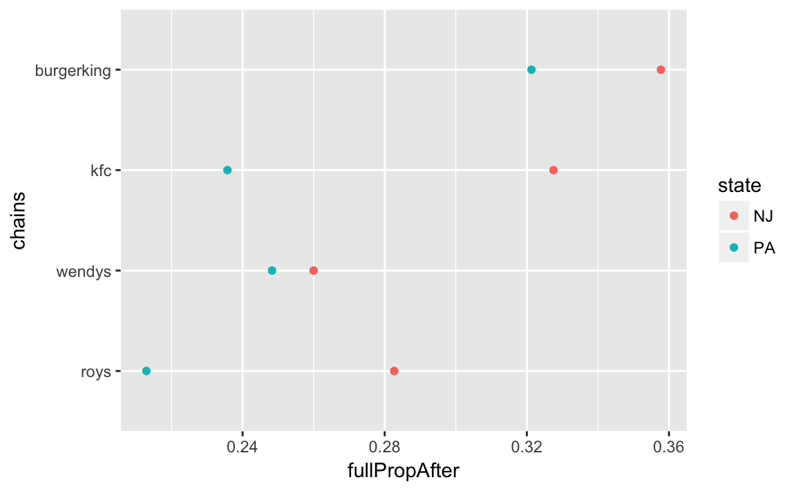

# Causality

## Prerequistes

This chapter only uses the tidyverse package

```r
library("tidyverse")
```
and the `qss_data_url` helper function to download data from the QSS site,


## Racial Discrimination in the Labor Market

The code in the book uses `table` and `addmargins` to construct the table.
However, this can be done easily with `dplyr` using grouping and summarizing.


```r
resume <- read_csv(qss_data_url("causality", "resume.csv"))
```

In addition to the functions shown in the text,

```r
dim(resume)
#> [1] 4870    4
summary(resume)
#>   firstname             sex                race                call     
#>  Length:4870        Length:4870        Length:4870        Min.   :0.00  
#>  Class :character   Class :character   Class :character   1st Qu.:0.00  
#>  Mode  :character   Mode  :character   Mode  :character   Median :0.00  
#>                                                           Mean   :0.08  
#>                                                           3rd Qu.:0.00  
#>                                                           Max.   :1.00
head(resume)
#> # A tibble: 6 x 4
#>   firstname    sex  race  call
#>       <chr>  <chr> <chr> <int>
#> 1   Allison female white     0
#> 2   Kristen female white     0
#> 3   Lakisha female black     0
#> 4   Latonya female black     0
#> 5    Carrie female white     0
#> 6       Jay   male white     0
```
we can also use `glimpse` to get a quick understanding of the variables in the data frame,

```r
glimpse(resume)
#> Observations: 4,870
#> Variables: 4
#> $ firstname <chr> "Allison", "Kristen", "Lakisha", "Latonya", "Carrie"...
#> $ sex       <chr> "female", "female", "female", "female", "female", "m...
#> $ race      <chr> "white", "white", "black", "black", "white", "white"...
#> $ call      <int> 0, 0, 0, 0, 0, 0, 0, 0, 0, 0, 0, 0, 0, 0, 0, 0, 0, 0...
```

For each combination of `race` and `call` let's count the observations:

```r
race_call_tab <-
  resume %>%
  group_by(race, call) %>%
  count()
race_call_tab
#> # A tibble: 4 x 3
#> # Groups:   race, call [4]
#>    race  call     n
#>   <chr> <int> <int>
#> 1 black     0  2278
#> 2 black     1   157
#> 3 white     0  2200
#> 4 white     1   235
```

If we want to calculate callback rates by race:

```r
race_call_rate <-
  race_call_tab %>%
  group_by(race) %>%
  mutate(call_rate =  n / sum(n)) %>%
  filter(call == 1) %>%
  select(race, call_rate)
race_call_rate
#> # A tibble: 2 x 2
#> # Groups:   race [2]
#>    race call_rate
#>   <chr>     <dbl>
#> 1 black    0.0645
#> 2 white    0.0965
```

If we want the overall callback rate, we can calculate it from the original 
data,

```r
resume %>%
  summarise(call_back = mean(call))
#> # A tibble: 1 x 1
#>   call_back
#>       <dbl>
#> 1    0.0805
```

## Subsetting Data in R


### Subsetting

The **dplyr** function `filter` is a much improved version of `subset`.

To select black individuals in the data:

```r
resumeB <-
  resume %>%
  filter(race == "black")
dim(resumeB)
#> [1] 2435    4
head(resumeB)
#> # A tibble: 6 x 4
#>   firstname    sex  race  call
#>       <chr>  <chr> <chr> <int>
#> 1   Lakisha female black     0
#> 2   Latonya female black     0
#> 3     Kenya female black     0
#> 4   Latonya female black     0
#> 5    Tyrone   male black     0
#> 6     Aisha female black     0
```

And to calculate the callback rate

```r
resumeB %>%
  summarise(call_rate = mean(call))
#> # A tibble: 1 x 1
#>   call_rate
#>       <dbl>
#> 1    0.0645
```

To keep call and first name variables and those with black-sounding first names.

```r
resumeBf <-
  resume %>%
  filter(race == "black", sex == "female") %>%
  select(call, firstname)
head(resumeBf)
#> # A tibble: 6 x 2
#>    call firstname
#>   <int>     <chr>
#> 1     0   Lakisha
#> 2     0   Latonya
#> 3     0     Kenya
#> 4     0   Latonya
#> 5     0     Aisha
#> 6     0     Aisha
```

Now we can calculate the gender gap by group. 

One way to do this is to calculate the call back rates for both sexes of 
black sounding names,

```r
resumeB <- resume %>%
  filter(race == "black") %>%
  group_by(sex) %>%
  summarise(black_rate = mean(call))
```
and white-sounding names

```r
resumeW <- resume %>%
  filter(race == "white") %>%
  group_by(sex) %>%
  summarise(white_rate = mean(call))
resumeW
#> # A tibble: 2 x 2
#>      sex white_rate
#>    <chr>      <dbl>
#> 1 female     0.0989
#> 2   male     0.0887
```
Then, merge `resumeB` and `resumeW` on `sex` and calculate the difference for both sexes.

```r
inner_join(resumeB, resumeW, by = "sex") %>%
  mutate(race_gap = white_rate - black_rate)
#> # A tibble: 2 x 4
#>      sex black_rate white_rate race_gap
#>    <chr>      <dbl>      <dbl>    <dbl>
#> 1 female     0.0663     0.0989   0.0326
#> 2   male     0.0583     0.0887   0.0304
```

This seems to be a little more code, but we didn't duplicate as much as in QSS, and this would easily scale to more than two categories.

A way to do this using the `spread` and gather functions from **tidy** are,
First, calculate the 

```r
resume_race_sex <-
  resume %>%
  group_by(race, sex) %>%
  summarise(call = mean(call))
head(resume_race_sex)
#> # A tibble: 4 x 3
#> # Groups:   race [2]
#>    race    sex   call
#>   <chr>  <chr>  <dbl>
#> 1 black female 0.0663
#> 2 black   male 0.0583
#> 3 white female 0.0989
#> 4 white   male 0.0887
```
Now, use `spread()` to make each value of `race` a new column:

```r
library("tidyr")
resume_sex <-
  resume_race_sex %>%
  ungroup() %>%
  spread(race, call)
resume_sex
#> # A tibble: 2 x 3
#>      sex  black  white
#> *  <chr>  <dbl>  <dbl>
#> 1 female 0.0663 0.0989
#> 2   male 0.0583 0.0887
```
Now we can calculate the race wage differences by sex as before,

```r
resume_sex %>%
  mutate(call_diff = white - black)
#> # A tibble: 2 x 4
#>      sex  black  white call_diff
#>    <chr>  <dbl>  <dbl>     <dbl>
#> 1 female 0.0663 0.0989    0.0326
#> 2   male 0.0583 0.0887    0.0304
```

This could be combined into a single chain with only six lines of code:

```r
resume %>%
  group_by(race, sex) %>%
  summarise(call = mean(call)) %>%
  ungroup() %>%
  spread(race, call) %>%
  mutate(call_diff = white - black)
#> # A tibble: 2 x 4
#>      sex  black  white call_diff
#>    <chr>  <dbl>  <dbl>     <dbl>
#> 1 female 0.0663 0.0989    0.0326
#> 2   male 0.0583 0.0887    0.0304
```


### Simple conditional statements

See the **dlpyr** functions `if_else`, `recode` and `case_when`.
The function `if_else` is like `ifelse` but corrects for some weird behavior that `ifelse` has in certain cases.


```r
resume %>% 
  mutate(BlackFemale = if_else(race == "black" & sex == "female", 1, 0)) %>%
  group_by(BlackFemale, race, sex) %>%
  count()
#> # A tibble: 4 x 4
#> # Groups:   BlackFemale, race, sex [4]
#>   BlackFemale  race    sex     n
#>         <dbl> <chr>  <chr> <int>
#> 1           0 black   male   549
#> 2           0 white female  1860
#> 3           0 white   male   575
#> 4           1 black female  1886
```


### Factor Variables

See R4DS Chapter 15 "Factors" and the package **forcats**

The code in this section works, but can be simplified by using the function
`case_when` which works in exactly these cases.

```r
resume %>%
  mutate(type = as.factor(case_when(
    .$race == "black" & .$sex == "female" ~ "BlackFemale",
    .$race == "black" & .$sex == "male" ~ "BlackMale",
    .$race == "white" & .$sex == "female" ~ "WhiteFemale",
    .$race == "white" & .$sex == "male" ~ "WhiteMale",
    TRUE ~ as.character(NA)
  )))
#> # A tibble: 4,870 x 5
#>   firstname    sex  race  call        type
#>       <chr>  <chr> <chr> <int>      <fctr>
#> 1   Allison female white     0 WhiteFemale
#> 2   Kristen female white     0 WhiteFemale
#> 3   Lakisha female black     0 BlackFemale
#> 4   Latonya female black     0 BlackFemale
#> 5    Carrie female white     0 WhiteFemale
#> 6       Jay   male white     0   WhiteMale
#> # ... with 4,864 more rows
```

Since the logic of this is so simple, we can create this variable by 
using `str_c` to combine the vectors of `sex` and `race`, after using `str_to_title` to capitalize them first.

```r
library(stringr)
resume <-
  resume %>%
  mutate(type = str_c(str_to_title(race), str_to_title(sex)))
```

Some of the reasons given for using factors in this chapter are not as important given the functionality in modern **tidyverse** packages.
For example, there is no reason to use `tapply`, as that can use `group_by` and `summarise`,

```r
resume %>%
  group_by(type) %>%
  summarise(call = mean(call))
#> # A tibble: 4 x 2
#>          type   call
#>         <chr>  <dbl>
#> 1 BlackFemale 0.0663
#> 2   BlackMale 0.0583
#> 3 WhiteFemale 0.0989
#> 4   WhiteMale 0.0887
```

What's nice about this approach is that we wouldn't have needed to create the factor variable first,

```r
resume %>%
  group_by(race, sex) %>%
  summarise(call = mean(call))
#> # A tibble: 4 x 3
#> # Groups:   race [?]
#>    race    sex   call
#>   <chr>  <chr>  <dbl>
#> 1 black female 0.0663
#> 2 black   male 0.0583
#> 3 white female 0.0989
#> 4 white   male 0.0887
```


We can use that same approach to calculate the mean of first names, and use
`arrange` to sort in ascending order.

```r
resume %>%
  group_by(firstname) %>%
  summarise(call = mean(call)) %>%
  arrange(call)
#> # A tibble: 36 x 2
#>   firstname   call
#>       <chr>  <dbl>
#> 1     Aisha 0.0222
#> 2   Rasheed 0.0299
#> 3    Keisha 0.0383
#> 4  Tremayne 0.0435
#> 5    Kareem 0.0469
#> 6   Darnell 0.0476
#> # ... with 30 more rows
```

## Causal Affects and the Counterfactual
 
Load the data using the **readr** function 

```r
social <- read_csv(qss_data_url("causality", "social.csv"))
summary(social)
#>      sex             yearofbirth    primary2004      messages        
#>  Length:305866      Min.   :1900   Min.   :0.000   Length:305866     
#>  Class :character   1st Qu.:1947   1st Qu.:0.000   Class :character  
#>  Mode  :character   Median :1956   Median :0.000   Mode  :character  
#>                     Mean   :1956   Mean   :0.401                     
#>                     3rd Qu.:1965   3rd Qu.:1.000                     
#>                     Max.   :1986   Max.   :1.000                     
#>   primary2006        hhsize    
#>  Min.   :0.000   Min.   :1.00  
#>  1st Qu.:0.000   1st Qu.:2.00  
#>  Median :0.000   Median :2.00  
#>  Mean   :0.312   Mean   :2.18  
#>  3rd Qu.:1.000   3rd Qu.:2.00  
#>  Max.   :1.000   Max.   :8.00
```

Use a grouped summarize instead of `tapply`,

```r
gotv_by_group <-
  social %>%
  group_by(messages) %>%
  summarize(turnout = mean(primary2006))
gotv_by_group
#> # A tibble: 4 x 2
#>     messages turnout
#>        <chr>   <dbl>
#> 1 Civic Duty   0.315
#> 2    Control   0.297
#> 3  Hawthorne   0.322
#> 4  Neighbors   0.378
```

Get the turnout for the control group

```r
gotv_control <-
  (filter(gotv_by_group, messages == "Control"))[["turnout"]]
```

Subtract the control group turnout from all groups


```r
gotv_by_group %>%
  mutate(diff_control = turnout - gotv_control)
#> # A tibble: 4 x 3
#>     messages turnout diff_control
#>        <chr>   <dbl>        <dbl>
#> 1 Civic Duty   0.315       0.0179
#> 2    Control   0.297       0.0000
#> 3  Hawthorne   0.322       0.0257
#> 4  Neighbors   0.378       0.0813
```

We could have also done this in one step like,

```r
gotv_by_group %>%
  mutate(control = mean(turnout[messages == "Control"]),
         control_diff = turnout - control)
#> # A tibble: 4 x 4
#>     messages turnout control control_diff
#>        <chr>   <dbl>   <dbl>        <dbl>
#> 1 Civic Duty   0.315   0.297       0.0179
#> 2    Control   0.297   0.297       0.0000
#> 3  Hawthorne   0.322   0.297       0.0257
#> 4  Neighbors   0.378   0.297       0.0813
```

We can compare the differences of variables across the groups easily using a grouped summarize

```r
gotv_by_group %>%
  mutate(control = mean(turnout[messages == "Control"]),
         control_diff = turnout - control)
#> # A tibble: 4 x 4
#>     messages turnout control control_diff
#>        <chr>   <dbl>   <dbl>        <dbl>
#> 1 Civic Duty   0.315   0.297       0.0179
#> 2    Control   0.297   0.297       0.0000
#> 3  Hawthorne   0.322   0.297       0.0257
#> 4  Neighbors   0.378   0.297       0.0813
```


**Pro-tip** The `summarise_at` functions allows you summarize one-or-more columns with one-or-more functions.
In addition to `age`, 2004 turnout, and household size, we'll also compare proportion female,

```r
social %>%
  group_by(messages) %>%
  mutate(age = 2006 - yearofbirth,
         female = (sex == "female")) %>%
  select(-age, -sex) %>%
  summarise_all(mean)
#> # A tibble: 4 x 6
#>     messages yearofbirth primary2004 primary2006 hhsize female
#>        <chr>       <dbl>       <dbl>       <dbl>  <dbl>  <dbl>
#> 1 Civic Duty        1956       0.399       0.315   2.19  0.500
#> 2    Control        1956       0.400       0.297   2.18  0.499
#> 3  Hawthorne        1956       0.403       0.322   2.18  0.499
#> 4  Neighbors        1956       0.407       0.378   2.19  0.500
```

## Observational Studies

Load the `minwage` dataset from its URL using `readr::read_csv`:

```r
minwage_url <- "https://raw.githubusercontent.com/kosukeimai/qss/master/CAUSALITY/minwage.csv"
minwage <- read_csv(minwage_url)
glimpse(minwage)
#> Observations: 358
#> Variables: 8
#> $ chain      <chr> "wendys", "wendys", "burgerking", "burgerking", "kf...
#> $ location   <chr> "PA", "PA", "PA", "PA", "PA", "PA", "PA", "PA", "PA...
#> $ wageBefore <dbl> 5.00, 5.50, 5.00, 5.00, 5.25, 5.00, 5.00, 5.00, 5.0...
#> $ wageAfter  <dbl> 5.25, 4.75, 4.75, 5.00, 5.00, 5.00, 4.75, 5.00, 4.5...
#> $ fullBefore <dbl> 20.0, 6.0, 50.0, 10.0, 2.0, 2.0, 2.5, 40.0, 8.0, 10...
#> $ fullAfter  <dbl> 0.0, 28.0, 15.0, 26.0, 3.0, 2.0, 1.0, 9.0, 7.0, 18....
#> $ partBefore <dbl> 20.0, 26.0, 35.0, 17.0, 8.0, 10.0, 20.0, 30.0, 27.0...
#> $ partAfter  <dbl> 36, 3, 18, 9, 12, 9, 25, 32, 39, 10, 20, 4, 13, 20,...
summary(minwage)
#>     chain             location           wageBefore     wageAfter   
#>  Length:358         Length:358         Min.   :4.25   Min.   :4.25  
#>  Class :character   Class :character   1st Qu.:4.25   1st Qu.:5.05  
#>  Mode  :character   Mode  :character   Median :4.50   Median :5.05  
#>                                        Mean   :4.62   Mean   :4.99  
#>                                        3rd Qu.:4.99   3rd Qu.:5.05  
#>                                        Max.   :5.75   Max.   :6.25  
#>    fullBefore     fullAfter      partBefore     partAfter   
#>  Min.   : 0.0   Min.   : 0.0   Min.   : 0.0   Min.   : 0.0  
#>  1st Qu.: 2.1   1st Qu.: 2.0   1st Qu.:11.0   1st Qu.:11.0  
#>  Median : 6.0   Median : 6.0   Median :16.2   Median :17.0  
#>  Mean   : 8.5   Mean   : 8.4   Mean   :18.8   Mean   :18.7  
#>  3rd Qu.:12.0   3rd Qu.:12.0   3rd Qu.:25.0   3rd Qu.:25.0  
#>  Max.   :60.0   Max.   :40.0   Max.   :60.0   Max.   :60.0
```

First, calculate the proportion of restaurants by state whose hourly wages were less than the minimum wage in NJ, \$5.05, for `wageBefore` and `wageAfter`:

Since the NJ minimum wage was \$5.05, we'll define a variable with that value.
Even if you use them only once or twice, it is a good idea to put values like this in variables. 
It makes your code closer to self-documenting.n

```r
NJ_MINWAGE <- 5.05
```
Later, it will be easier to understand `wageAfter < NJ_MINWAGE` without any comments than it would be to understand `wageAfter < 5.05`. 
In the latter case you'd have to remember that the new NJ minimum wage was 5.05 and that's why you were using that value.
This is an example of a [magic number](https://en.wikipedia.org/wiki/Magic_number_(programming)#Unnamed_numerical_constants): try to avoid them.

Note that location has multiple values: PA and four regions of NJ.
So we'll add a state variable to the data.

```r
minwage %>%
  count(location)
#> # A tibble: 5 x 2
#>    location     n
#>       <chr> <int>
#> 1 centralNJ    45
#> 2   northNJ   146
#> 3        PA    67
#> 4   shoreNJ    33
#> 5   southNJ    67
```

We can extract the state from the final two characters of the location variable using the **stringr** function `str_sub` (R4DS Ch 14: Strings):

```r
library(stringr)
minwage <-
  mutate(minwage, state = str_sub(location, -2L))
```
Alternatively, since everything is either PA or NJ

```r
minwage <-
  mutate(minwage, state = if_else(location == "PA", "PA", "NJ"))
```

Let's confirm that the restaurants followed the law:

```r
minwage %>%
  group_by(state) %>%
  summarise(prop_after = mean(wageAfter < NJ_MINWAGE),
            prop_Before = mean(wageBefore < NJ_MINWAGE))
#> # A tibble: 2 x 3
#>   state prop_after prop_Before
#>   <chr>      <dbl>       <dbl>
#> 1    NJ    0.00344       0.911
#> 2    PA    0.95522       0.940
```

Create a variable for the proportion of full-time employees in NJ and PA 

```r
minwage <-
  minwage %>%
  mutate(totalAfter = fullAfter + partAfter,
        fullPropAfter = fullAfter / totalAfter)
```

Now calculate the average for each state:

```r
full_prop_by_state <-
  minwage %>%
  group_by(state) %>%
  summarise(fullPropAfter = mean(fullPropAfter))
full_prop_by_state
#> # A tibble: 2 x 2
#>   state fullPropAfter
#>   <chr>         <dbl>
#> 1    NJ         0.320
#> 2    PA         0.272
```

We could compute the difference by  

```r
(filter(full_prop_by_state, state == "NJ")[["fullPropAfter"]] - 
  filter(full_prop_by_state, state == "PA")[["fullPropAfter"]])
#> [1] 0.0481
```
or using **tidyr** functions `spread` (R4DS Ch 11: Tidy Data):

```r
spread(full_prop_by_state, state, fullPropAfter) %>%
  mutate(diff = NJ - PA)
#> # A tibble: 1 x 3
#>      NJ    PA   diff
#>   <dbl> <dbl>  <dbl>
#> 1  0.32 0.272 0.0481
```


### Confounding Bias

We can calculate the proportion of fast-food restaurants in each chain in each state:

```r
chains_by_state <-
  minwage %>%
  group_by(state) %>%
  count(chain) %>%
  mutate(prop = n / sum(n)) 
```

We can easily compare these using a simple dot-plot:

```r
ggplot(chains_by_state, aes(x = chain, y = prop, colour = state)) +
  geom_point() + 
  coord_flip()
```


In the QSS text, only Burger King restaurants are compared. 
However, **dplyr** makes this easy.
All we have to do is change the `group_by` statement we used last time,
and add chain to it:


```r
full_prop_by_state_chain <-
  minwage %>%
  group_by(state, chain) %>%
  summarise(fullPropAfter = mean(fullPropAfter))
full_prop_by_state_chain
#> # A tibble: 8 x 3
#> # Groups:   state [?]
#>   state      chain fullPropAfter
#>   <chr>      <chr>         <dbl>
#> 1    NJ burgerking         0.358
#> 2    NJ        kfc         0.328
#> 3    NJ       roys         0.283
#> 4    NJ     wendys         0.260
#> 5    PA burgerking         0.321
#> 6    PA        kfc         0.236
#> # ... with 2 more rows
```

We can plot and compare the proportions easily in this format.
In general, ordering categorical variables alphabetically is useless, so we'll order the chains by the average of the NJ and PA `fullPropAfter`, using `forcats::fct_reorder`:

```r
ggplot(full_prop_by_state_chain,
       aes(x = forcats::fct_reorder(chain, fullPropAfter),
           y = fullPropAfter, 
           colour = state)) +
  geom_point() +
  coord_flip() +
  labs(x = "chains")
```



To calculate the differences, we need to get the data frame 

1. The join method.

   1. Create New Jersey and Pennsylvania data sets with `chain` and prop full employed columns.
   2. Merge the two data sets on `chain`.
   

```r
chains_nj <- full_prop_by_state_chain %>%
  ungroup() %>%
  filter(state == "NJ") %>%
  select(-state) %>%
  rename(NJ = fullPropAfter)
chains_pa <- full_prop_by_state_chain %>%
  ungroup() %>%
  filter(state == "PA") %>%
  select(-state) %>%
  rename(PA = fullPropAfter)

full_prop_state_chain_diff <- 
  full_join(chains_nj, chains_pa, by = "chain") %>%
  mutate(diff = NJ - PA)
full_prop_state_chain_diff
#> # A tibble: 4 x 4
#>        chain    NJ    PA   diff
#>        <chr> <dbl> <dbl>  <dbl>
#> 1 burgerking 0.358 0.321 0.0364
#> 2        kfc 0.328 0.236 0.0918
#> 3       roys 0.283 0.213 0.0697
#> 4     wendys 0.260 0.248 0.0117
```

Q: In the code above why did I remove the `state` variable and rename the `fullPropAfter` variable before merging? What happens if I didn't?

2. The spread/gather method. We can also use the `spread` and `gather` functions from **tidyr**. In this example it is much more compact code.


```r
full_prop_by_state_chain %>%
  spread(state, fullPropAfter) %>%
  mutate(diff = NJ - PA)
#> # A tibble: 4 x 4
#>        chain    NJ    PA   diff
#>        <chr> <dbl> <dbl>  <dbl>
#> 1 burgerking 0.358 0.321 0.0364
#> 2        kfc 0.328 0.236 0.0918
#> 3       roys 0.283 0.213 0.0697
#> 4     wendys 0.260 0.248 0.0117
```

### Before and After and Difference-in-Difference Designs


To compute the estimates in the before and after design first create a variable for the difference before and after the law passed.

```r
minwage <- 
  minwage %>%
  mutate(totalBefore = fullBefore + partBefore,
         fullPropBefore = fullBefore / totalBefore)
```

The before-and-after analysis is the difference between the full-time employment before and after the minimum wage law passed looking only at NJ:

```r
filter(minwage, state == "NJ") %>%
  summarise(diff = mean(fullPropAfter) - mean(fullPropBefore))
#> # A tibble: 1 x 1
#>     diff
#>    <dbl>
#> 1 0.0239
```

The difference-in-differences design uses the difference in the before-and-after differences for each state.

```r
diff_by_state <-
  minwage %>%
  group_by(state) %>%
  summarise(diff = mean(fullPropAfter) - mean(fullPropBefore))

filter(diff_by_state, state == "NJ")[["diff"]] -
  filter(diff_by_state, state == "PA")[["diff"]]
#> [1] 0.0616
```

Let's create a single dataset with the mean values of each state before and after to visually look at each of these designs:

```r
full_prop_by_state <-
  minwage %>%
  group_by(state) %>%
  summarise_at(vars(fullPropAfter, fullPropBefore), mean) %>%
  gather(period, fullProp, -state) %>%
  mutate(period = recode(period, fullPropAfter = 1, fullPropBefore = 0))
full_prop_by_state
#> # A tibble: 4 x 3
#>   state period fullProp
#>   <chr>  <dbl>    <dbl>
#> 1    NJ      1    0.320
#> 2    PA      1    0.272
#> 3    NJ      0    0.297
#> 4    PA      0    0.310
```


```r
ggplot(full_prop_by_state, aes(x = period, y = fullProp, colour = state)) +
  geom_point() +
  geom_line() +
  scale_x_continuous(breaks = c(0, 1), labels = c("Before", "After"))
```


## Descriptive Statistics for a Single Variable


To calculate the summary for the variables `wageBefore` and `wageAfter`:

```r
minwage %>%
  filter(state == "NJ") %>%
  select(wageBefore, wageAfter) %>%
  summary()
#>    wageBefore     wageAfter   
#>  Min.   :4.25   Min.   :5.00  
#>  1st Qu.:4.25   1st Qu.:5.05  
#>  Median :4.50   Median :5.05  
#>  Mean   :4.61   Mean   :5.08  
#>  3rd Qu.:4.87   3rd Qu.:5.05  
#>  Max.   :5.75   Max.   :5.75
```

We calculate the IQR for each state's wages after the passage of the law using the same grouped summarize as we used before:

```r
minwage %>%
  group_by(state) %>%
  summarise(wageAfter = IQR(wageAfter),
            wageBefore = IQR(wageBefore))
#> # A tibble: 2 x 3
#>   state wageAfter wageBefore
#>   <chr>     <dbl>      <dbl>
#> 1    NJ     0.000       0.62
#> 2    PA     0.575       0.75
```

Calculate the variance and standard deviation of `wageAfter` and `wageBefore` for each state:


```r
minwage %>%
  group_by(state) %>%
  summarise(wageAfter_sd = sd(wageAfter),
               wageAfter_var = var(wageAfter),
               wageBefore_sd = sd(wageBefore),
               wageBefore_var = var(wageBefore))
#> # A tibble: 2 x 5
#>   state wageAfter_sd wageAfter_var wageBefore_sd wageBefore_var
#>   <chr>        <dbl>         <dbl>         <dbl>          <dbl>
#> 1    NJ        0.106        0.0112         0.343          0.118
#> 2    PA        0.359        0.1291         0.358          0.128
```
or, more compactly, using `summarise_at`:

```r
minwage %>%
  group_by(state) %>%
  summarise_at(vars(wageAfter, wageBefore), funs(sd, var))
#> # A tibble: 2 x 5
#>   state wageAfter_sd wageBefore_sd wageAfter_var wageBefore_var
#>   <chr>        <dbl>         <dbl>         <dbl>          <dbl>
#> 1    NJ        0.106         0.343        0.0112          0.118
#> 2    PA        0.359         0.358        0.1291          0.128
```

