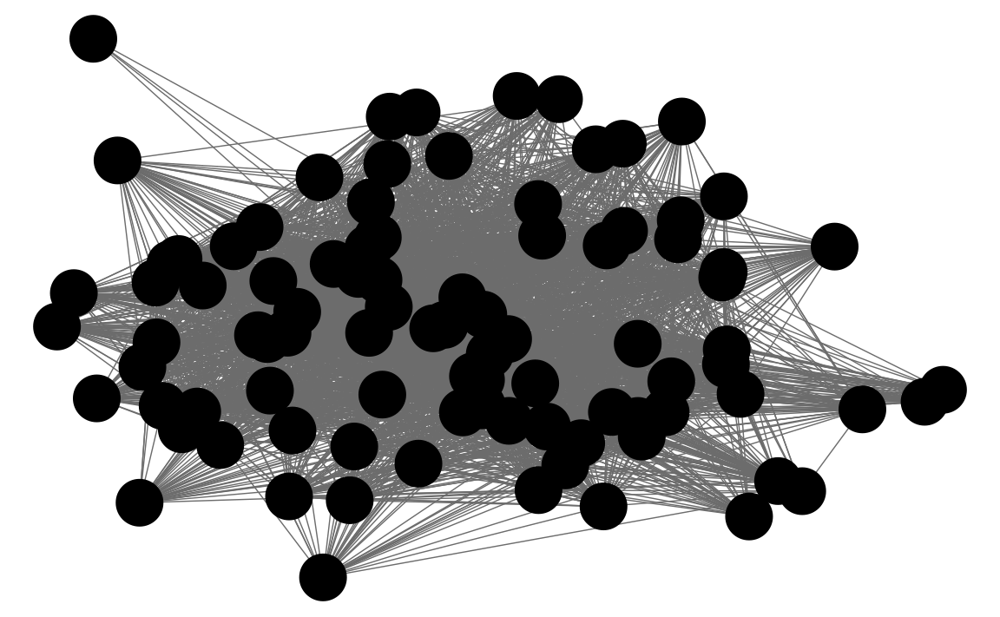

## Network data 

The [igraph](https://cran.r-project.org/package=igraph), [sna](https://cran.r-project.org/package=sna), and [network](https://cran.r-project.org/package=network) packages are the best in class.
See the Social Network Analysis section of the [Social Sciences Task View](https://cran.r-project.org/web/views/SocialSciences.html).
See this tutorial by Katherin Ognyanova, [Static and dynamic network visualization with R](https://rpubs.com/kateto/netviz), for a good overview of network visualization with those packages in R.

There are several packages that plot networks in ggplot2.

- [ggnetwork](https://cran.r-project.org/package=ggnetwork)
- [ggraph](https://cran.r-project.org/package=ggraph)
- [geomnet](https://cran.r-project.org/package=geomnet)
- [GGally](https://cran.r-project.org/package=GGally) functions [ggnet](https://ggobi.github.io/ggally/rd.html#ggnet), `ggnet2`, and `ggnetworkmap`.
- [ggCompNet](https://cran.r-project.org/package=ggCompNet) compares the speed of various network plotting packages in R.

See this [presentation](http://curleylab.psych.columbia.edu/netviz/netviz1.html#/12) for an overview of some of those packages for data visualization.

Examples: [Network Visualization Examples with the ggplot2 Package](https://cran.r-project.org/web/packages/ggCompNet/vignettes/examples-from-paper.html)


### Prerequisites {-}


```r
library("tidyverse")
library("lubridate")
library("stringr")
library("forcats")
library("igraph")
library("intergraph")
library("GGally")
```


### Twitter Following Network


```r
data("twitter.following", package = "qss")
```

```r
data("twitter.senator", package = "qss")
```

Since the names `twitter.following` and `twitter.senator` are verbose, we'll
simplify future code by copying their values to variables named `twitter` and `senator`, respectively.

```r
twitter <- twitter.following
senator <- twitter.senator
```

Simply use the  function since `twitter` consists of edges (a link from a senator to another).
Since `graph_from_edgelist` expects a matrix, convert the data frame to a matrix using .

```r
twitter_adj <- graph_from_edgelist(as.matrix(twitter))
```


```r
environment(degree)
#> <environment: namespace:igraph>
```

Add in- and out-degree variables to the `senator` data frame:

```r
senator <-
  mutate(senator,
         indegree = igraph::degree(twitter_adj, mode = "in"),
         outdegree = igraph::degree(twitter_adj, mode = "out"))
```

Now find the senators with the 3 greatest in-degrees

```r
arrange(senator, desc(indegree)) %>%
  slice(1:3) %>%
  select(name, party, state, indegree, outdegree)
#> # A tibble: 3 x 5
#>   name              party state indegree outdegree
#>   <chr>             <chr> <chr>    <dbl>     <dbl>
#> 1 Tom Cotton        R     AR        64.0      15.0
#> 2 Richard J. Durbin D     IL        60.0      87.0
#> 3 John Barrasso     R     WY        58.0      79.0
```
or using the  function:

```r
top_n(senator, 3, indegree) %>%
  arrange(desc(indegree)) %>%
  select(name, party, state, indegree, outdegree)
#>                name party state indegree outdegree
#> 1        Tom Cotton     R    AR       64        15
#> 2 Richard J. Durbin     D    IL       60        87
#> 3     John Barrasso     R    WY       58        79
#> 4      Joe Donnelly     D    IN       58         9
#> 5    Orrin G. Hatch     R    UT       58        50
```
The `top_n` function catches that three senators are tied for 3rd highest outdegree, whereas the simply sorting and slicing cannot.

And we can find the senators with the three highest out-degrees similarly,

```r
top_n(senator, 3, outdegree) %>%
  arrange(desc(outdegree)) %>%
  select(name, party, state, indegree, outdegree)
#>               name party state indegree outdegree
#> 1     Thad Cochran     R    MS       55        89
#> 2     Steve Daines     R    MT       30        88
#> 3      John McCain     R    AZ       41        88
#> 4 Joe Manchin, III     D    WV       43        88
```


```r
# Define scales to reuse for the plots
scale_colour_parties <- scale_colour_manual("Party", values = c(R = "red",
                                                       D = "blue",
                                                       I = "green"))
scale_shape_parties <- scale_shape_manual("Party", values = c(R = 16,
                                                              D = 17,
                                                              I = 4))


senator %>%
  mutate(closeness_in = igraph::closeness(twitter_adj, mode = "in"),
         closeness_out = igraph::closeness(twitter_adj, mode = "out")) %>%
  ggplot(aes(x = closeness_in, y = closeness_out,
             colour = party, shape = party)) +
  geom_abline(intercept = 0, slope = 1, colour = "white", size = 2) +
  geom_point() +
  scale_colour_parties +
  scale_shape_parties +
  labs(main = "Closeness", x = "Incoming path", y = "Outgoing path")
```


What does the reference line indicate? What does that say about senators twitter
networks?


```r
senator %>%
  mutate(betweenness_dir = igraph::betweenness(twitter_adj, directed = TRUE),
         betweenness_undir = igraph::betweenness(twitter_adj,
                                                 directed = FALSE)) %>%
  ggplot(aes(x = betweenness_dir, y = betweenness_undir, colour = party,
             shape = party)) +
  geom_abline(intercept = 0, slope = 1, colour = "white", size = 2) +
  geom_point() +
  scale_colour_parties +
  scale_shape_parties +
  labs(main = "Betweenness", x = "Directed", y = "Undirected")
```


We've covered three different methods of calculating the importance of a node in a network: degree, closeness, and centrality.
But what do they mean? What's the "best" measure of importance?
The answer to the the former is "it depends on the question".
There are probably other papers out there on this, but Borgatti (2005) is a good
discussion:

> Borgatti, Stephen. 2005. "Centrality and Network Flow". *Social Networks*.
  [DOI](https://dx.doi.org/doi:10.1016/j.socnet.2004.11.008)


Add and plot page-rank:

```r
senator <- mutate(senator, page_rank = page_rank(twitter_adj)[["vector"]])
ggnet(twitter_adj, mode = "target")
```


