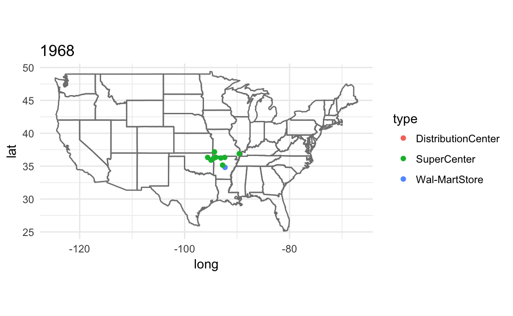
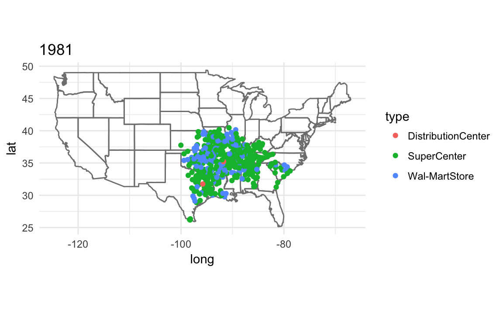
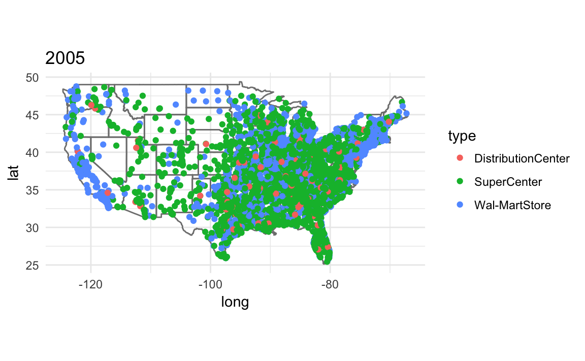

# Discovery

The idea of tidy data and the common feature of tidyverse packages is that data should be stored in data frames with certain conventions.
This works well with naturally tabular data, the type which has been common in social science applications.
But there are other domains in which other data structures are more appropriate because they more naturally model the data or processes, or for computational reasons.
The three applications in this chapter: text, networks, and spatial data are examples where the tidy data structure is less of an advantage.
I will still rely on **ggplot2** for plotting, and use tidyverse compatible packages where appropriate.

- Textual data: [tidytext](https://cran.r-project.org/package=tidytext) 
- Network data: [igraph](https://cran.r-project.org/package=igraph) for network computation, as in the chapter. But several ggplot2 extension packages for plotting the networks.
- Spatial data: [ggplot2](https://cran.r-project.org/package=ggplot2) has some built-in support for maps. The [map](https://cran.r-project.org/package=map) package provides map data.

See the [R for Data Science](http://r4ds.had.co.nz/) section [12.7 Non-tidy data](http://r4ds.had.co.nz/tidy-data.html#non-tidy-data) and this post on [Non-tidy data](http://simplystatistics.org/2016/02/17/non-tidy-data/) by Jeff Leek for more on non-tidy data.


## Prerequisites


```r
library("tidyverse")
library("lubridate")
#> Loading required package: methods
#> 
#> Attaching package: 'lubridate'
#> The following object is masked from 'package:base':
#> 
#>     date
library("stringr")
```

## Textual data

This section will primarily use the [tidytext](https://cran.r-project.org/package=tidytext) package.
It is a relatively new package.
The [tm](https://cran.r-project.org/package=tm) and [quanteda](https://cran.r-project.org/package=quanteda) (by Ken Benoit) packages are more established and use the document-term matrix format as described in the QSS chapter.
The **tidytext** package stores everything in a data frame; this may be less efficient than the other packages, but has the benefit of being able to easily take advantage of the tidyverse ecosystem.
If your corpus is not too large, this shouldn't be an issue.

See [Tidy Text Mining with R](http://tidytextmining.com/) for a full introduction to using **tidytext**.

In tidy data, each row is an observation and each column is a variable.
In the **tidytext** package, documents are stored as data frames with **one-term-per-row**.


## Network Data


## Spatial Data in R

Sources:

- ggfortify: `fortify` and `autoplot` allows ggplot to handle some popular R packages. https://journal.r-project.org/archive/accepted/tang-horikoshi-li.pdf
- https://cran.r-project.org/web/packages/ggfortify/vignettes/plot_map.html
- ggplot loads map data using the `map_data` function.

  - http://docs.ggplot2.org/current/borders.html
  - http://docs.ggplot2.org/current/fortify.map.html
  - http://docs.ggplot2.org/current/map_data.html

- https://cran.r-project.org/doc/contrib/intro-spatial-rl.pdf
- https://cran.r-project.org/web/views/Spatial.html
- https://cran.r-project.org/web/packages/sp/index.html
- https://cran.r-project.org/web/packages/maptools/index.html
- https://cran.r-project.org/web/packages/tmap/index.html
- https://cran.r-project.org/web/packages/leaflet/index.html
- https://www.ggplot2-exts.org
- David Kahle and Hadley Wickham. 2013. [ggmap: Spatial Visualization with ggplot2](https://journal.r-project.org/archive/2013-1/kahle-wickham.pdf). *Journal of Statistical Software*
- Github [dkahle/ggmamp](https://github.com/dkahle/ggmap)
- http://eriqande.github.io/rep-res-web/lectures/making-maps-with-R.html
- https://www.r-bloggers.com/r-beginners-plotting-locations-on-to-a-world-map/
- https://rpubs.com/m_dev/Intro-to-Spatial-Data-and-ggplot2


```r
library("maps")
#> 
#> Attaching package: 'maps'
#> The following object is masked from 'package:purrr':
#> 
#>     map
library("ggrepel")
```


```r
data(us.cities)
glimpse(us.cities)
#> Observations: 1,005
#> Variables: 6
#> $ name        <chr> "Abilene TX", "Akron OH", "Alameda CA", "Albany GA...
#> $ country.etc <chr> "TX", "OH", "CA", "GA", "NY", "OR", "NM", "LA", "V...
#> $ pop         <int> 113888, 206634, 70069, 75510, 93576, 45535, 494962...
#> $ lat         <dbl> 32.5, 41.1, 37.8, 31.6, 42.7, 44.6, 35.1, 31.3, 38...
#> $ long        <dbl> -99.7, -81.5, -122.3, -84.2, -73.8, -123.1, -106.6...
#> $ capital     <int> 0, 0, 0, 0, 2, 0, 0, 0, 0, 0, 0, 0, 0, 0, 0, 0, 0,...
```


```r
usa_map <- map_data("usa")
capitals <- filter(us.cities,
                   capital == 2, 
                   !country.etc %in% c("HI", "AK"))
ggplot() +
  geom_map(map = usa_map) +
  borders(database = "usa") +
  geom_point(aes(x = long, y = lat, size = pop), 
             data = capitals) +
  # scale size area ensures: 0 = no area
  scale_size_area() +
  coord_quickmap() +
  theme_minimal() +
  labs(x = "", y = "", title = "US State Capitals",
       size = "Population")

  
```


```r
cal_cities <- filter(us.cities, country.etc == "CA") %>%
  top_n(7, pop)

ggplot() +
  borders(database = "state", regions = "California") +
  geom_point(aes(x = long, y = lat), data = cal_cities) +
  geom_text_repel(aes(x = long, y = lat, label = name), data = cal_cities) +
  coord_quickmap() +
  theme_minimal() +
  labs(x = "", y = "")
```


### Colors in R

**TODO** There are many more links for this.

Use [scale_identity](http://docs.ggplot2.org/current/scale_identity.html) for the color and alpha scales since the values
of the variables are the values of the scale itself (the color names, and the 
alpha values).

```r
ggplot(tibble(x = rep(1:4, each = 2),
              y = x + rep(c(0, 0.2), times = 2),
              colour = rep(c("black", "red"), each = 4),
              alpha = c(1, 1, 0.5, 0.5, 1, 1, 0.5, 0.5)),
  aes(x = x, y = y, colour = colour, alpha = alpha)) +
  geom_point(size = 15) +
  scale_color_identity() +
  scale_alpha_identity() +
  theme_bw() +
  theme(panel.grid = element_blank())
```


### United States Presidential Elections

**Original:**

```r
pres08 <- read.csv("pres08.csv")
## two-party vote share
pres08$Dem <- pres08$Obama / (pres08$Obama + pres08$McCain)
pres08$Rep <- pres08$McCain / (pres08$Obama + pres08$McCain) ## color for California
cal.color <- rgb(red = pres08$Rep[pres08$state == "CA"],
                 blue = pres08$Dem[pres08$state == "CA"],
                 green = 0)
```

**tidyverse:**

```r
pres08 <- read_csv(qss_data_url("discovery", "pres08.csv")) %>%
  mutate(Dem = Obama / (Obama + McCain),
         Rep = McCain / (Obama + McCain))
#> Parsed with column specification:
#> cols(
#>   state.name = col_character(),
#>   state = col_character(),
#>   Obama = col_integer(),
#>   McCain = col_integer(),
#>   EV = col_integer()
#> )
```

**Original:**

```r
## California as a blue state
map(database = "state", regions = "California", col = "blue",
    fill = TRUE)
## California as a purple state
map(database = "state", regions = "California", col = cal.color,
    fill = TRUE)
```

**tidyverse:**

```r
ggplot() +
  borders(database = "state", regions = "California", fill = "blue") +
  coord_quickmap() +
  theme_minimal() 
```


```r
cal_color <- filter(pres08, state == "CA") %>%
  {rgb(red = .$Rep, green = 0, blue = .$Dem)}
  
ggplot() +
  borders(database = "state", regions = "California", fill = cal_color) +
  coord_quickmap() +
  theme_minimal()
          
```


```r
# America as red and blue states
map(database = "state") # create a map 
for (i  in 1:nrow(pres08)) {
    if ((pres08$state[i] != "HI") & (pres08$state[i] != "AK") &
        (pres08$state[i] != "DC")) {
        map(database = "state", regions = pres08$state.name[i],
            col = ifelse(pres08$Rep[i] > pres08$Dem[i], "red", "blue"),
            fill = TRUE, add = TRUE)
    }
}

## America as purple states 
map(database = "state") # create a map 
for (i in 1:nrow(pres08)) {
    if ((pres08$state[i] != "HI") & (pres08$state[i] != "AK") &
        (pres08$state[i] != "DC")) {
        map(database = "state", regions = pres08$state.name[i],
            col = rgb(red = pres08$Rep[i], blue = pres08$Dem[i],
               green = 0), fill = TRUE, add = TRUE)
    }
}                      
```


```r
states <- map_data("state") %>%
  left_join(mutate(pres08, state.name = str_to_lower(state.name)),
            by = c("region" = "state.name")) %>%
  # drops DC
  filter(!is.na(EV)) %>%
  mutate(party = if_else(Dem > Rep, "Dem", "Rep"),
         color = map2_chr(Dem, Rep, ~ rgb(blue = .x, red = .y, green = 0)))

ggplot(states) +
  geom_polygon(aes(group = group, x = long, y = lat,
                   fill = party)) +
  coord_quickmap() +
  scale_fill_manual(values = c("Rep" = "red", "Dem" = "blue")) +
  theme_minimal() +
  labs(x = "", y = "")
```


For plotting the purple states, I use `scale_fill_identity` since the `color` column contains the RGB values to use in the plot:

```r
ggplot(states) +
  geom_polygon(aes(group = group, x = long, y = lat,
                   fill = color)) +
  coord_quickmap() +
  scale_fill_identity() +
  theme_minimal() +
  labs(x = "", y = "")
```


### Expansion of Walmart

**Original:**

```r
walmart <- read.csv("walmart.csv")
## red = WalMartStore, blue = SuperCenter, green = DistributionCenter
walmart$storecolors <- NA # create an empty vector
walmart$storecolors[walmart$type == "Wal-MartStore"] <-
    rgb(red = 1, green = 0, blue = 0, alpha = 1/3)
walmart$storecolors[walmart$type == "SuperCenter"] <-
    rgb(red = 0, green = 0, blue = 1, alpha = 1/3)
walmart$storecolors[walmart$type == "DistributionCenter"] <-
rgb(red = 0, green = 1, blue = 0, alpha = 1/3)
## larger circles for DistributionCenter
walmart$storesize <- ifelse(walmart$type == "DistributionCenter", 1, 0.5)
```

**tidyverse** We don't need to do the direct mapping since 

```r
walmart <- read_csv(qss_data_url("discovery", "walmart.csv"))
#> Parsed with column specification:
#> cols(
#>   opendate = col_date(format = ""),
#>   st.address = col_character(),
#>   city = col_character(),
#>   state = col_character(),
#>   long = col_double(),
#>   lat = col_double(),
#>   type = col_character()
#> )

ggplot() +
  borders(database = "state") +
  geom_point(aes(x = long, y = lat, colour = type, size = size),
             data = mutate(walmart, 
                           size = if_else(type == "DistributionCenter", 2, 1)), alpha = 1 / 3) +
  coord_quickmap() +
  scale_size_identity() +
  theme_minimal() 
```


We don't need to worry about colors since `ggplot` handles that.

To make a plot showing all Walmart stores opened up through that year, I write a function, that takes the year and dataset as parameters.

Since I am calling the function for its side effect (printing the plot) rather than the value it returns, I use the [walk](https://www.rdocumentation.org/packages/purrr/topics/walk) function rather than [map](https://www.rdocumentation.org/packages/purrr/topics/map). See [R for Data Science](http://r4ds.had.co.nz/), [Chapter 21.8: Walk](http://r4ds.had.co.nz/iteration.html#walk) for more information.

```r
map_walmart <- function(year, .data) {
  .data <- filter(.data, opendate < make_date(year, 1, 1)) %>%
    mutate(size = if_else(type == "DistributionCenter", 2, 1))
  ggplot() +
    borders(database = "state") +
    geom_point(aes(x = long, y = lat, colour = type, size = size),
               data = .data, alpha = 1 / 3) +
    coord_quickmap() +
    scale_size_identity() +
    theme_minimal() +
    ggtitle(year)
}

years <- c(1975, 1985, 1995, 2005)
walk(years, ~ print(map_walmart(.x, walmart)))
```


### Animation in R

For easy annimation with [ggplot](https://cran.r-project.org/package=ggplot), use the [gganimate](https://github.com/dgrtwo/gganimate) package.
Note that the **gganimate** package is not on CRAN, so you have to install it with the [devtools](https://cran.r-project.org/package=devtools) package:

```r
install.packages("cowplot")
devtools::install_github("dgrtwo/animate")
```

The **gganimate** works by simply adding a new `frame` aesthetic.
And then the function `gg_animate` will animate the plot.

This creates a `gif` with store openings by year.
I use `frame = year(opendate)` to have the animation use each year as a frame, and `cumulative = TRUE` so that the previous years are shown.

```r
library("gganimate")
walmart_animated <-
  ggplot() +
    borders(database = "state") +
    geom_point(aes(x = long, y = lat,
                   colour = type,
                   fill = type,
                   frame = year(opendate),
                   cumulative = TRUE),
               data = walmart) +
    coord_quickmap() +
    theme_minimal()

gganimate(walmart_animated)
```



