---
output: html_document
editor_options: 
  chunk_output_type: console
---
# Measurement

## Prerequisites {-}


```r
library("tidyverse")
library("forcats")
library("broom")
library("tidyr")
```


## Measuring Civilian Victimization during Wartime


```r
data("afghan", package = "qss")
```

Summarize the variables of interest

```r
afghan %>%
  select(age, educ.years, employed, income) %>%
  summary()
#>       age         educ.years    employed        income         
#>  Min.   :15.0   Min.   : 0   Min.   :0.000   Length:2754       
#>  1st Qu.:22.0   1st Qu.: 0   1st Qu.:0.000   Class :character  
#>  Median :30.0   Median : 1   Median :1.000   Mode  :character  
#>  Mean   :32.4   Mean   : 4   Mean   :0.583                     
#>  3rd Qu.:40.0   3rd Qu.: 8   3rd Qu.:1.000                     
#>  Max.   :80.0   Max.   :18   Max.   :1.000
```

Loading data with either `data()` or`read_csv()` does not convert strings to factors by default; see below with `income`.
To get a summary of the different levels, either convert it to a factor (see [R4DS Ch 15](http://r4ds.had.co.nz/factors.html)), or use `count()`:


```r
count(afghan, income)
#> # A tibble: 6 x 2
#>   income              n
#>   <chr>           <int>
#> 1 10,001-20,000     616
#> 2 2,001-10,000     1420
#> 3 20,001-30,000      93
#> 4 less than 2,000   457
#> 5 over 30,000        14
#> 6 <NA>              154
```

Use count to calculate the proportion of respondents who answer that they were harmed by the ISAF or the Taliban (`violent.exp.ISAF` and `violent.exp.taliban`, respectively):

```r
afghan %>%
  group_by(violent.exp.ISAF, violent.exp.taliban) %>%
  count() %>%
  ungroup() %>%
  mutate(prop = n / sum(n))
#> # A tibble: 9 x 4
#>   violent.exp.ISAF violent.exp.taliban     n    prop
#>              <int>               <int> <int>   <dbl>
#> 1                0                   0  1330 0.483  
#> 2                0                   1   354 0.129  
#> 3                0                  NA    22 0.00799
#> 4                1                   0   475 0.172  
#> 5                1                   1   526 0.191  
#> 6                1                  NA    22 0.00799
#> # ... with 3 more rows
```

We need to use `ungroup()` in order to ensure that `sum(n)` sums over the entire
dataset as opposed to only within categories of `violent.exp.ISAF`.
Unlike `prop.table()`, the code above does not drop missing values.
We can drop those values by adding `filter()` and `!is.na()` to test
for missing values in those variables:

```r
afghan %>%
  filter(!is.na(violent.exp.ISAF), !is.na(violent.exp.taliban)) %>%
  group_by(violent.exp.ISAF, violent.exp.taliban) %>%
  count() %>%
  ungroup() %>%
  mutate(prop = n / sum(n))
#> # A tibble: 4 x 4
#>   violent.exp.ISAF violent.exp.taliban     n  prop
#>              <int>               <int> <int> <dbl>
#> 1                0                   0  1330 0.495
#> 2                0                   1   354 0.132
#> 3                1                   0   475 0.177
#> 4                1                   1   526 0.196
```


## Handling Missing Data in R

We already observed the issues with `NA` values in calculating the proportion
answering the "experienced violence" questions.
You can filter rows with specific variables having missing values using `filter()`
as shown above.


```r
head(afghan$income, n = 10)
#>  [1] "2,001-10,000"  "2,001-10,000"  "2,001-10,000"  "2,001-10,000" 
#>  [5] "2,001-10,000"  NA              "10,001-20,000" "2,001-10,000" 
#>  [9] "2,001-10,000"  NA
head(is.na(afghan$income), n = 10)
#>  [1] FALSE FALSE FALSE FALSE FALSE  TRUE FALSE FALSE FALSE  TRUE
```

Counts and proportion of missing values of `income`:

```r
summarise(afghan,
          n_missing = sum(is.na(income)),
          p_missing = mean(is.na(income)))
#>   n_missing p_missing
#> 1       154    0.0559
```

Mean, and other functions, do not by default exclude missing values. Use `na.rm = TRUE` in these cases.

```r
x <- c(1, 2, 3, NA)
mean(x)
#> [1] NA
mean(x, na.rm = TRUE)
#> [1] 2
```

Table of proportions of individuals harmed by the ISAF and Taliban that includes missing (`NA`) values:

```r
violent_exp_prop <-
  afghan %>%
  group_by(violent.exp.ISAF, violent.exp.taliban) %>%
  count() %>%
  ungroup() %>%
  mutate(prop = n / sum(n)) %>%
  select(-n)
violent_exp_prop
#> # A tibble: 9 x 3
#>   violent.exp.ISAF violent.exp.taliban    prop
#>              <int>               <int>   <dbl>
#> 1                0                   0 0.483  
#> 2                0                   1 0.129  
#> 3                0                  NA 0.00799
#> 4                1                   0 0.172  
#> 5                1                   1 0.191  
#> 6                1                  NA 0.00799
#> # ... with 3 more rows
```

The data frame above can be reorganized so that rows are ISAF and the columns are Taliban as follows:


```r
violent_exp_prop %>%
  spread(violent.exp.taliban, prop)
#> # A tibble: 3 x 4
#>   violent.exp.ISAF     `0`     `1`  `<NA>`
#>              <int>   <dbl>   <dbl>   <dbl>
#> 1                0 0.483   0.129   0.00799
#> 2                1 0.172   0.191   0.00799
#> 3               NA 0.00254 0.00290 0.00363
```

`drop_na` is an alternative to `na.omit` that allows for removing missing values,

```r
drop_na(afghan)
```

**Tip** There are multiple types of [missing values](http://r4ds.had.co.nz/vectors.html#important-types-of-atomic-vector).

```r
NA  # logical
#> [1] NA
NA_integer_ # integer
#> [1] NA
NA_real_ # double
#> [1] NA
NA_character_ # character
#> [1] NA
```
In many cases, this distinction does not matter since many functions will coerce these missing
values to the correct vector type. 
However, you will need to use these in some tidyverse functions that require the outputs
to be the same type, e.g. `map()` and most of the other [purrr](https://cran.r-project.org/package=purrr) functions,
and `if_else()`.
The code below produces an error, since the `TRUE` case returns an integer value (`x` is an integer), but the `FALSE` case does not specify the type of `NA`.

```r
x <- 1:5
class(x)
#> [1] "integer"
if_else(x < 3, x, NA)
#> Error: `false` must be type integer, not logical
```
So instead of `NA`, use `NA_integer_`:

```r
if_else(x < 3, x, NA_integer_)
#> [1]  1  2 NA NA NA
```


## Visualizing the Univariate Distribution


### Barplot


```r
afghan <-
  afghan %>%
  mutate(violent.exp.ISAF.fct =
           fct_explicit_na(fct_recode(factor(violent.exp.ISAF),
                                      Harm = "1", "No Harm" = "0"),
                           "No response"))
ggplot(afghan, aes(x = violent.exp.ISAF.fct, y = ..prop.., group = 1)) +
  geom_bar() +
  xlab("Response category") +
  ylab("Proportion of respondents") +
  ggtitle("Civilian Victimization by the ISAF")
```

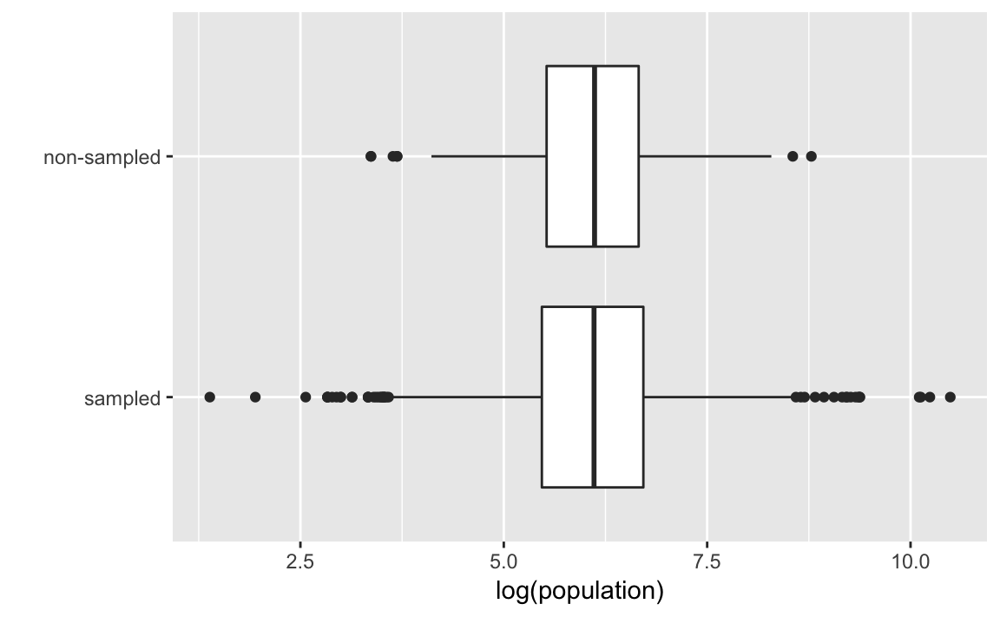


```r
afghan <-
  afghan %>%
  mutate(violent.exp.taliban.fct =
           fct_explicit_na(fct_recode(factor(violent.exp.taliban),
                                      Harm = "1", "No Harm" = "0"),
                           "No response"))
ggplot(afghan, aes(x = violent.exp.ISAF.fct, y = ..prop.., group = 1)) +
  geom_bar() +
  xlab("Response category") +
  ylab("Proportion of respondents") +
  ggtitle("Civilian Victimization by the Taliban")
```

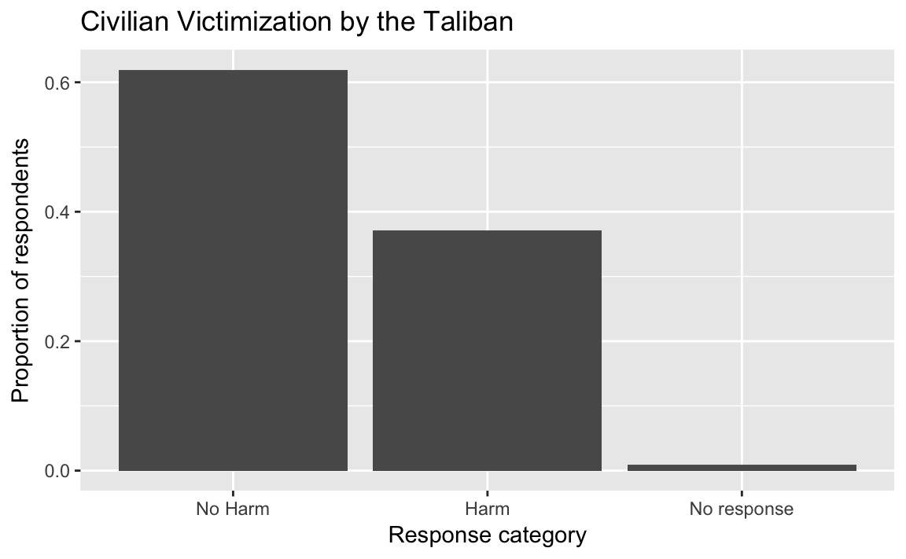

Instead of creating two separate box-plots, create a single plot facetted by ISAF and Taliban:

```r
select(afghan, violent.exp.ISAF, violent.exp.taliban) %>%
  gather(variable, value) %>%
  mutate(value = fct_explicit_na(fct_recode(factor(value),
                                Harm = "1", "No Harm" = "0"),
                                "No response"),
         variable = recode(variable,
                           violent.exp.ISAF = "ISAF",
                           violent.exp.taliban = "Taliban")) %>%
  ggplot(aes(x = value, y = ..prop.., group = 1)) +
  geom_bar() +
  facet_wrap(~ variable, ncol = 1) +
  xlab("Response category") +
  ylab("Proportion of respondents") +
  ggtitle("Civilian Victimization")
```

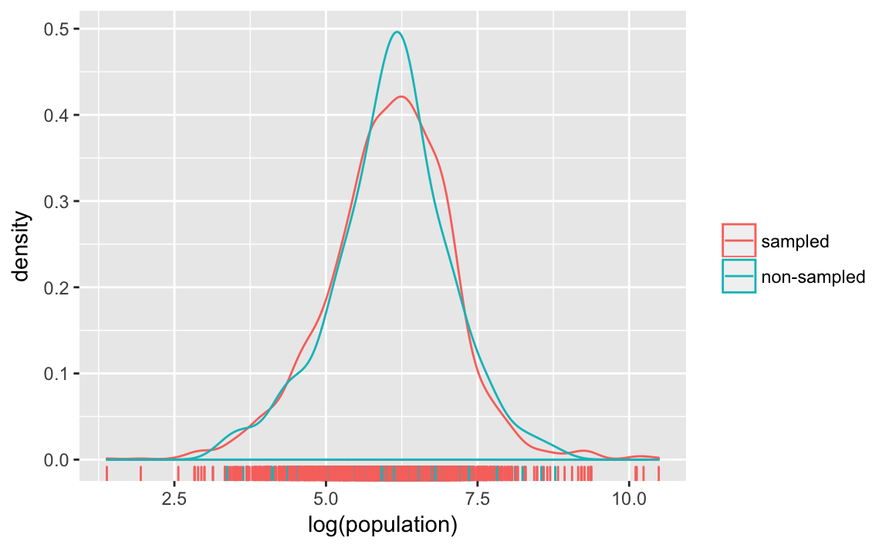

This plot could improved by plotting the two values simultaneously to be able to better compare them.
This will require creating a data frame that has the following columns: perpetrator (`ISAF`, `Taliban`) and response (`No Harm`, `Harm`, `No response`).

```r
violent_exp <-
  afghan %>%
  select(violent.exp.ISAF, violent.exp.taliban) %>%
  gather(perpetrator, response) %>%
  mutate(perpetrator = str_replace(perpetrator, "violent\\.exp\\.", ""),
         perpetrator = str_replace(perpetrator, "taliban", "Taliban"),
         response = fct_recode(factor(response), "Harm" = "1", "No Harm" = "0"),
         response = fct_explicit_na(response, "No response"),
         response = fct_relevel(response, c("No response", "No Harm"))
         ) %>%
  count(perpetrator, response) %>%
  mutate(prop = n / sum(n))
ggplot(violent_exp, aes(x = prop, y = response, color = perpetrator)) +
  geom_point() +
  scale_color_manual(values = c(ISAF = "green", Taliban = "black"))
```

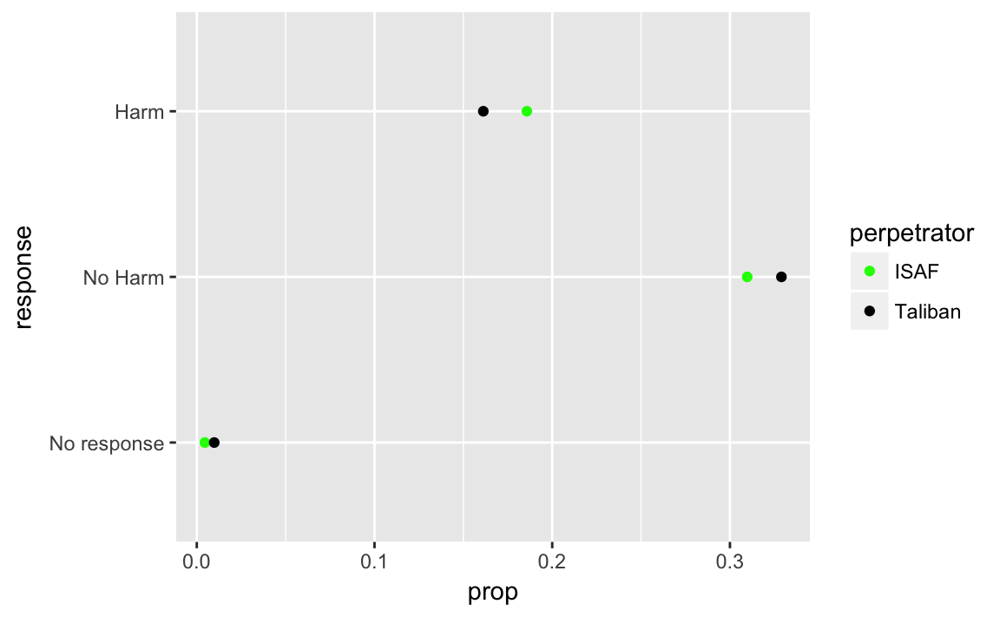

Black was chosen for the Taliban, and Green for ISAF because they are the colors of their respective [flags](https://en.wikipedia.org/wiki/International_Security_Assistance_Force).


### Histogram

See the documentation for [geom_histogram](https://www.rdocumentation.org/packages/ggplot2/topics/geom_histogram).


```r
ggplot(afghan, aes(x = age, y = ..density..)) +
  geom_histogram(binwidth = 5, boundary = 0) +
  scale_x_continuous(breaks = seq(20, 80, by = 10)) +
  labs(title = "Distribution of respondent's age",
       y = "Age", x = "Density")
```

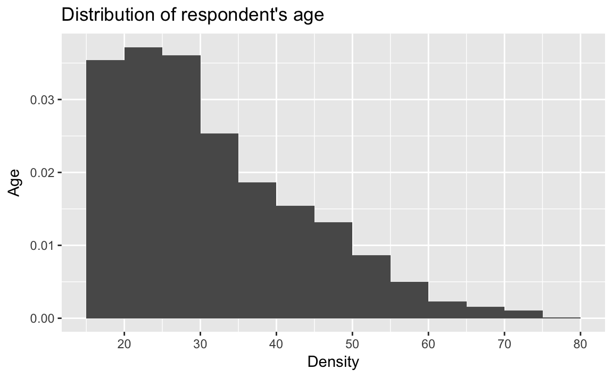


```r
ggplot(afghan, aes(x = educ.years, y = ..density..)) +
  geom_histogram(binwidth = 1, center = 0) +
  geom_vline(xintercept = median(afghan$educ.years),
             color = "white", size = 2) +
  annotate("text", x = median(afghan$educ.years),
           y = 0.2, label = "median", hjust = 0) +
  labs(title = "Distribution of respondent's education",
       x = "Years of education",
       y = "Density")
  
```

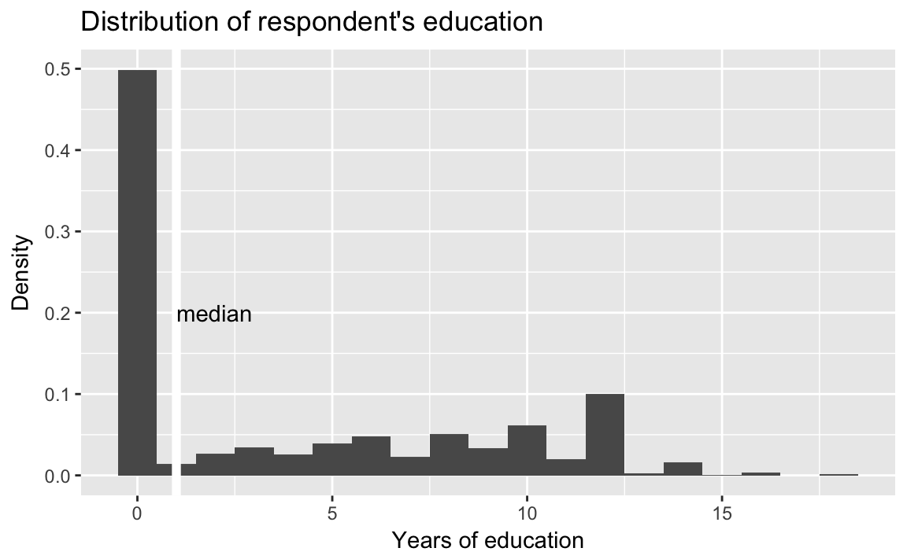

There are several alternatives to the histogram.

Density plots ([geom_density](https://www.rdocumentation.org/packages/ggplot2/topics/geom_density)):

```r
dens_plot <- ggplot(afghan, aes(x = age)) +
  geom_density() +
  scale_x_continuous(breaks = seq(20, 80, by = 10)) +
  labs(title = "Distribution of respondent's age",
       y = "Age", x = "Density")
dens_plot
```

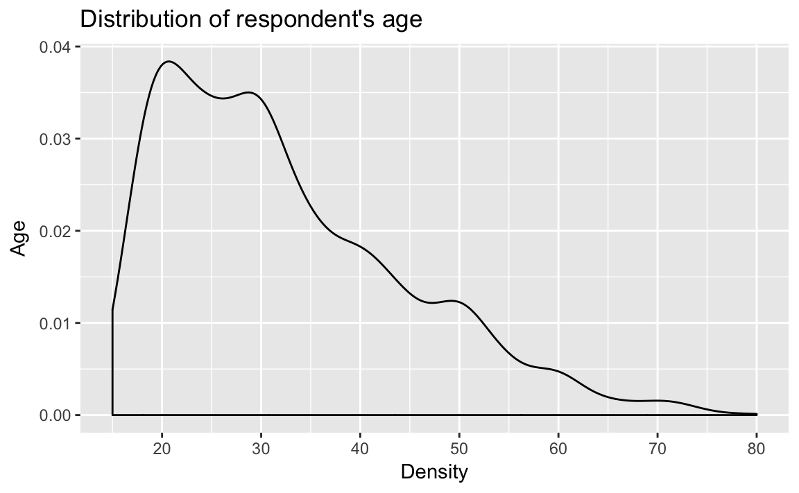
which can be combined with a [geom_rug](https://www.rdocumentation.org/packages/ggplot2/topics/geom_rug) to create a rug plot, which puts small lines on the axis to represent the value of each observation. It can be combined with a scatter or density plot to add extra detail. Adjust the `alpha` to modify the color transparency of the rug and address overplotting.

```r
dens_plot + geom_rug(alpha = .2)
```

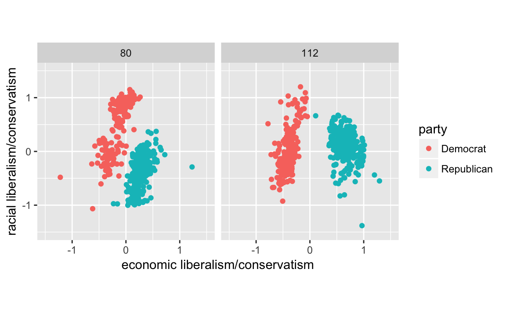

Frequency polygons ([geom_freqpoly](https://www.rdocumentation.org/packages/ggplot2/topics/geom_freqpoly)): See [R for Data Science](http://r4ds.had.co.nz/) [EDA](http://r4ds.had.co.nz/exploratory-data-analysis.html).

```r
ggplot(afghan, aes(x = age)) +
  geom_freqpoly() +
  scale_x_continuous(breaks = seq(20, 80, by = 10)) +
  labs(title = "Distribution of respondent's age",
       y = "Age", x = "Density")
#> `stat_bin()` using `bins = 30`. Pick better value with `binwidth`.
```

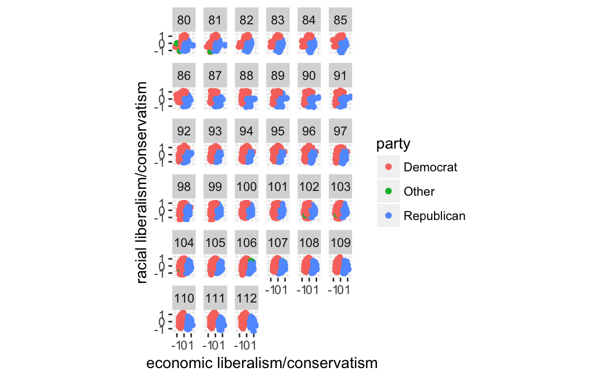


### Boxplot

See the documentation for [geom_boxplot](https://www.rdocumentation.org/packages/ggplot2/topics/geom_boxplot).


```r
ggplot(afghan, aes(x = 1, y = age)) +
  geom_boxplot() +
  coord_flip() +
  labs(y = "Age", x = "", title = "Distribution of Age")
```

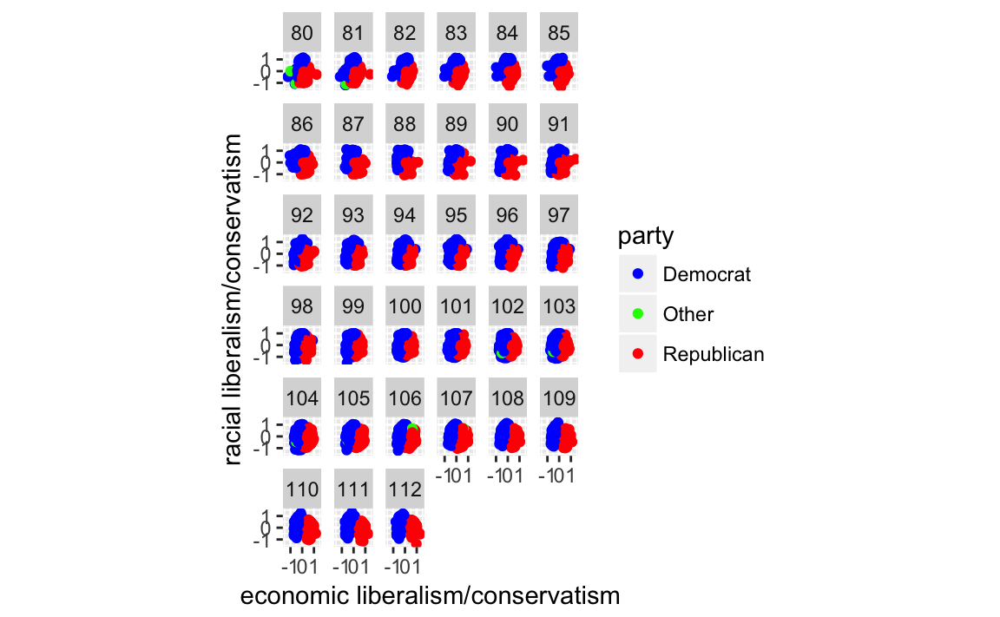


```r
ggplot(afghan, aes(y = educ.years, x = province)) +
  geom_boxplot() +
  coord_flip() +
  labs(x = "Province", y = "Years of education",
       title = "Education by Province")
```

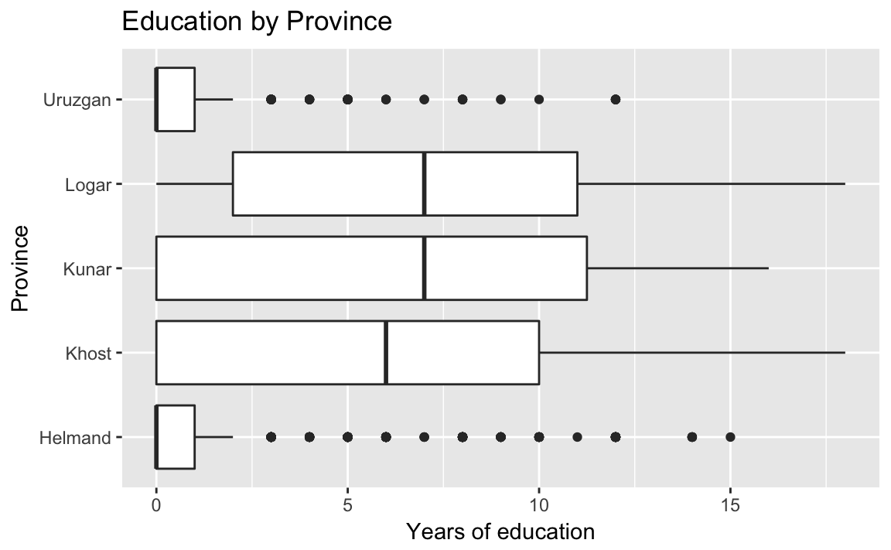
Helmand and Uruzgan have much lower levels of education than the other
provinces, and also report higher levels of violence.


```r
afghan %>%
  group_by(province) %>%
  summarise(educ.years = mean(educ.years, na.rm = TRUE),
            violent.exp.taliban =
              mean(violent.exp.taliban, na.rm = TRUE),
            violent.exp.ISAF =
              mean(violent.exp.ISAF, na.rm = TRUE)) %>%
  arrange(educ.years)
#> # A tibble: 5 x 4
#>   province educ.years violent.exp.taliban violent.exp.ISAF
#>   <chr>         <dbl>               <dbl>            <dbl>
#> 1 Uruzgan        1.04              0.455             0.496
#> 2 Helmand        1.60              0.504             0.541
#> 3 Khost          5.79              0.233             0.242
#> 4 Kunar          5.93              0.303             0.399
#> 5 Logar          6.70              0.0802            0.144
```

An alternatives to the traditional boxplot:


The Tufte boxplot:

```r
library("ggthemes")
ggplot(afghan, aes(y = educ.years, x = province)) +
  geom_tufteboxplot() +
  coord_flip() +
  labs(x = "Province", y = "Years of education",
       title = "Education by Province")
```

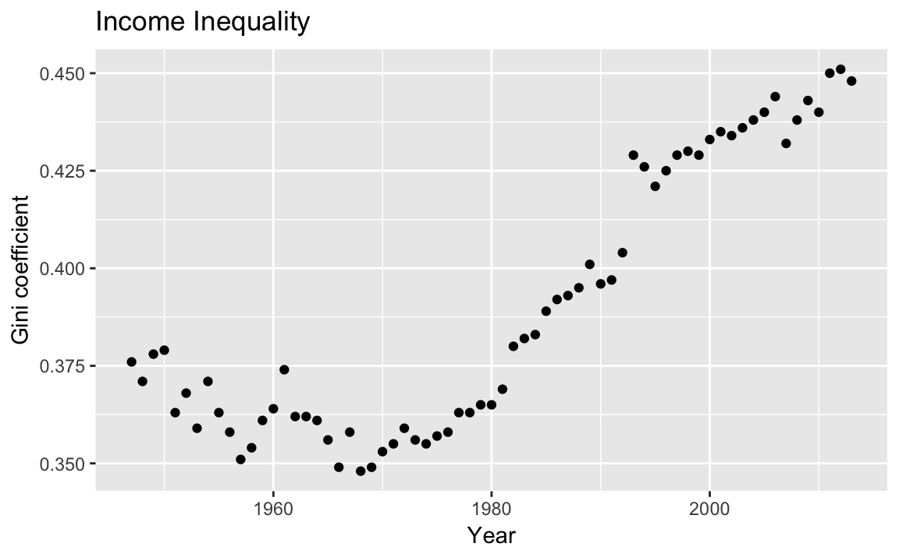
Dot plot with jitter and adjusted alpha to avoid overplotting:

```r
ggplot(afghan, aes(y = educ.years, x = province)) +
  geom_point(position = position_jitter(width = 0.25, height = 0),
             alpha = .2) +
  coord_flip() +
  labs(x = "Province", y = "Years of education",
       title = "Education by Province")
```

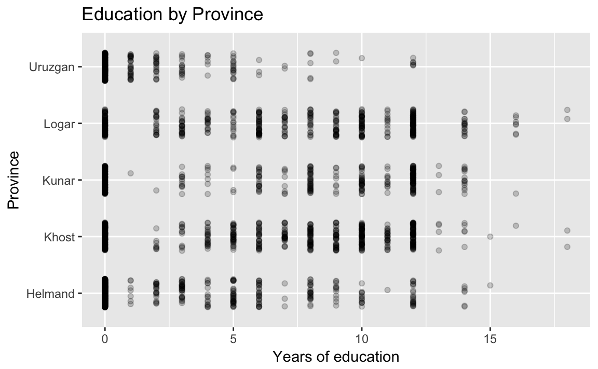
A violin plot:

```r
ggplot(afghan, aes(y = educ.years, x = province)) +
  geom_violin() +
  coord_flip() +
  labs(x = "Province", y = "Years of education",
       title = "Education by Province")
```

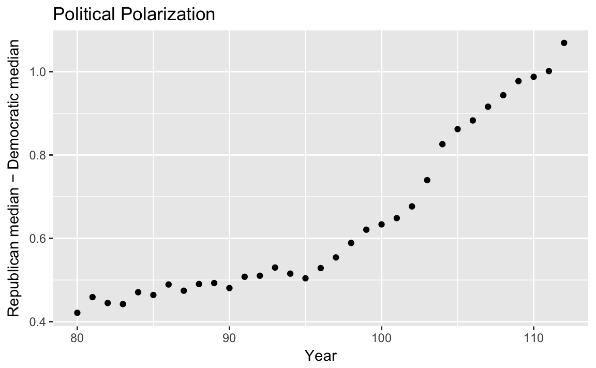


### Printing and saving graphics

Use the function `rdoc ("ggplot2", "ggsave")` to save [ggplot2](https://cran.r-project.org/package=ggplot2) graphics.
Also, R Markdown files have their own means of creating and saving plots created by code-chunks.


## Survey Sampling


### The Role of Randomization


```r
data("afghan.village", package = "qss")
```

Box-plots of altitude

```r
ggplot(afghan.village, aes(x = factor(village.surveyed,
                                      labels = c("sampled", "non-sampled")),
                           y = altitude)) +
  geom_boxplot() +
  labs(y = "Altitude (meter)", x = "") +
  coord_flip()
```

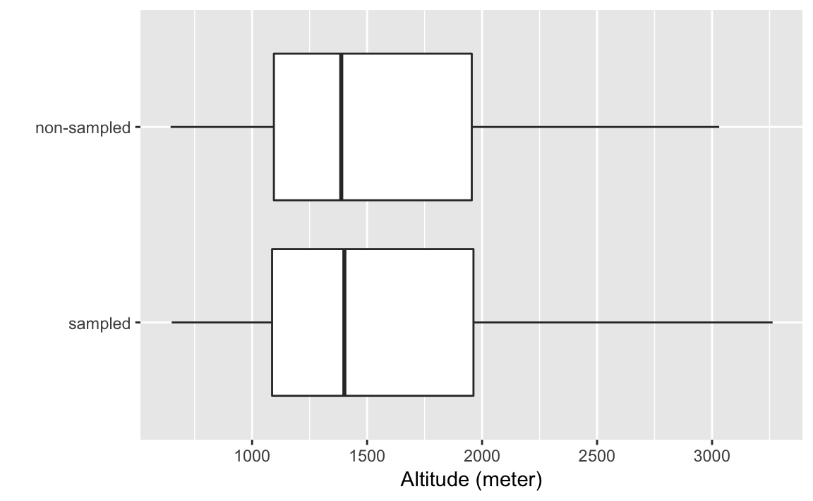

Box plots log-population values of sampled and non-sampled

```r
ggplot(afghan.village, aes(x = factor(village.surveyed,
                                      labels = c("sampled", "non-sampled")),
                           y = log(population))) +
  geom_boxplot() +
  labs(y = "log(population)", x = "") +
  coord_flip()
```


You can also compare these distributions by plotting their densities:

```r
ggplot(afghan.village, aes(colour = factor(village.surveyed,
                                      labels = c("sampled", "non-sampled")),
                           x = log(population))) +
  geom_density() +
  geom_rug() +
  labs(x = "log(population)", colour = "")
```


### Non-response and other sources of bias

Calculate the rates of item non-response by province to the question about civilian victimization by ISAF and Taliban forces (`violent.exp.ISAF` and
`violent.exp.taliban`):

```r
afghan %>%
  group_by(province) %>%
  summarise(ISAF = mean(is.na(violent.exp.ISAF)),
            taliban = mean(is.na(violent.exp.taliban))) %>%
  arrange(-ISAF)
#> # A tibble: 5 x 3
#>   province    ISAF taliban
#>   <chr>      <dbl>   <dbl>
#> 1 Uruzgan  0.0207  0.0620 
#> 2 Helmand  0.0164  0.0304 
#> 3 Khost    0.00476 0.00635
#> 4 Kunar    0       0      
#> 5 Logar    0       0
```

Calculate the proportion who support the ISAF using the difference in means
between the ISAF and control groups:

```r
(mean(filter(afghan, list.group == "ISAF")$list.response) -
  mean(filter(afghan, list.group == "control")$list.response))
#> [1] 0.049
```

To calculate the table responses to the list experiment in the control, ISAF,
and Taliban groups:

```r
afghan %>%
  group_by(list.response, list.group) %>%
  count() %>%
  glimpse() %>%
  spread(list.group, n, fill = 0)
#> Observations: 12
#> Variables: 3
#> $ list.response <int> 0, 0, 1, 1, 1, 2, 2, 2, 3, 3, 3, 4
#> $ list.group    <chr> "control", "ISAF", "control", "ISAF", "taliban",...
#> $ n             <int> 188, 174, 265, 278, 433, 265, 260, 287, 200, 182...
#> # A tibble: 5 x 4
#> # Groups:   list.response [5]
#>   list.response control  ISAF taliban
#>           <int>   <dbl> <dbl>   <dbl>
#> 1             0     188 174         0
#> 2             1     265 278       433
#> 3             2     265 260       287
#> 4             3     200 182       198
#> 5             4       0  24.0       0
```


## Measuring Political Polarization


```r
data("congress", package = "qss")
```


```r
glimpse(congress)
#> Observations: 14,552
#> Variables: 7
#> $ congress <int> 80, 80, 80, 80, 80, 80, 80, 80, 80, 80, 80, 80, 80, 8...
#> $ district <int> 0, 1, 2, 3, 4, 5, 6, 7, 8, 9, 98, 98, 1, 2, 3, 4, 5, ...
#> $ state    <chr> "USA", "ALABAMA", "ALABAMA", "ALABAMA", "ALABAMA", "A...
#> $ party    <chr> "Democrat", "Democrat", "Democrat", "Democrat", "Demo...
#> $ name     <chr> "TRUMAN", "BOYKIN  F.", "GRANT  G.", "ANDREWS  G.", "...
#> $ dwnom1   <dbl> -0.276, -0.026, -0.042, -0.008, -0.082, -0.170, -0.12...
#> $ dwnom2   <dbl> 0.016, 0.796, 0.999, 1.005, 1.066, 0.870, 0.990, 0.89...
```


```r
q <-
  congress %>%
  filter(congress %in% c(80, 112),
         party %in% c("Democrat", "Republican")) %>%
  ggplot(aes(x = dwnom1, y = dwnom2, colour = party)) +
  geom_point() +
  facet_wrap(~ congress) +
  coord_fixed() +
  scale_y_continuous("racial liberalism/conservatism",
                     limits = c(-1.5, 1.5)) +
  scale_x_continuous("economic liberalism/conservatism",
                     limits = c(-1.5, 1.5))
q
```

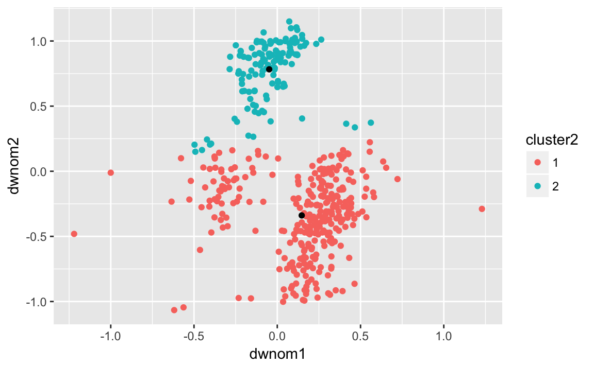

However, since there are colors associated with Democrats (blue) and Republicans (blue), we should use them rather than the defaults.
There's some evidence that using semantically-resonant colors can help decoding data visualizations (See [Lin, et al. 2013](http://vis.stanford.edu/files/2013-SemanticColor-EuroVis.pdf)).
Since I'll reuse the scale several times, I'll save it in a variable.

```r
scale_colour_parties <-
  scale_colour_manual(values = c(Democrat = "blue",
                                 Republican = "red",
                                 Other = "green"))
q + scale_colour_parties
```

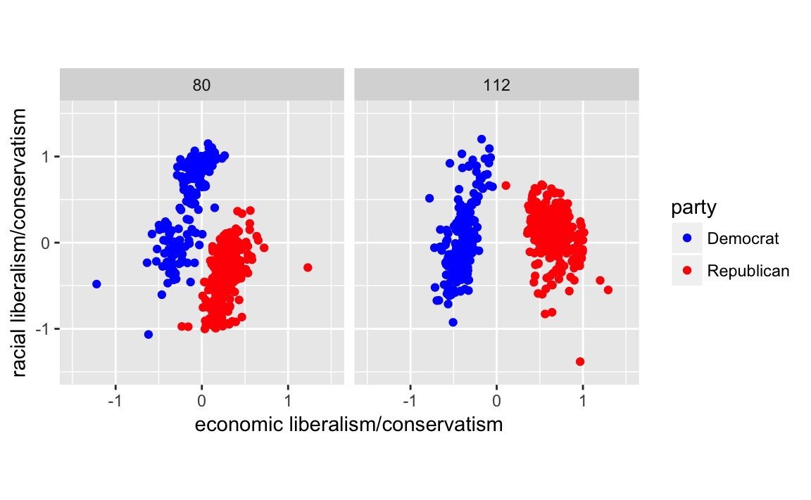


```r
congress %>%
  ggplot(aes(x = dwnom1, y = dwnom2, colour = party)) +
  geom_point() +
  facet_wrap(~ congress) +
  coord_fixed() +
  scale_y_continuous("racial liberalism/conservatism",
                     limits = c(-2, 2)) +
  scale_x_continuous("economic liberalism/conservatism",
                     limits = c(-2, 2)) 
  #scale_colour_parties
```

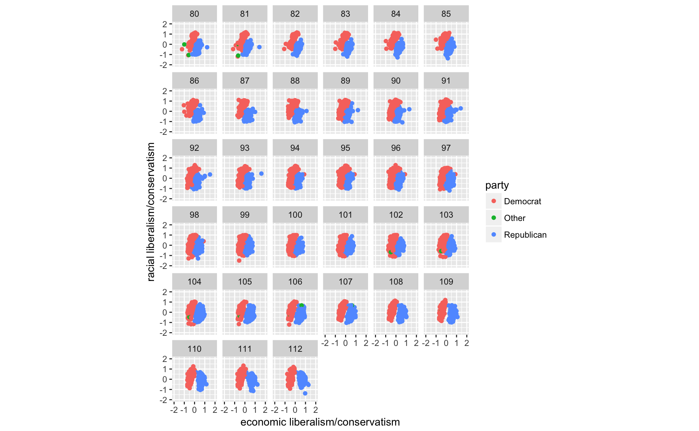


```r
congress %>%
  group_by(congress, party) %>%
  summarise(dwnom1 = mean(dwnom1)) %>%
  filter(party %in% c("Democrat", "Republican")) %>%
  ggplot(aes(x = congress, y = dwnom1,
             colour = fct_reorder2(party, congress, dwnom1))) +
  geom_line() +
  scale_colour_parties +
  labs(y = "DW-NOMINATE score (1st Dimension)", x = "Congress",
       colour = "Party")
```

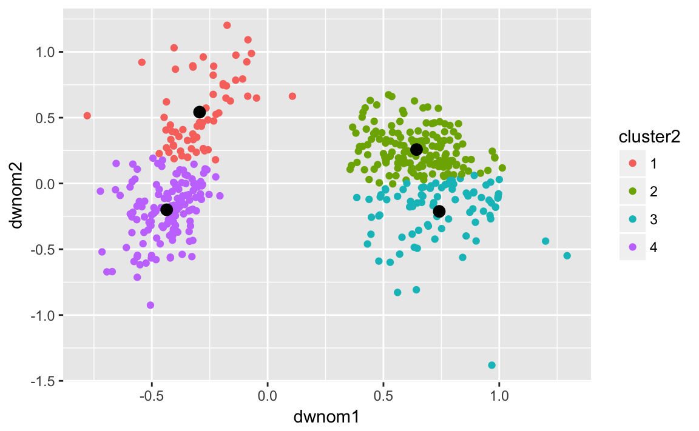

Alternatively, you can plot the mean DW-Nominate scores for each party and congress over time. This plot uses color for parties and lets the points and labels for the first and last congresses (80 and 112) to convey progress through time.


```r
party_means <-
  congress %>%
  filter(party %in% c("Democrat", "Republican")) %>%
  group_by(party, congress) %>%
  summarise(dwnom1 = mean(dwnom1),
            dwnom2 = mean(dwnom2))

party_endpoints <-
  party_means %>%
  filter(congress %in% c(min(congress), max(congress))) %>%
  mutate(label = str_c(party, congress, sep = " - "))

ggplot(party_means, 
         aes(x = dwnom1, y = dwnom2, color = party,
             group = party)) +
  geom_point() +
  geom_path() +
  ggrepel::geom_text_repel(data = party_endpoints,
                           mapping = aes(label = congress),
                           color = "black") +
  scale_y_continuous("racial liberalism/conservatism") +
  scale_x_continuous("economic liberalism/conservatism") +
  scale_colour_parties
```

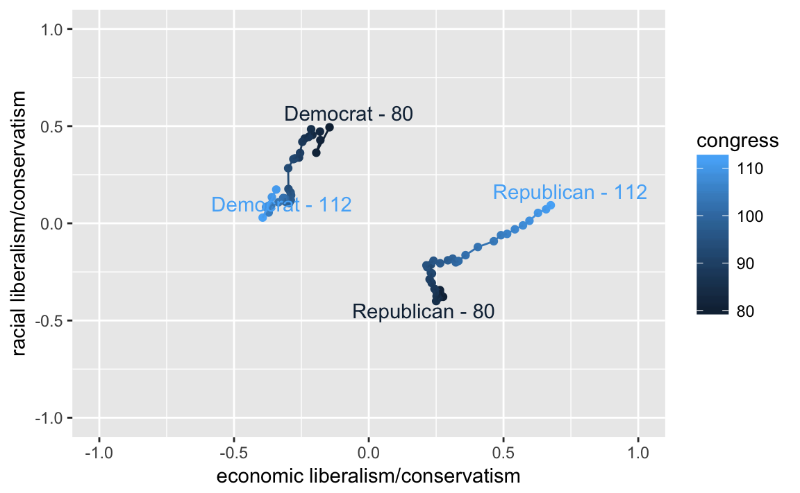


### Correlation

Let's plot the Gini coefficient

```r
data("USGini", package = "qss")
```


```r
ggplot(USGini, aes(x = year, y = gini)) +
  geom_point() +
  geom_line() +
  labs(x = "Year", y = "Gini coefficient") +
  ggtitle("Income Inequality")
```


To calculate a measure of party polarization take the code used in the plot of Republican and Democratic party median ideal points and adapt it to calculate the difference in the party medians:


```r
party_polarization <-
  congress %>%
  group_by(congress, party) %>%
  summarise(dwnom1 = mean(dwnom1)) %>%
  filter(party %in% c("Democrat", "Republican")) %>%
  spread(party, dwnom1) %>%
  mutate(polarization = Republican - Democrat)
party_polarization
#> # A tibble: 33 x 4
#> # Groups:   congress [33]
#>   congress Democrat Republican polarization
#>      <int>    <dbl>      <dbl>        <dbl>
#> 1       80   -0.146      0.276        0.421
#> 2       81   -0.195      0.264        0.459
#> 3       82   -0.180      0.265        0.445
#> 4       83   -0.181      0.261        0.442
#> 5       84   -0.209      0.261        0.471
#> 6       85   -0.214      0.250        0.464
#> # ... with 27 more rows
```


```r
ggplot(party_polarization, aes(x = congress, y = polarization)) +
  geom_point() +
  geom_line() +
  ggtitle("Political Polarization") +
  labs(x = "Year", y = "Republican median − Democratic median")
```

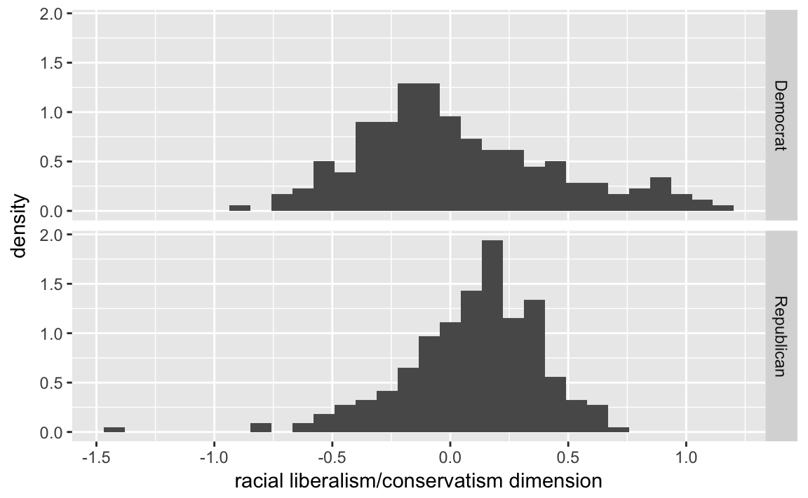


### Quantile-Quantile Plot


```r
congress %>%
  filter(congress == 112, party %in% c("Republican", "Democrat")) %>%
  ggplot(aes(x = dwnom2, y = ..density..)) +
  geom_histogram(binwidth = .2) +
  facet_grid(party ~ .) +
  labs(x = "racial liberalism/conservatism dimension")
```

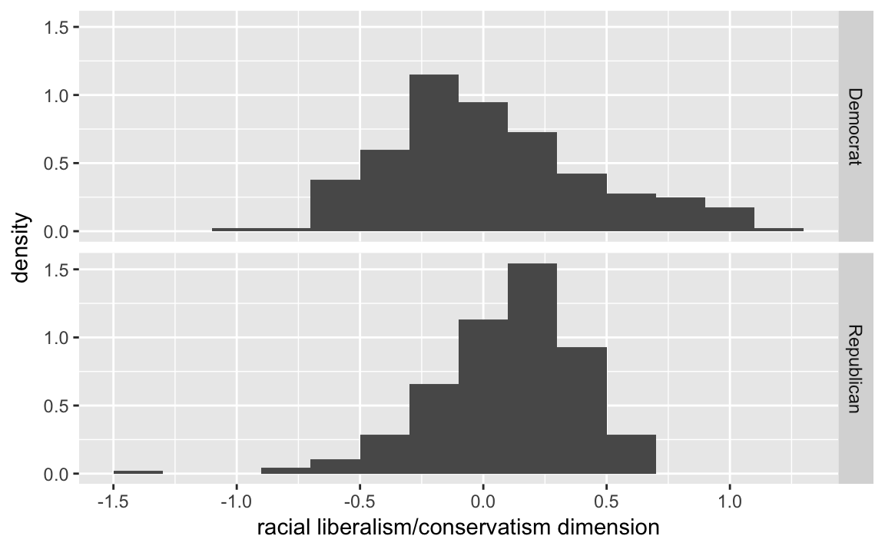

The package *ggplot2* includes a function `stat_qq` which can be used to create qq-plots but it is more suited to comparing a sample distribution with a theoretical distribution, usually the normal one.
However, we can calculate one by hand, which may give more insight into exactly what the qq-plot is doing.

```r
party_qtiles <- tibble(
  probs = seq(0, 1, by = 0.01),
  Democrat = quantile(filter(congress, congress == 112,
                             party == "Democrat")$dwnom2,
         probs = probs),
  Republican = quantile(filter(congress, congress == 112,
                               party == "Republican")$dwnom2,
         probs = probs)
)
party_qtiles
#> # A tibble: 101 x 3
#>    probs Democrat Republican
#>    <dbl>    <dbl>      <dbl>
#> 1 0        -0.925     -1.38 
#> 2 0.0100   -0.672     -0.720
#> 3 0.0200   -0.619     -0.566
#> 4 0.0300   -0.593     -0.526
#> 5 0.0400   -0.567     -0.468
#> 6 0.0500   -0.560     -0.436
#> # ... with 95 more rows
```


The plot looks different than the one in the text since the x- and y-scales are in the original values instead of z-scores (see the next section).


```r
party_qtiles %>%
  ggplot(aes(x = Democrat, y = Republican)) +
  geom_point() +
  geom_abline() +
  coord_fixed()
```

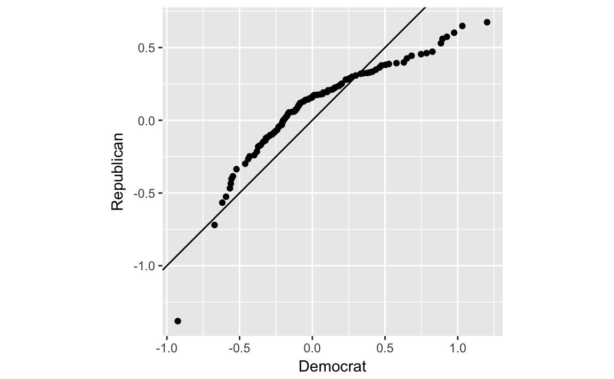


## Clustering


### Matrices

While matrices are great for numerical computations, such as when you are
implementing algorithms, generally keeping data in data frames is more convenient for data wrangling.

See [R for Data Science](http://r4ds.had.co.nz/) chapter [Vectors](http://r4ds.had.co.nz/vectors.html).


### Lists

See [R for Data Science](http://r4ds.had.co.nz/) chapters [Vectors](http://r4ds.had.co.nz/vectors.html) and [Iteration](http://r4ds.had.co.nz/iteration.html), as well as the [purrr](https://cran.r-project.org/package=purrr) package for more powerful methods of computing on lists.


### k-means algorithms

Calculate the clusters by the 80th and 112th congresses:

```r
k80two.out <-
  kmeans(select(filter(congress, congress == 80),
                       dwnom1, dwnom2),
              centers = 2, nstart = 5)
```

Add the cluster ids to data sets:

```r
congress80 <-
  congress %>%
  filter(congress == 80) %>%
  mutate(cluster2 = factor(k80two.out$cluster))
```

We will also create a data sets with the cluster centroids.
These are in the `centers` element of the cluster object.

```r
k80two.out$centers
#>    dwnom1 dwnom2
#> 1 -0.0484  0.783
#> 2  0.1468 -0.339
```

To make it easier to use with [ggplot2](https://cran.r-project.org/package=ggplot2), we need to convert this to a data frame.
The [tidy](https://www.rdocumentation.org/packages/broom/topics/tidy) function from the [broom](https://cran.r-project.org/package=broom) package:

```r
k80two.clusters <- tidy(k80two.out)
k80two.clusters
#>        x1     x2 size withinss cluster
#> 1 -0.0484  0.783  135     10.9       1
#> 2  0.1468 -0.339  311     54.9       2
```

Plot the ideal points and clusters:

```r
ggplot() +
  geom_point(data = congress80,
             aes(x = dwnom1, y = dwnom2, colour = cluster2)) +
  geom_point(data = k80two.clusters, mapping = aes(x = x1, y = x2))
```

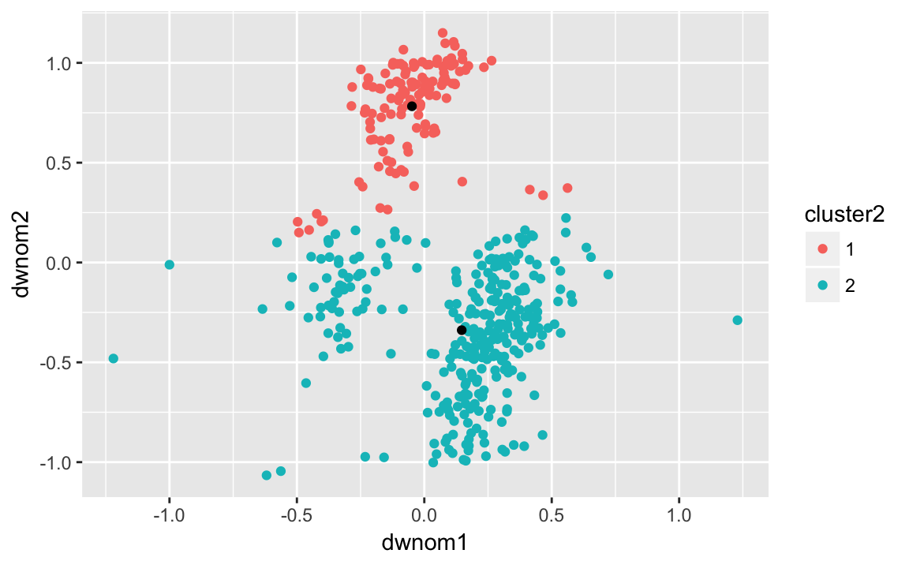


```r
congress80 %>%
  group_by(party, cluster2) %>%
  count()
#> # A tibble: 5 x 3
#> # Groups:   party, cluster2 [5]
#>   party      cluster2     n
#>   <chr>      <fct>    <int>
#> 1 Democrat   1          132
#> 2 Democrat   2           62
#> 3 Other      2            2
#> 4 Republican 1            3
#> 5 Republican 2          247
```

And now we can repeat these steps for the 112th congress:

```r
k112two.out <-
  kmeans(select(filter(congress, congress == 112),
                dwnom1, dwnom2),
         centers = 2, nstart = 5)
congress112 <-
  filter(congress, congress == 112) %>%
  mutate(cluster2 = factor(k112two.out$cluster))
k112two.clusters <- tidy(k112two.out)
ggplot() +
  geom_point(data = congress112,
             mapping = aes(x = dwnom1, y = dwnom2, colour = cluster2)) +
  geom_point(data = k112two.clusters,
             mapping = aes(x = x1, y = x2))
```

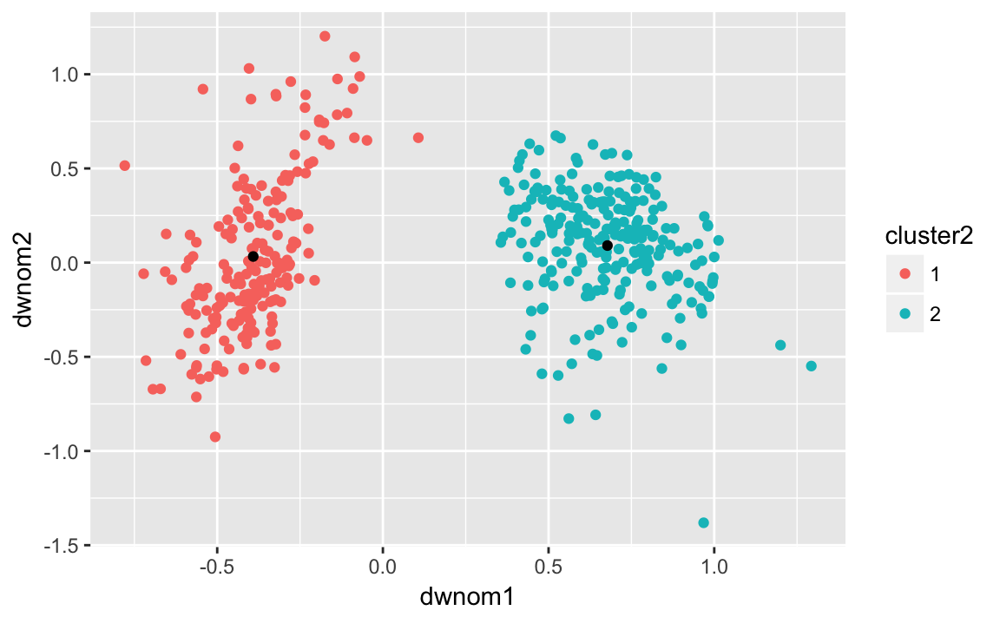

Number of observations from each party in each cluster:

```r
congress112 %>%
  group_by(party, cluster2) %>%
  count()
#> # A tibble: 3 x 3
#> # Groups:   party, cluster2 [3]
#>   party      cluster2     n
#>   <chr>      <fct>    <int>
#> 1 Democrat   1          200
#> 2 Republican 1            1
#> 3 Republican 2          242
```

Now repeat the same with four clusters on the 80th congress:

```r
k80four.out <-
  kmeans(select(filter(congress, congress == 80),
                dwnom1, dwnom2),
         centers = 4, nstart = 5)
congress80 <-
  filter(congress, congress == 80) %>%
  mutate(cluster2 = factor(k80four.out$cluster))
k80four.clusters <- tidy(k80four.out)
ggplot() +
  geom_point(data = congress80,
             mapping = aes(x = dwnom1, y = dwnom2, colour = cluster2)) +
  geom_point(data = k80four.clusters,
             mapping = aes(x = x1, y = x2), size = 3)
```

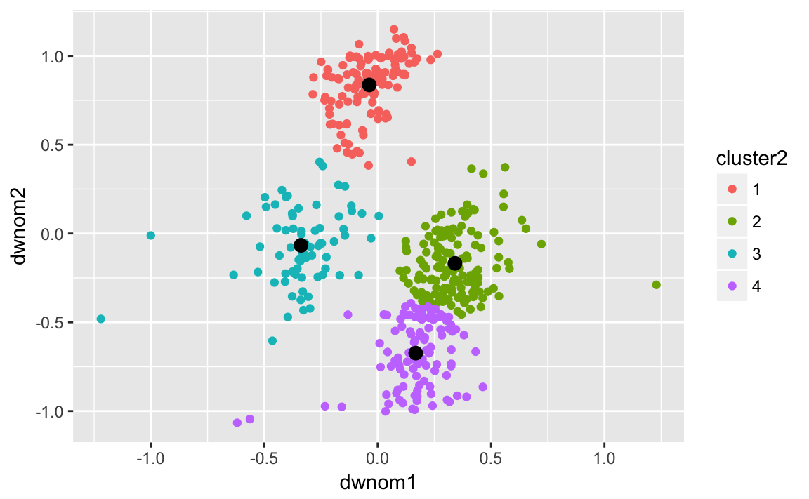
and on the 112th congress:

```r
k112four.out <-
  kmeans(select(filter(congress, congress == 112),
                dwnom1, dwnom2),
         centers = 4, nstart = 5)
congress112 <-
  filter(congress, congress == 112) %>%
  mutate(cluster2 = factor(k112four.out$cluster))
k112four.clusters <- tidy(k112four.out)
ggplot() +
  geom_point(data = congress112,
             mapping = aes(x = dwnom1, y = dwnom2, colour = cluster2)) +
  geom_point(data = k112four.clusters,
             mapping = aes(x = x1, y = x2), size = 3)
```

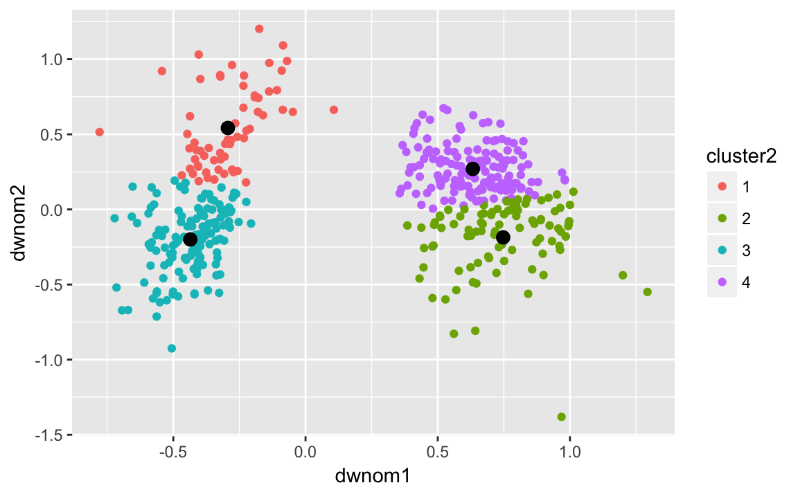
