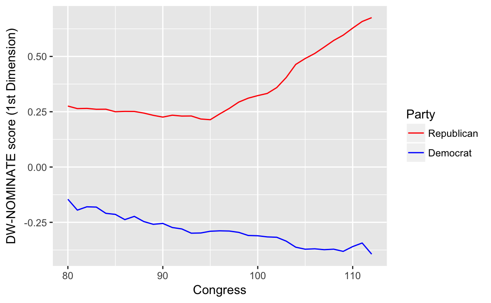

# Measurement

## Prerequisites


```r
library("tidyverse")
library("forcats")
library("broom")
```

## Measuring Civilian Victimization during Wartime


```r
afghan <- read_csv(qss_data_url("measurement", "afghan.csv"))
```

Summarize the variables of interest

```r
afghan %>%
  select(age, educ.years, employed, income) %>%
  summary()
#>       age         educ.years    employed        income         
#>  Min.   :15.0   Min.   : 0   Min.   :0.000   Length:2754       
#>  1st Qu.:22.0   1st Qu.: 0   1st Qu.:0.000   Class :character  
#>  Median :30.0   Median : 1   Median :1.000   Mode  :character  
#>  Mean   :32.4   Mean   : 4   Mean   :0.583                     
#>  3rd Qu.:40.0   3rd Qu.: 8   3rd Qu.:1.000                     
#>  Max.   :80.0   Max.   :18   Max.   :1.000
```

With `income`,  never converts strings to factors by default.
To get a summary of the different levels, either convert it to a factor (R4DS Ch 15), or use `count()`

```r
afghan %>%
  count(income)
#> # A tibble: 6 × 2
#>            income     n
#>             <chr> <int>
#> 1   10,001-20,000   616
#> 2    2,001-10,000  1420
#> 3   20,001-30,000    93
#> 4 less than 2,000   457
#> 5     over 30,000    14
#> 6            <NA>   154
```

Count the number a proportion of respondents who answer that they were harmed by the ISF (`violent.exp.ISAF`) and (`violent.exp.taliban`) respectively,

```r
afghan %>%
  group_by(violent.exp.ISAF, violent.exp.taliban) %>%
  count() %>%
  ungroup() %>%
  mutate(prop = n / sum(n))
#> # A tibble: 9 × 4
#>   violent.exp.ISAF violent.exp.taliban     n    prop
#>              <int>               <int> <int>   <dbl>
#> 1                0                   0  1330 0.48293
#> 2                0                   1   354 0.12854
#> 3                0                  NA    22 0.00799
#> 4                1                   0   475 0.17248
#> 5                1                   1   526 0.19099
#> 6                1                  NA    22 0.00799
#> # ... with 3 more rows
```
We need to use `ungroup()` in order to ensure that `sum(n)` sums over the entire
dataset as opposed to only within categories of `violent.exp.ISAF`.


Unlike `prop.table`, the code above does not drop missing values.
We can drop those values by adding a `filter` verb and using `!is.na()` to test
for missing values in those variables:

```r
afghan %>%
  filter(!is.na(violent.exp.ISAF), !is.na(violent.exp.taliban)) %>%
  group_by(violent.exp.ISAF, violent.exp.taliban) %>%
  count() %>%
  ungroup() %>%
  mutate(prop = n / sum(n))
#> # A tibble: 4 × 4
#>   violent.exp.ISAF violent.exp.taliban     n  prop
#>              <int>               <int> <int> <dbl>
#> 1                0                   0  1330 0.495
#> 2                0                   1   354 0.132
#> 3                1                   0   475 0.177
#> 4                1                   1   526 0.196
```

### Handling Missing Data in R

We already observed the issues with `NA` values in calculating the proportion
answering the "experienced violence" questions.

You can filter rows with specific variables having missing values using `filter`
as shown above.

However, `na.omit` works with tibbles just like any other data frame.

```r
na.omit(afghan)
#> # A tibble: 2,554 × 11
#>   province     district village.id   age educ.years employed        income
#>      <chr>        <chr>      <int> <int>      <int>    <int>         <chr>
#> 1    Logar Baraki Barak         80    26         10        0  2,001-10,000
#> 2    Logar Baraki Barak         80    49          3        1  2,001-10,000
#> 3    Logar Baraki Barak         80    60          0        1  2,001-10,000
#> 4    Logar Baraki Barak         80    34         14        1  2,001-10,000
#> 5    Logar Baraki Barak         80    21         12        1  2,001-10,000
#> 6    Logar Baraki Barak         80    42          6        1 10,001-20,000
#> # ... with 2,548 more rows, and 4 more variables: violent.exp.ISAF <int>,
#> #   violent.exp.taliban <int>, list.group <chr>, list.response <int>
```

## Visualizing the Univariate Distribution 

### Barplot


```r
library(forcats)
afghan <-
  afghan %>%
  mutate(violent.exp.ISAF.fct = 
           fct_explicit_na(fct_recode(factor(violent.exp.ISAF),
                                      Harm = "1", "No Harm" = "0"),
                           "No response"))
ggplot(afghan, aes(x = violent.exp.ISAF.fct, y = ..prop.., group = 1)) +
  geom_bar() +
  xlab("Response category") +
  ylab("Proportion of respondents") +
  ggtitle("Civilian Victimization by the ISAF")
```


```r
afghan <-
  afghan %>%
  mutate(violent.exp.taliban.fct = 
           fct_explicit_na(fct_recode(factor(violent.exp.taliban),
                                      Harm = "1", "No Harm" = "0"),
                           "No response"))
ggplot(afghan, aes(x = violent.exp.ISAF.fct, y = ..prop.., group = 1)) +
  geom_bar() +
  xlab("Response category") +
  ylab("Proportion of respondents") +
  ggtitle("Civilian Victimization by the Taliban")
```


This plot could improved by plotting the two values simultaneously to be able to better compare them.

This will require creating a data frame that has the following columns: perpetrator (`ISAF`, `Taliban`), response (`No Harm`, `Harm`, `No response`). 


```r
library("tidyr")
violent_exp <-
  afghan %>%
  select(violent.exp.ISAF, violent.exp.taliban) %>%
  gather(perpetrator, response) %>%
  mutate(perpetrator = str_replace(perpetrator, "violent\\.exp\\.", ""),
         perpetrator = str_replace(perpetrator, "taliban", "Taliban"),
         response = fct_recode(factor(response), c("Harm" = "1", "No Harm" = "0")),
         response = fct_explicit_na(response, "No response"),
         response = fct_relevel(response, c("No response", "No Harm"))) %>%
  count(perpetrator, response) %>%
  mutate(prop = n / sum(n))
         
ggplot(violent_exp, aes(x = prop, y = response, color = perpetrator)) +
  geom_point() +
  scale_color_manual(values = c(ISAF = "green", Taliban = "black"))
```


Black was chosen for the Taliban, and Green for ISAF because it is the color of their respective [flags](https://en.wikipedia.org/wiki/International_Security_Assistance_Force).


### Boxplot


```r
ggplot(afghan, aes(x = 1, y = age)) +
  geom_boxplot() +
  coord_flip() +
  labs(y = "Age", x = "") +
  ggtitle("Distribution of Age")
```


```r
ggplot(afghan, aes(y = educ.years, x = province)) +
  geom_boxplot() +
  coord_flip() +
  labs(x = "Province", y = "Years of education") +
  ggtitle("Education by Province")
```


Helmand and Uruzgan have much lower levels of education than the other
provinces, and also report higher levels of violence.

```r
afghan %>%
  group_by(province) %>%
  summarise(educ.years = mean(educ.years, na.rm = TRUE),
            violent.exp.taliban =
              mean(violent.exp.taliban, na.rm = TRUE),
            violent.exp.ISAF =
              mean(violent.exp.ISAF, na.rm = TRUE)) %>%
  arrange(educ.years)
#> # A tibble: 5 × 4
#>   province educ.years violent.exp.taliban violent.exp.ISAF
#>      <chr>      <dbl>               <dbl>            <dbl>
#> 1  Uruzgan       1.04              0.4545            0.496
#> 2  Helmand       1.60              0.5042            0.541
#> 3    Khost       5.79              0.2332            0.242
#> 4    Kunar       5.93              0.3030            0.399
#> 5    Logar       6.70              0.0802            0.144
```

### Printing and saving graphics

Use the function `ggsave()` to save **ggplot2** graphics. 

Also, R Markdown files have their own means of creating and saving plots
created by code-chunks.


## Survey Sampling

### The Role of Randomization

## load village data


```r
afghan.village <- read_csv(qss_data_url("measurement", "afghan-village.csv"))
```

Box-plots of altitude

```r
ggplot(afghan.village, aes(x = factor(village.surveyed,
                                      labels = c("sampled", "non-sampled")),
                           y = altitude)) +
  geom_boxplot() +
  labs(y = "Altitude (meter)", x = "") +
  coord_flip()
```


Box plots log-population values of sampled and non-sampled

```r
ggplot(afghan.village, aes(x = factor(village.surveyed,
                                      labels = c("sampled", "non-sampled")),
                           y = log(population))) +
  geom_boxplot() +
  labs(y = "log(population)", x = "") +
  coord_flip()
```


You can also compare these distributions by plotting their densities:

```r
ggplot(afghan.village, aes(colour = factor(village.surveyed,
                                      labels = c("sampled", "non-sampled")),
                           x = log(population))) +
  geom_density() +
  geom_rug() +
  labs(x = "log(population)", colour = "")
```


The function [geom_rug](http://docs.ggplot2.org/current/geom_rug.html), creates a rug plot, which puts small lines on the axis to represent the value of each observation.
It can be combined with a scatter or density plot to add extra detail.

### Non-response and other sources of bias

Calculate the rates of non-response by province to `violent.exp.ISAF` and
`violent.exp.taliban`:

```r
afghan %>%
  group_by(province) %>%
  summarise(ISAF = mean(is.na(violent.exp.ISAF)),
            taliban = mean(is.na(violent.exp.taliban))) %>%
  arrange(-ISAF)
#> # A tibble: 5 × 3
#>   province    ISAF taliban
#>      <chr>   <dbl>   <dbl>
#> 1  Uruzgan 0.02067 0.06202
#> 2  Helmand 0.01637 0.03041
#> 3    Khost 0.00476 0.00635
#> 4    Kunar 0.00000 0.00000
#> 5    Logar 0.00000 0.00000
```


Calculate the proportion who support the ISAF using the difference in means
between the ISAF and control groups:

```r
(mean(filter(afghan, list.group == "ISAF")$list.response) -
  mean(filter(afghan, list.group == "control")$list.response))
#> [1] 0.049
```


To calculate the table responses to the list experiment in the control, ISAF,
and Taliban groups>

```r
afghan %>%
  group_by(list.response, list.group) %>%
  count() %T>%
  glimpse() %>%
  spread(list.group, n, fill = 0)
#> Observations: 12
#> Variables: 3
#> $ list.response <int> 0, 0, 1, 1, 1, 2, 2, 2, 3, 3, 3, 4
#> $ list.group    <chr> "control", "ISAF", "control", "ISAF", "taliban",...
#> $ n             <int> 188, 174, 265, 278, 433, 265, 260, 287, 200, 182...
#> Source: local data frame [5 x 4]
#> Groups: list.response [5]
#> 
#>   list.response control  ISAF taliban
#> *         <int>   <dbl> <dbl>   <dbl>
#> 1             0     188   174       0
#> 2             1     265   278     433
#> 3             2     265   260     287
#> 4             3     200   182     198
#> 5             4       0    24       0
```

## Measuring Political Polarization


```r
congress <- read_csv(qss_data_url("measurement", "congress.csv"))
```


```r
glimpse(congress)
#> Observations: 14,552
#> Variables: 7
#> $ congress <int> 80, 80, 80, 80, 80, 80, 80, 80, 80, 80, 80, 80, 80, 8...
#> $ district <int> 0, 1, 2, 3, 4, 5, 6, 7, 8, 9, 98, 98, 1, 2, 3, 4, 5, ...
#> $ state    <chr> "USA", "ALABAMA", "ALABAMA", "ALABAMA", "ALABAMA", "A...
#> $ party    <chr> "Democrat", "Democrat", "Democrat", "Democrat", "Demo...
#> $ name     <chr> "TRUMAN", "BOYKIN  F.", "GRANT  G.", "ANDREWS  G.", "...
#> $ dwnom1   <dbl> -0.276, -0.026, -0.042, -0.008, -0.082, -0.170, -0.12...
#> $ dwnom2   <dbl> 0.016, 0.796, 0.999, 1.005, 1.066, 0.870, 0.990, 0.89...
```


```r
q <- 
  congress %>%
  filter(congress %in% c(80, 112), 
         party %in% c("Democrat", "Republican")) %>%
  ggplot(aes(x = dwnom1, y = dwnom2, colour = party)) +
  geom_point() +
  facet_wrap(~ congress) +
  coord_fixed() +
  scale_y_continuous("racial liberalism/conservatism",
                     limits = c(-1.5, 1.5)) +
  scale_x_continuous("economic liberalism/conservatism",
                     limits = c(-1.5, 1.5))
q
```


However, since there are colors associated with Democrats (blue) and Republicans (blue), we should use them rather than the defaults.
There's some evidence that using semantically-resonant colors can help decoding data visualizations ([Lin, et al. 2013](http://vis.stanford.edu/files/2013-SemanticColor-EuroVis.pdf)).

Since I'll reuse the scale several times, I'll save it in a variable.

```r
scale_colour_parties <-
  scale_colour_manual(values = c(Democrat = "blue",
                                 Republican = "red",
                                 Other = "green"))
q + scale_colour_parties
```


```r
congress %>%
  ggplot(aes(x = dwnom1, y = dwnom2, colour = party)) +
  geom_point() +
  facet_wrap(~ congress) +
  coord_fixed() +
  scale_y_continuous("racial liberalism/conservatism",
                     limits = c(-1.5, 1.5)) +
  scale_x_continuous("economic liberalism/conservatism",
                     limits = c(-1.5, 1.5)) +
  scale_colour_parties
#> Warning: Removed 2 rows containing missing values (geom_point).
```


```r
congress %>%
  group_by(congress, party) %>%
  summarise(dwnom1 = mean(dwnom1)) %>%
  filter(party %in% c("Democrat", "Republican")) %>%
  ggplot(aes(x = congress, y = dwnom1, 
             colour = fct_reorder2(party, congress, dwnom1))) +
  geom_line() +
  scale_colour_parties +
  labs(y = "DW-NOMINATE score (1st Dimension)", x = "Congress",
       colour = "Party")
```




### Correlation

Let's plot the Gini coefficient

```r
USGini <- read_csv(qss_data_url("measurement", "USGini.csv"))
#> Warning: Missing column names filled in: 'X1' [1]
```


```r
ggplot(USGini, aes(x = year, y = gini)) +
  geom_point() +
  geom_line() +
  labs(x = "Year", y = "Gini coefficient") +
  ggtitle("Income Inequality")
```


To calculate a measure of party polarization take the code used in the plot of Republican and Democratic party median ideal points and adapt it to calculate the difference in the party medians:

```r
party_polarization <- 
  congress %>%
  group_by(congress, party) %>%
  summarise(dwnom1 = mean(dwnom1)) %>%
  filter(party %in% c("Democrat", "Republican")) %>%
  spread(party, dwnom1) %>%
  mutate(polarization = Republican - Democrat)
party_polarization
#> Source: local data frame [33 x 4]
#> Groups: congress [33]
#> 
#>   congress Democrat Republican polarization
#>      <int>    <dbl>      <dbl>        <dbl>
#> 1       80   -0.146      0.276        0.421
#> 2       81   -0.195      0.264        0.459
#> 3       82   -0.180      0.265        0.445
#> 4       83   -0.181      0.261        0.442
#> 5       84   -0.209      0.261        0.471
#> 6       85   -0.214      0.250        0.464
#> # ... with 27 more rows
```


```r
ggplot(party_polarization, aes(x = congress, y = polarization)) +
  geom_point() +
  geom_line() +
  ggtitle("Political Polarization") +
  labs(x = "Year", y = "Republican median − Democratic median")
```


### Quantile-Quantile Plot


```r
congress %>%
  filter(congress == 112, party %in% c("Republican", "Democrat")) %>%
  ggplot(aes(x = dwnom2, y = ..density..)) +
  geom_histogram() +
  facet_grid(party ~ .) + 
  labs(x = "racial liberalism/conservatism dimension")
#> `stat_bin()` using `bins = 30`. Pick better value with `binwidth`.
```


*ggplot2* includes a `stat_qq` which can be used to create qq-plots but it is more suited to comparing a sample distribution with a theoretical distribution, usually the normal one.
However, we can calculate one by hand, which may give more insight into exactly what the qq-plot is doing.


```r
party_qtiles <- tibble(
  probs = seq(0, 1, by = 0.01),
  Democrat = quantile(filter(congress, congress == 112, party == "Democrat")$dwnom2,
         probs = probs),
  Republican = quantile(filter(congress, congress == 112, party == "Republican")$dwnom2,
         probs = probs)
)
party_qtiles
#> # A tibble: 101 × 3
#>   probs Democrat Republican
#>   <dbl>    <dbl>      <dbl>
#> 1  0.00   -0.925     -1.381
#> 2  0.01   -0.672     -0.720
#> 3  0.02   -0.619     -0.566
#> 4  0.03   -0.593     -0.526
#> 5  0.04   -0.567     -0.468
#> 6  0.05   -0.560     -0.436
#> # ... with 95 more rows
```

The plot looks different than the one in the text since the x- and y-scales are in the original values instead of z-scores (see the next section).

```r
party_qtiles %>%
  ggplot(aes(x = Democrat, y = Republican)) + 
  geom_point() +
  geom_abline() +
  coord_fixed()
```


## Clustering


### Matrices

While matrices are great for numerical computations, such as when you are 
implementing algorithms, generally keeping data in data frames is more convenient for data wrangling.

### Lists 

See R4DS [Chapter 20: Vectors](http://r4ds.had.co.nz/vectors.html),  [Chapter 21: Iteration](http://r4ds.had.co.nz/iteration.html) and the **purrr** package for more powerful methods of computing on lists.

### k-means algorithms

**TODO** A good visualization of the k-means algorithm and a simple, naive implementation in R.

Calculate the clusters by the 80th and 112th congresses,

```r
k80two.out <- 
  kmeans(select(filter(congress, congress == 80),
                       dwnom1, dwnom2),
              centers = 2, nstart = 5)
```

Add the cluster ids to data sets

```r
congress80 <- 
  congress %>%
  filter(congress == 80) %>%
  mutate(cluster2 = factor(k80two.out$cluster))
```

We will also create a data sets with the cluster centroids.
These are in the `centers` element of the cluster object.

```r
k80two.out$centers
#>    dwnom1 dwnom2
#> 1 -0.0484  0.783
#> 2  0.1468 -0.339
```
To make it easier to use with **ggplot2**, we need to convert this to a data frame.
The `tidy` function from the **broom** package:

```r
k80two.clusters <- tidy(k80two.out)
k80two.clusters
#>        x1     x2 size withinss cluster
#> 1 -0.0484  0.783  135     10.9       1
#> 2  0.1468 -0.339  311     54.9       2
```


Plot the ideal points and clusters

```r
ggplot() +
  geom_point(data = congress80,
             aes(x = dwnom1, y = dwnom2, colour = cluster2)) +
  geom_point(data = k80two.clusters, mapping = aes(x = x1, y = x2))
```


We can also plot,

```r
congress80 %>%
  group_by(party, cluster2) %>%
  count()
#> Source: local data frame [5 x 3]
#> Groups: party [?]
#> 
#>        party cluster2     n
#>        <chr>   <fctr> <int>
#> 1   Democrat        1   132
#> 2   Democrat        2    62
#> 3      Other        2     2
#> 4 Republican        1     3
#> 5 Republican        2   247
```

And now we can repeat these steps for the 112th congress:

```r
k112two.out <-
  kmeans(select(filter(congress, congress == 112),
                dwnom1, dwnom2),
         centers = 2, nstart = 5)

congress112 <-
  filter(congress, congress == 112) %>%
  mutate(cluster2 = factor(k112two.out$cluster))

k112two.clusters <- tidy(k112two.out)

ggplot() +
  geom_point(data = congress112,
             mapping = aes(x = dwnom1, y = dwnom2, colour = cluster2)) +
  geom_point(data = k112two.clusters,
             mapping = aes(x = x1, y = x2))
```


```r
congress112 %>%
  group_by(party, cluster2) %>%
  count()
#> Source: local data frame [3 x 3]
#> Groups: party [?]
#> 
#>        party cluster2     n
#>        <chr>   <fctr> <int>
#> 1   Democrat        1   200
#> 2 Republican        1     1
#> 3 Republican        2   242
```

Now repeat the same with four clusters on the 80th congress:

```r
k80four.out <-
  kmeans(select(filter(congress, congress == 80),
                dwnom1, dwnom2),
         centers = 4, nstart = 5)

congress80 <-
  filter(congress, congress == 80) %>%
  mutate(cluster2 = factor(k80four.out$cluster))

k80four.clusters <- tidy(k80four.out)

ggplot() +
  geom_point(data = congress80,
             mapping = aes(x = dwnom1, y = dwnom2, colour = cluster2)) +
  geom_point(data = k80four.clusters,
             mapping = aes(x = x1, y = x2), size = 3)
```


and on the 112th congress:

```r
k112four.out <-
  kmeans(select(filter(congress, congress == 112),
                dwnom1, dwnom2),
         centers = 4, nstart = 5)

congress112 <-
  filter(congress, congress == 112) %>%
  mutate(cluster2 = factor(k112four.out$cluster))

k112four.clusters <- tidy(k112four.out)

ggplot() +
  geom_point(data = congress112,
             mapping = aes(x = dwnom1, y = dwnom2, colour = cluster2)) +
  geom_point(data = k112four.clusters,
             mapping = aes(x = x1, y = x2), size = 3)
```


