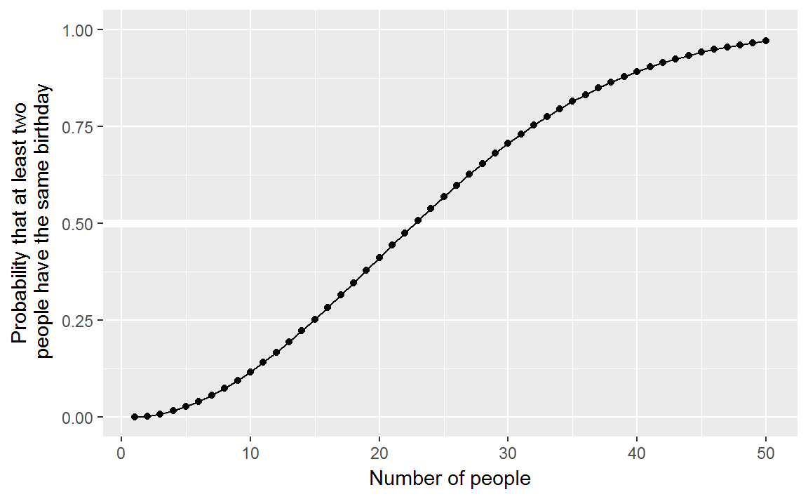
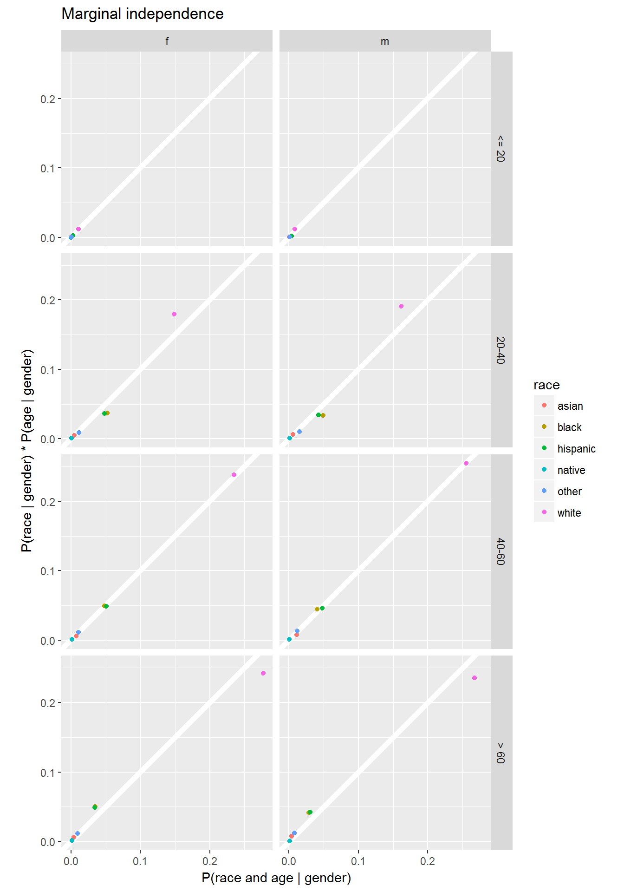
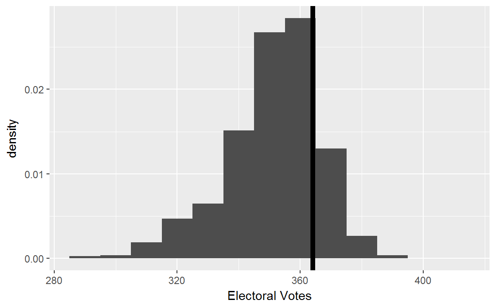
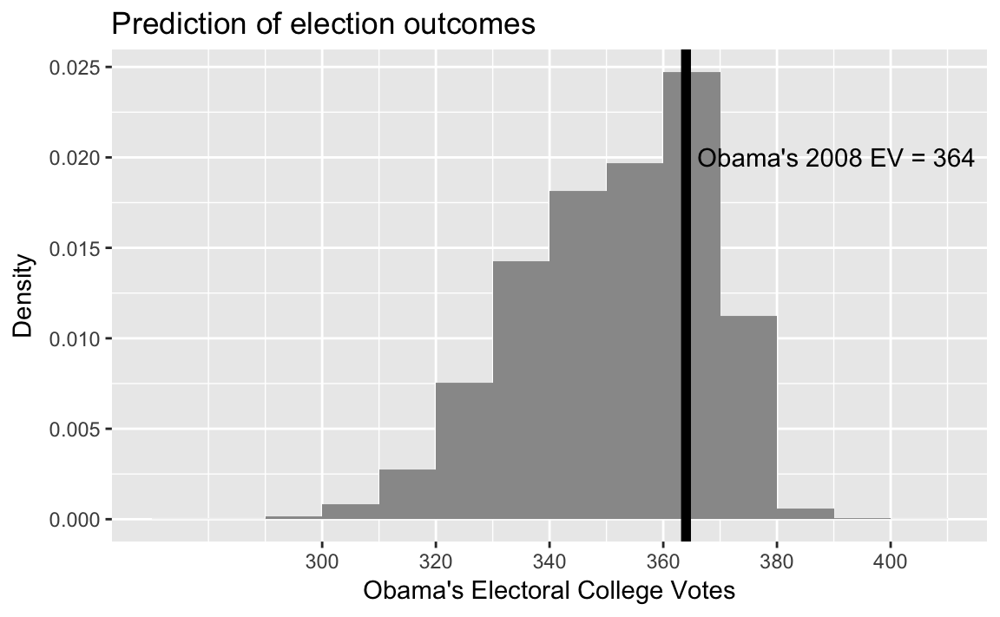
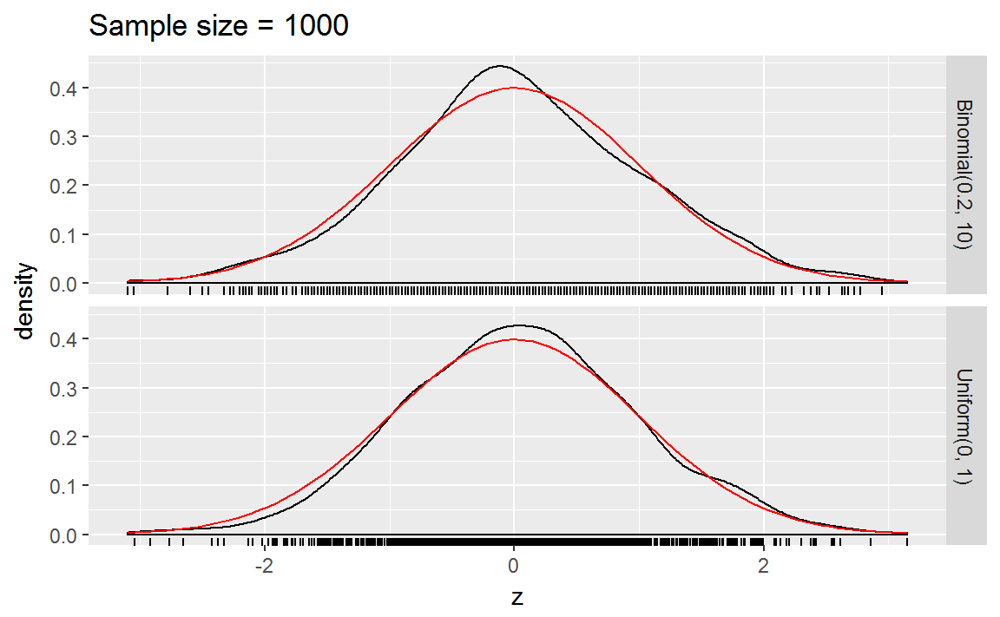
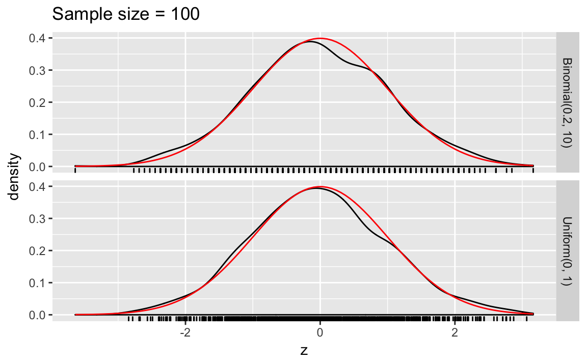

# Probability

## Prerequisites


```r
library("tidyverse")
library("forcats")
library("stringr")
```
We will also, use the function `qss_data_url`:


```r
qss_data_url <-
function(chapter, file) {
  stringr::str_c("https://raw.githubusercontent.com/kosukeimai/qss/master/",
        stringr::str_to_upper(chapter), "/", file)
}
```


## Probability

**Original code**

```r
k <- 23 # number of people
sims <- 1000 # number of simulations event <- 0 # counter
for (i in 1:sims) {
days <- sample(1:365, k, replace = TRUE)
days.unique <- unique(days) # unique birthdays
## if there are duplicates, the number of unique birthdays 
## will be less than the number of birthdays, which is `k' 
if (length(days.unique) < k) {
        event <- event + 1
    }
}
## fraction of trials where at least two bdays are the same
answer <- event / sims
answer
```

**tidyverse**

```r
birthday <- function(k) {
  logdenom <- k * log(365) + lfactorial(365 - k)
  lognumer <- lfactorial(365)
  pr <- 1 -   exp(lognumer - logdenom)
  pr
}

bday <- tibble(k = 1:50,
               pr = birthday(k))
ggplot(bday, aes(x = k , y = pr)) +
  geom_hline(yintercept = 0.5, colour = "white", size = 2) +
  geom_line() +
  geom_point() +
  scale_y_continuous("Probability that at least two\n people have the same birthday", limits = c(0, 1)) +
  labs(x = "Number of people")
```



**Note:** The logarithm is used for numerical stability. Basically,  "floating-point" numbers are approximations of numbers. If you perform arithmetic with numbers that are very large, very small, or vary differently in magnitudes, you could have problems. Logarithms help with some of those issues.
See "Falling Into the Floating Point Trap" in [The R Inforno](http://www.burns-stat.com/pages/Tutor/R_inferno.pdf) for a summary of floating point numbers.
See these John Fox posts [1](http://www.johndcook.com/blog/2008/09/26/comparing-three-methods-of-computing-standard-deviation/) [2](http://www.johndcook.com/blog/2008/09/28/theoretical-explanation-for-numerical-results/) for an example of numerical stability gone wrong.
Also see: http://andrewgelman.com/2016/06/11/log-sum-of-exponentials/.


### Sampling without replacement

**Original code:**

```r
k <- 23 # number of people
sims <- 1000 # number of simulations event <- 0 # counter
for (i in 1:sims) {
days <- sample(1:365, k, replace = TRUE)
days.unique <- unique(days) # unique birthdays
## if there are duplicates, the number of unique birthdays 
## will be less than the number of birthdays, which is `k' 
if (length(days.unique) < k) {
        event <- event + 1
    }
}
## fraction of trials where at least two bdays are the same
answer <- event / sims
answer
```


**tidyverse code:**
Instead of using a for loop, we could do the simulations using a functional
as described in [R for Data Science](http://r4ds.had.co.nz/).
Define the function `sim_bdays` to randomly sample `k` birthdays, and returns
`TRUE` if there are any duplicates.

```r
sim_bdays <- function(k) {
  days <- sample(1:365, k, replace = TRUE)
  length(unique(days)) < k
}
```
Set the parameters for 1,000 simulations, and 23 individuals.
We use `map_lgl` since `sim_bdays` returns a logical value (`TRUE`, `FALSE`):

```r
sims <- 1000
k <- 23
map_lgl(seq_len(sims), ~ sim_bdays(k)) %>%
  mean()
#> [1] 0.478
```


### Combinations

**Original code**

```r
choose(84, 6)
#> [1] 4.06e+08
```

## Conditional Probability

### Conditional, Marginal, and Joint Probabilities


**Original:**

```r
FLVoters <- read.csv("FLVoters.csv")
dim(FLVoters)
FLVoters <- na.omit(FLVoters)
dim(FLVoters)
```

**tidyverse**

```r
FLVoters <- read_csv(qss_data_url("probability", "FLVoters.csv"))
dim(FLVoters)
#> [1] 10000     6
FLVoters <- FLVoters %>%
  na.omit()
```

**original:** 

```r
margin.race <- prop.table(table(FLVoters$race))
margin.race
margin.gender <- prop.table(table(FLVoters$gender))
margin.gender
```

**tidyverse:** 
Instead of using [prop.base](https://www.rdocumentation.org/packages/base/topics/prop.base), we calculate the probabilities
with a data frame.
Marginal probabilities of race,

```r
margin_race <-
  FLVoters %>%
  count(race) %>%
  mutate(prop = n / sum(n))
margin_race
#> # A tibble: 6 × 3
#>       race     n    prop
#>      <chr> <int>   <dbl>
#> 1    asian   175 0.01920
#> 2    black  1194 0.13102
#> 3 hispanic  1192 0.13080
#> 4   native    29 0.00318
#> 5    other   310 0.03402
#> 6    white  6213 0.68177
```

Marginal probabilities of gender:

```r
margin_gender <- FLVoters %>%
  count(gender) %>%
  mutate(prop = n / sum(n))
margin_gender
#> # A tibble: 2 × 3
#>   gender     n  prop
#>    <chr> <int> <dbl>
#> 1      f  4883 0.536
#> 2      m  4230 0.464
```

**Original:**

```r
prop.table(table(FLVoters$race[FLVoters$gender == "f"]))
```

**tidyverse:**

```r
FLVoters %>%
  filter(gender == "f") %>%
  count(race) %>%
  mutate(prop = n / sum(n))
#> # A tibble: 6 × 3
#>       race     n    prop
#>      <chr> <int>   <dbl>
#> 1    asian    83 0.01700
#> 2    black   678 0.13885
#> 3 hispanic   666 0.13639
#> 4   native    17 0.00348
#> 5    other   158 0.03236
#> 6    white  3281 0.67192
```


**Original:**

```r
joint.p <- prop.table(table(race = FLVoters$race, gender = FLVoters$gender))
joint.p
#>           gender
#> race             f       m
#>   asian    0.00911 0.01010
#>   black    0.07440 0.05662
#>   hispanic 0.07308 0.05772
#>   native   0.00187 0.00132
#>   other    0.01734 0.01668
#>   white    0.36004 0.32174
```

**tidyverse:**

```r
joint_p <-
  FLVoters %>%
  count(gender, race) %>%
  # needed because it is still grouped by gender
  ungroup() %>%
  mutate(prop = n / sum(n))
joint_p
#> # A tibble: 12 × 4
#>   gender     race     n    prop
#>    <chr>    <chr> <int>   <dbl>
#> 1      f    asian    83 0.00911
#> 2      f    black   678 0.07440
#> 3      f hispanic   666 0.07308
#> 4      f   native    17 0.00187
#> 5      f    other   158 0.01734
#> 6      f    white  3281 0.36004
#> # ... with 6 more rows
```

We can convert the data frame to have gender as columns:

```r
joint_p %>%
  ungroup() %>%
  select(-n) %>%
  spread(gender, prop)
#> # A tibble: 6 × 3
#>       race       f       m
#> *    <chr>   <dbl>   <dbl>
#> 1    asian 0.00911 0.01010
#> 2    black 0.07440 0.05662
#> 3 hispanic 0.07308 0.05772
#> 4   native 0.00187 0.00132
#> 5    other 0.01734 0.01668
#> 6    white 0.36004 0.32174
```

**Original:**

```r
rowSums(joint.p)
```

**tidyverse:** Sum over race:

```r
joint_p %>%
  group_by(race) %>%
  summarise(prop = sum(prop))
#> # A tibble: 6 × 2
#>       race    prop
#>      <chr>   <dbl>
#> 1    asian 0.01920
#> 2    black 0.13102
#> 3 hispanic 0.13080
#> 4   native 0.00318
#> 5    other 0.03402
#> 6    white 0.68177
```

**Original:**

```r
colSums(joint.p)
```

**tidyverse:** Sum over gender

```r
joint_p %>%
  group_by(gender) %>%
  summarise(prop = sum(prop))
#> # A tibble: 2 × 2
#>   gender  prop
#>    <chr> <dbl>
#> 1      f 0.536
#> 2      m 0.464
```

**Original:**

```r
FLVoters$age.group <- NA # initialize a variable
FLVoters$age.group[FLVoters$age <= 20] <- 1
FLVoters$age.group[FLVoters$age > 20 & FLVoters$age <= 40] <- 2
FLVoters$age.group[FLVoters$age > 40 & FLVoters$age <= 60] <- 3
FLVoters$age.group[FLVoters$age > 60] <- 4
```

**tidyverse:** Use the [cut](https://www.rdocumentation.org/packages/base/topics/cut)

```r
FLVoters <-
  FLVoters %>%
  mutate(age_group = cut(age, c(0, 20, 40, 60, Inf), right = TRUE,
                         labels = c("<= 20", "20-40", "40-60", "> 60")))
```

**Original:** 

```r
joint3 <-
    prop.table(table(race = FLVoters$race, age.group = FLVoters$age.group,
                     gender = FLVoters$gender))
joint3
```

**tidyverse:**

```r
joint3 <-
  FLVoters %>%
  count(race, age_group, gender) %>%
  ungroup() %>%
  mutate(prop = n / sum(n))
joint3
#> # A tibble: 47 × 5
#>    race age_group gender     n     prop
#>   <chr>    <fctr>  <chr> <int>    <dbl>
#> 1 asian     <= 20      f     1 0.000110
#> 2 asian     <= 20      m     2 0.000219
#> 3 asian     20-40      f    24 0.002634
#> 4 asian     20-40      m    26 0.002853
#> 5 asian     40-60      f    38 0.004170
#> 6 asian     40-60      m    47 0.005157
#> # ... with 41 more rows
```

**original:** 

```r
margin.age <- prop.table(table(FLVoters$age.group))
margin.age
joint3["black", 4, "f"] / margin.age[4]
```


**tidyverse:**
Marginal probabilities by age groups

```r
margin_age <-
  FLVoters %>%
  count(age_group) %>%
  mutate(prop = n / sum(n))
margin_age
#> # A tibble: 4 × 3
#>   age_group     n   prop
#>      <fctr> <int>  <dbl>
#> 1     <= 20   161 0.0177
#> 2     20-40  2469 0.2709
#> 3     40-60  3285 0.3605
#> 4      > 60  3198 0.3509
```


Calculate the probabilities that each group is in a given age group, and show
$P(\text{black} \land \text{female} | \text{"> 60""})

```r
left_join(joint3,
          select(margin_age, age_group, margin_age = prop),
          by = "age_group") %>%
  mutate(prob_age_group = prop / margin_age) %>%
  filter(race == "black", gender == "f", age_group == "> 60") %>%
  select(race, age_group, gender, prob_age_group)
#> # A tibble: 1 × 4
#>    race age_group gender prob_age_group
#>   <chr>    <fctr>  <chr>          <dbl>
#> 1 black      > 60      f         0.0538
```

**Original:**

```r
joint2 <- prop.table(table(age.group = FLVoters$age.group,
                           gender = FLVoters$gender))
joint2
joint2[4, "f"]
joint3["black", 4, "f"] / joint2[4, "f"]
```

**tidyverse:**
Two-way joint probability table for age group and gender

```r
joint2 <- FLVoters %>%
  count(age_group, gender) %>%
  ungroup() %>%
  mutate(prob_age_gender = n / sum(n))
joint2
#> # A tibble: 8 × 4
#>   age_group gender     n prob_age_gender
#>      <fctr>  <chr> <int>           <dbl>
#> 1     <= 20      f    88         0.00966
#> 2     <= 20      m    73         0.00801
#> 3     20-40      f  1304         0.14309
#> 4     20-40      m  1165         0.12784
#> 5     40-60      f  1730         0.18984
#> 6     40-60      m  1555         0.17064
#> # ... with 2 more rows
```

The joint probability $P(\text{age} > 60 \land \text{female})$,

```r
filter(joint2, age_group == "> 60", gender == "f")
#> # A tibble: 1 × 4
#>   age_group gender     n prob_age_gender
#>      <fctr>  <chr> <int>           <dbl>
#> 1      > 60      f  1761           0.193
```

The conditional probabilities $P(race | gender, age)$,

```r
condprob_race <-
  left_join(joint3, select(joint2, -n), by = c("age_group", "gender")) %>%
  mutate(prob_race = prop / prob_age_gender) %>%
  arrange(age_group, gender) %>%
  select(age_group, gender, race, prob_race)
```
Each row is the $P(race | age_group, gender)$, so $P(\text{black} | \text{female} \land \text{age} > 60)$,

```r
filter(condprob_race, gender == "f", age_group == "> 60", race == "black")
#> # A tibble: 1 × 4
#>   age_group gender  race prob_race
#>      <fctr>  <chr> <chr>     <dbl>
#> 1      > 60      f black    0.0977
```


### Independence

**Original code**

```r
plot(c(margin.race * margin.gender["f"]), # product of marginal probs.
     c(joint.p[, "f"]), # joint probabilities
xlim = c(0, 0.4), ylim = c(0, 0.4),
xlab = "P(race) * P(female)", ylab = "P(race and female)")
abline(0, 1) # 45 degree line
```

**Tidyverse**

Create a table with the products of margins of race and age.
Using the function [crossing](https://www.rdocumentation.org/packages/tidyr/topics/crossing) to create a tibble with
all combinations of race and gender and the independent prob

```r
race_gender_indep <-
  crossing(select(margin_race, race, prob_race = prop),
           select(margin_gender, gender, prob_gender = prop)) %>%
  mutate(prob_indep = prob_race * prob_gender) %>%
  left_join(select(joint_p, gender, race, prob = prop),
            by = c("gender", "race")) %>%
  select(race, gender, everything())
race_gender_indep
#> # A tibble: 12 × 6
#>       race gender prob_race prob_gender prob_indep    prob
#>      <chr>  <chr>     <dbl>       <dbl>      <dbl>   <dbl>
#> 1    asian      f    0.0192       0.536    0.01029 0.00911
#> 2    asian      m    0.0192       0.464    0.00891 0.01010
#> 3    black      f    0.1310       0.536    0.07021 0.07440
#> 4    black      m    0.1310       0.464    0.06082 0.05662
#> 5 hispanic      f    0.1308       0.536    0.07009 0.07308
#> 6 hispanic      m    0.1308       0.464    0.06071 0.05772
#> # ... with 6 more rows
```


```r
ggplot(race_gender_indep,
       aes(x = prob_indep, y = prob, colour = race)) +
  geom_abline(intercept = 0, slope = 1, colour = "white", size = 2) +
  geom_point() +
  facet_grid(. ~ gender) +
  coord_fixed() +
  theme(legend.position = "bottom") +
  labs(x = expression(P("race") * P("gender")),
       y = expression(P("race and gender")))
```


**Original code**

```r
## joint independence
plot(c(joint3[, 4, "f"]), # joint probability
margin.race * margin.age[4] * margin.gender["f"], # product of marginals xlim = c(0, 0.3), ylim = c(0, 0.3), main = "joint independence",
xlab = "P(race and above 60 and female)",
ylab = "P(race) * P(above 60) * P(female)")
abline(0, 1)
## conditional independence given female
plot(c(joint3[, 4, "f"]) / margin.gender["f"], # joint prob. given female
     ## product of marginals
     (joint.p[, "f"] / margin.gender["f"]) *
         (joint2[4, "f"] / margin.gender["f"]),
     xlim = c(0, 0.3), ylim = c(0, 0.3), main = "marginal independence",
     xlab = "P(race and above 60 | female)",
     ylab = "P(race | female) * P(above 60 | female)")
abline(0, 1)
```

While the original code only calculates joint-independence value for values of
age > 60, and female, this calculates the joint probabilities for all combinations
of the three variables, and facets by age and gender.


```r
joint_indep <-
  # all combinations of race, age, gender
  crossing(select(margin_race, race, prob_race = prop),
           select(margin_age, age_group, prob_age = prop),
           select(margin_gender, gender, prob_gender = prop)) %>%
  mutate(indep_prob = prob_race * prob_age * prob_gender) %>%
  left_join(select(joint3, race, age_group, gender, prob = prop),
            by = c("gender", "age_group", "race")) %>%
  replace_na(list(prob = 0))
  
ggplot(joint_indep, aes(x = prob, y = indep_prob, colour = race)) +
  geom_abline(intercept = 0, slope = 1, colour = "white", size = 2) +
  geom_point() +
  facet_grid(age_group ~ gender) +
  coord_fixed() +
  labs(x = "P(race and age and gender)",
       y = "P(race) * P(age) * P(gender)",
       title = "Joint Independence")
    
```


The original code only calculates the conditional independence given female;
this calculates conditional independence for all values of `gender`:

```r
cond_gender <- 
  left_join(select(joint3, race, age_group, gender, joint_prob = prop),
            select(margin_gender, gender, prob_gender = prop),
            by = c("gender")) %>%
  mutate(cond_prob = joint_prob / prob_gender)

# P(race | gender)
prob_race_gender <- 
  left_join(select(joint_p, race, gender, prob_race_gender = prop),
            select(margin_gender, gender, prob_gender = prop),
            by = "gender") %>%
  mutate(prob_race = prob_race_gender / prob_gender)
# P(age | gender)
prob_age_gender <- 
  left_join(select(joint2, age_group, gender, prob_age_gender),
            select(margin_gender, gender, prob_gender = prop),
            by = "gender") %>%
  mutate(prob_age = prob_age_gender / prob_gender)

# indep prob of race and age    
indep_cond_gender <-
  full_join(select(prob_race_gender, race, gender, prob_race),
            select(prob_age_gender, age_group, gender, prob_age),
            by = "gender") %>%
  mutate(indep_prob = prob_race * prob_age)

inner_join(select(indep_cond_gender, race, age_group, gender, indep_prob),
           select(cond_gender, race, age_group, gender, cond_prob),
           by = c("gender", "age_group", "race")) %>%
  ggplot(aes(x = cond_prob, y = indep_prob, colour = race)) +
  geom_abline(intercept = 0, slope = 1, colour = "white", size = 2) +
  geom_point() +
  facet_grid(age_group ~ gender) +
  coord_fixed() +
  labs(x = "P(race and age | gender)",
       y = "P(race | gender) * P(age | gender)",
       title = "Marginal independence")
```




**Orginal code** for the Monty-Hall problem

```r
sims <- 1000
doors <- c("goat", "goat", "car")
result.switch <- result.noswitch <- rep(NA, sims)
for (i in 1:sims) {
  ## randomly choose the initial door
  first <- sample(1:3, size = 1)
  result.noswitch[i] <- doors[first]
  remain <- doors[-first] # remaining two doors
  ## Monty chooses one door with a goat
  monty <- sample((1:2)[remain == "goat"], size = 1)
  result.switch[i] <- remain[-monty]
}
mean(result.noswitch == "car")
```

This code doesn't rely on any non-tidyverse code, but the following is another way to write it.

First, create a function for a single iteration.
This will save the results as data frame.

```r
choose_door <- function(.id) {
  # put doors inside the function to ensure it doesn't get changed
  doors <- c("goat", "goat", "car")
  first <- sample(1:3, 1)
  remain <- doors[-first]
  monty <- sample((1:2)[remain == "goat"], size = 1)
  ret <- tribble(~strategy, ~result,
          "no switch", doors[first],
          "switch", remain[-monty])
  ret[[".id"]] <- .id
  ret
}
```
Now use [map_df](https://www.rdocumentation.org/packages/purrr/topics/map_df) to run `choose_door` multiple times,
and then summarize the results:

```r
sims <- 1000
results <- map_df(seq_len(sims), choose_door)
results %>%
  group_by(strategy) %>%
  summarise(pct_win = mean(result == "car"))
#> # A tibble: 2 × 2
#>    strategy pct_win
#>       <chr>   <dbl>
#> 1 no switch   0.338
#> 2    switch   0.662
```

Can we make this even more general? What about a function that takes a data frame as its input with the choices? ...


### Predicting Race Using Surname and Residence Location

Start with the Census names files:

```r
cnames <- read_csv(qss_data_url("probability", "names.csv"))
glimpse(cnames)
#> Observations: 151,671
#> Variables: 7
#> $ surname     <chr> "SMITH", "JOHNSON", "WILLIAMS", "BROWN", "JONES", ...
#> $ count       <int> 2376206, 1857160, 1534042, 1380145, 1362755, 11278...
#> $ pctwhite    <dbl> 73.34, 61.55, 48.52, 60.72, 57.69, 85.80, 64.73, 6...
#> $ pctblack    <dbl> 22.22, 33.80, 46.72, 34.54, 37.73, 10.41, 30.77, 0...
#> $ pctapi      <dbl> 0.40, 0.42, 0.37, 0.41, 0.35, 0.42, 0.40, 1.43, 0....
#> $ pcthispanic <dbl> 1.56, 1.50, 1.60, 1.64, 1.44, 1.43, 1.58, 90.82, 9...
#> $ pctothers   <dbl> 2.48, 2.73, 2.79, 2.69, 2.79, 1.94, 2.52, 1.09, 0....
```

For each surname, contains variables with the probability that it belongs to an individual of a given race (`pctwhite`, `pctblack`, ...).
We want to find the most-likely race for a given surname, by finding the race with the maximum proportion.
Instead of dealing with multiple variables, it is easier to use `max` on a single variable, so we will rearrange the data to in order to use a grouped summarize, and then merge the new variable back to the original data sets.

<!-- This needs to be sped up. Possibly a  -->

Note, this code takes a while.

```r
most_likely <-
  cnames %>%
  select(-count) %>%
  gather(race_pred, pct, -surname) %>%
  # remove pct prefix
  mutate(race_pred = str_replace(race_pred, "^pct", "")) %>%
  # group by surname
  group_by(surname) %>%
  filter(pct == max(pct)) %>%
  # if there are ties, keep only one obs
  slice(1) %>%
  # don't need pct anymore
  select(-pct) %>%
  mutate(race_pred = factor(race_pred),
         # need to convert to factor first, else errors
         race_pred = fct_recode(race_pred, 
                                "asian" = "api", "other" = "others"))
```

Now merge that back to the original `cnames` data frame.

```r
cnames <- left_join(cnames, most_likely, by = "surname")
```


Instead of using `match`, use `inner_join` to merge the surnames to `FLVoters`:

```r
FLVoters <- inner_join(FLVoters, cnames, by = "surname")
dim(FLVoters)
#> [1] 8022   14
```
`FLVoters` also includes a "native" category that the surname dataset does not.

```r
FLVoters <- FLVoters %>%
  mutate(race2 = fct_recode(race, other = "native"))
```

Check that the levels of `race` and `race_pred` are the same:

```r
FLVoters %>%
  count(race2)
#> # A tibble: 5 × 2
#>      race2     n
#>     <fctr> <int>
#> 1    asian   140
#> 2    black  1078
#> 3 hispanic  1023
#> 4    other   277
#> 5    white  5504
```

```r
FLVoters %>%
  count(race_pred)
#> # A tibble: 5 × 2
#>   race_pred     n
#>      <fctr> <int>
#> 1     white  6516
#> 2     black   258
#> 3  hispanic  1121
#> 4     asian   120
#> 5     other     7
```


Now we can calculate *True positive rate* for *all* races

```r
FLVoters %>%
  group_by(race2) %>%
  summarise(tp = mean(race2 == race_pred)) %>%
  arrange(desc(tp))
#> # A tibble: 5 × 2
#>      race2      tp
#>     <fctr>   <dbl>
#> 1    white 0.95022
#> 2 hispanic 0.84653
#> 3    asian 0.56429
#> 4    black 0.16048
#> 5    other 0.00361
```
and the *False discovery rate* for *all* races,

```r
FLVoters %>%
  group_by(race_pred) %>%
  summarise(fp = mean(race2 != race_pred)) %>%
  arrange(desc(fp))
#> # A tibble: 5 × 2
#>   race_pred    fp
#>      <fctr> <dbl>
#> 1     other 0.857
#> 2     asian 0.342
#> 3     black 0.329
#> 4  hispanic 0.227
#> 5     white 0.197
```

Now add get residence data

```r
FLCensus <- read_csv(qss_data_url("probability", "FLCensusVTD.csv"))
```

$P(race)$ in Florida:

```r
race.prop <-
  FLCensus %>%
  select(total.pop, white, black, api, hispanic, others) %>%
  gather(race, pct, -total.pop) %>%
  group_by(race) %>%
  summarise(mean = weighted.mean(pct, weights = total.pop)) %>%
  arrange(desc(mean))
race.prop
#> # A tibble: 5 × 2
#>       race   mean
#>      <chr>  <dbl>
#> 1    white 0.6045
#> 2 hispanic 0.2128
#> 3    black 0.1394
#> 4      api 0.0219
#> 5   others 0.0214
```

### Predicting Election Outcomes with Uncertainty

**Original code**

```r
pres08 <- read.csv("pres08.csv")
## two-party vote share
pres08$p <- pres08$Obama / (pres08$Obama + pres08$McCain)
```

**Tidyverse code**

```r
pres08 <- read_csv(qss_data_url("probability", "pres08.csv")) %>%
  mutate(p = Obama / (Obama + McCain))
```

**Original code**

```r
n.states <- nrow(pres08) # number of states
n <- 1000 # number of respondents
sims <- 10000 # number of simulations
## Obama's electoral votes
Obama.ev <- rep(NA, sims)
for (i in 1:sims) {
  ## samples number of votes for Obama in each state
  draws <- rbinom(n.states, size = n, prob = pres08$p)
  ## sums state's electoral college votes if Obama wins the majority
  Obama.ev[i] <- sum(pres08$EV[draws > n/2])
}
hist(Obama.ev, freq = FALSE, main = "Prediction of Election Outcome",
xlab = "Obama's Electoral College Votes")
abline(v = 364, col = "red") # actual result
```

**Tidyverse code**

Write a function to simulate the elections. `df` is the data frame (`pres08`)
with the state, EV, and `p` columns. `n_draws` is the size of the binomial distribution to draw from. `.id` is the simulation number.

```r
sim_election <- function(.id, df, n_draws = 1000) {
  # For each state randomly sample
  mutate(df,
         draws = rbinom(n(), n_draws, p)) %>%
  filter(draws > (n_draws / 2)) %>%
  summarise(EV = sum(EV),
            .id = .id)
}
```

Now simulate the election 10,000 times:

```r
sims <- 10000
sim_results <- map_df(seq_len(sims), ~ sim_election(.x, pres08, n_draws = 1000))
```
In the 2008 election, Obama received 364 electoral votes

```r
ELECTION_EV <- 364
```
And plot them,

```r
ggplot(sim_results, aes(x = EV, y = ..density..)) +
  geom_histogram(binwidth = 10, fill = "gray30") +
  geom_vline(xintercept = ELECTION_EV, colour = "black", size = 2) +
  labs(x = "Electoral Votes", y = "density")
```



**Original code**

```r
mean(Obama.ev)
## [1] 352.1646
## probability of binomial random variable taking greater than n/2 votes
sum(pres08$EV * pbinom(n/2, size = n, prob = pres08$p, lower.tail = FALSE))
## [1] 352.1388
## approximate variance using Monte Carlo draws
var(Obama.ev)
## [1] 268.7592
## theoretical variance
pres08$pb <- pbinom(n/2, size = n, prob = pres08$p, lower.tail = FALSE)
V <- sum(pres08$pb*(1-pres08$pb)*pres08$EV^2)
V
## [1] 268.8008
## approximate standard deviation using Monte Carlo draws
sd(Obama.ev)
## [1] 16.39388
## theoretical standard deviation
sqrt(V)
## [1] 16.39515
```

**tidyverse code**

Simulation mean, variance, and standard deviations:

```r
sim_results %>%
  select(EV) %>%
  summarise_all(funs(mean, var, sd))
#> # A tibble: 1 × 3
#>    mean   var    sd
#>   <dbl> <dbl> <dbl>
#> 1   352   269  16.4
```

Theoretical probabilities

```r
# we cannot use n, because mutate will look for n() first.
n_draws <- 1000
pres08 %>%
  mutate(pb = pbinom(n_draws / 2, size = n_draws, prob = p,
                     lower.tail  = FALSE)) %>%
  summarise(mean = sum(pb * EV),
            V = sum(pb * (1 - pb) * EV ^ 2),
            sd = sqrt(V))
#> # A tibble: 1 × 3
#>    mean     V    sd
#>   <dbl> <dbl> <dbl>
#> 1   352   269  16.4
```

## Large Sample Theorems

### Law of Large Numbers

**Original:**

```r
sims <- 1000
## 3 separate simulations for each
x.binom <- rbinom(sims, p = 0.2, size = 10)
## computing sample mean with varying sample size
mean.binom <- cumsum(x.binom) / 1:sims
```

**Tidyverse**: Put the simulation number, `x` and `mean` in a tibble:

```r
sims <- 1000
p <- 0.2
size = 10
lln_binom <- tibble(
  n = seq_len(sims),
  x = rbinom(sims, p = p, size = size),
  mean = cumsum(x) / n,
  distrib = str_c("Binomial(", size, ", ", p, ")"))
```

**Original:**

```r
## default runif() is uniform(0, 1)
x.unif <- runif(sims)
mean.unif <- cumsum(x.unif) / 1:sims
```

**Tidyverse:**

```r
lln_unif <-
 tibble(n = seq_len(sims),
        x = runif(sims),
        mean = cumsum(x) / n,
        distrib = str_c("Uniform(0, 1)"))
```

**Original:**

```r
par(cex = 1.5)
## plot for binomial
plot(1:sims, mean.binom, type = "l", ylim = c(1, 3),
     xlab = "Sample size", ylab = "Sample mean", main = "Binomial(10, 0.2)")
abline(h = 2, lty = "dashed") # expectation

## plot for uniform
plot(1:sims, mean.unif, type = "l", ylim = c(0, 1),
     xlab = "Sample size", ylab = "Sample mean", main = "Uniform(0, 1)")
abline(h = 0.5, lty = "dashed") # expectation
```

**Tidyverse:** 

```r
true_means <- 
  tribble(~distrib, ~mean,
          "Uniform(0, 1)", 0.5,
          str_c("Binomial(", size, ", ", p, ")"), size * p)

ggplot() +
  geom_hline(aes(yintercept = mean), data = true_means, 
             colour = "white", size = 2) +
  geom_line(aes(x = n, y = mean), 
            data = bind_rows(lln_binom, lln_unif)) +
  facet_grid(distrib ~ ., scales = "free_y") +
  labs(x = "Sample Size", y = "Sample Mean")
```



### Central Limit Theorem

**Original:**

```r
par(cex = 1.5)
## sims = number of simulations
n.samp <- 1000
z.binom <- z.unif <- rep(NA, sims)

for (i in 1:sims) {
    x <- rbinom(n.samp, p = 0.2, size = 10)
    z.binom[i] <- (mean(x) - 2) / sqrt(1.6 / n.samp)
    x <- runif(n.samp, min = 0, max = 1)
    z.unif[i] <- (mean(x) - 0.5) / sqrt(1 / (12 * n.samp))
}

## histograms; nclass specifies the number of bins
hist(z.binom, freq = FALSE, nclass = 40, xlim = c(-4, 4), ylim = c(0, 0.6),
     xlab = "z-score", main = "Binomial(0.2, 10)")

x <- seq(from = -3, to = 3, by = 0.01)
lines(x, dnorm(x)) # overlay the standard Normal PDF
hist(z.unif, freq = FALSE, nclass = 40, xlim = c(-4, 4), ylim = c(0, 0.6),
     xlab = "z-score", main = "Uniform(0, 1)")
lines(x, dnorm(x))
```

**tidyverse:** Instead of using a for loop, write functions to 

The population mean of the binomial distribution is $\mu = p n$ and the variance is $\mu = p (1 - p) n$.


```r
sims <- 1000
n_samp <- 1000

# Mean of binomial distribution
binom_mean <- function(size, p) {
  size * p
}

# Variance of binomial distribution
binom_var <- function(size, p) {
  size * p * (1 - p) 
}

sim_binom_clt <- function(n_samp, size, p) {
  x <- rbinom(n_samp, prob = p, size = size)
  z <- (mean(x) - binom_mean(size, p)) /
    sqrt(binom_var(size, p) / n_samp)
  tibble(distrib = str_c("Binomial(", p, ", ", size, ")"),
         z = z)
}

# Mean of uniform distribution
unif_mean <- function(min, max) {
  0.5 * (min + max)
}

# Variance of uniform distribution
unif_var <- function(min, max) {
  (1 / 12) * (max - min) ^ 2
}

sim_unif_clt <- function(n_samp, min = 0, max = 1) {
  x <- runif(n_samp, min = min, max = max)
  z <- (mean(x) - unif_mean(min, max)) /
    sqrt(unif_var(min, max) / n_samp)
  tibble(distrib = str_c("Uniform(", min, ", ", max, ")"),
         z = z)
}
```

Since we will calculate this for `n_samp = 1000` and `n_samp`, we might as well write a function for it. 

```r
clt_plot <- function(n_samp) {
  bind_rows(map_df(seq_len(sims), ~ sim_binom_clt(n_samp, size, p)),
            map_df(seq_len(sims), ~ sim_unif_clt(n_samp))) %>%
    ggplot(aes(x = z)) +
    geom_density() +
    geom_rug() +
    stat_function(fun = dnorm, colour = "red") +
    facet_grid(distrib ~ .) +
    ggtitle(str_c("Sample size = ", n_samp))
}
clt_plot(1000)
clt_plot(100)
```



