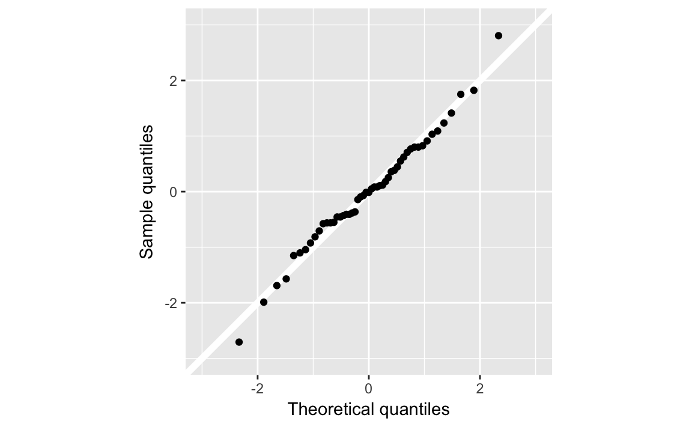
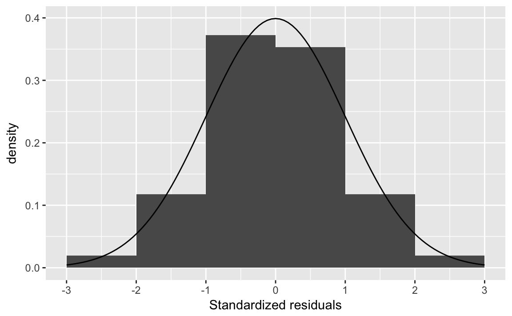
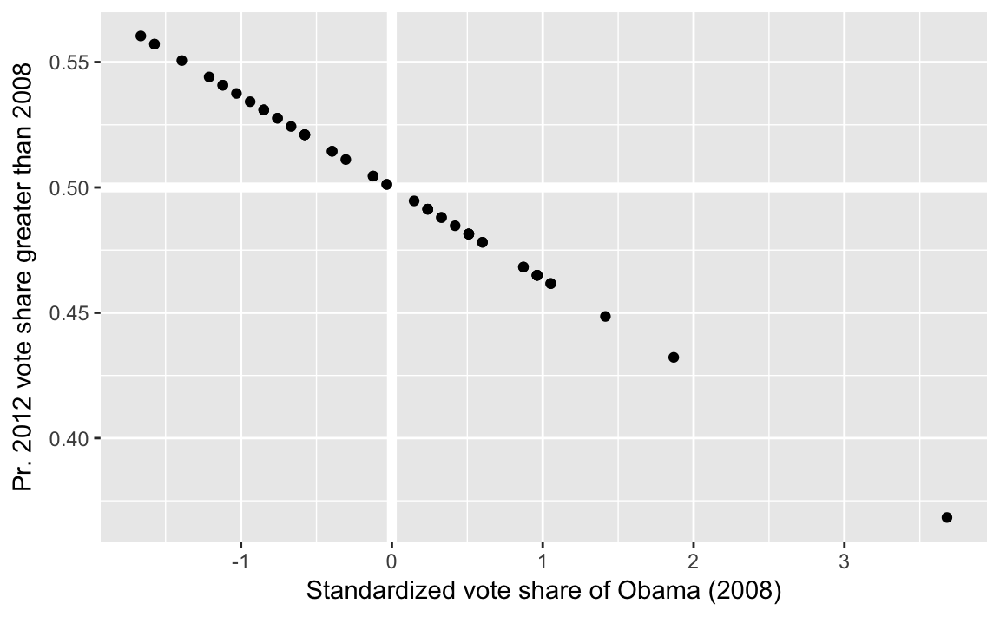

---
output: html_document
editor_options:
  chunk_output_type: console
---

# Probability


## Prerequisites {-}


```r
library("tidyverse")
library("forcats")
library("stringr")
library("broom")
```


## Probability

### Frequentist vs. Bayesian

### Definition and Axioms

### Permutations


```r
birthday <- function(k) {
  logdenom <- k * log(365) + lfactorial(365 - k)
  lognumer <- lfactorial(365)
  pr <- 1 -   exp(lognumer - logdenom)
  pr
}

bday <- tibble(k = 1:50, pr = birthday(k))
               
ggplot(bday, aes(x = k, y = pr)) +
  geom_hline(yintercept = 0.5, colour = "white", size = 2) +
  geom_line() +
  geom_point() +
  scale_y_continuous(str_c("Probability that at least two",
                           "people have the same birthday", sep = "\n"),
                     limits = c(0, 1), breaks = seq(0, 1, by = 0.1)) +
  labs(x = "Number of people")
```


**Note:** The logarithm is used for numerical stability. Basically,  "floating-point" numbers are approximations of numbers. If you perform arithmetic with numbers that are very large, very small, or vary differently in magnitudes, you could have problems. Logarithms help with some of those issues.
See "Falling Into the Floating Point Trap" in [The R Inferno](http://www.burns-stat.com/pages/Tutor/R_inferno.pdf) for a summary of floating point numbers.
See these John Fox posts [1](http://www.johndcook.com/blog/2008/09/26/comparing-three-methods-of-computing-standard-deviation/) [2](http://www.johndcook.com/blog/2008/09/28/theoretical-explanation-for-numerical-results/) for an example of numerical stability gone wrong.
Also see: http://andrewgelman.com/2016/06/11/log-sum-of-exponentials/.


### Sampling without replacement

Instead of using a for loop, we could do the simulations using a functional
as described in [R for Data Science](http://r4ds.had.co.nz/) chapter "Iterations".

Define the function `sim_bdays` which randomly samples `k` birthdays, and returns
`TRUE` if there are any duplicate birthdays, and `FALSE` if there are none.

```r
sim_bdays <- function(k) {
  days <- sample(1:365, k, replace = TRUE)
  length(unique(days)) < k
}
```

We can test the code for `k = 10` birthdays.

```r
sim_bdays(10)
#> [1] FALSE
```
Since the function is randomly sampling birthdays, running it multiple times will produce different answers.

One helpful feature of a functional style of writing code vs. a `for` loop is that
the function encapsulates the code and allows you to test that it works for different
inputs before repeating it for many inputs.
It is more difficult to debug functions that produce random outputs, but some sanity checks
are that the function

- returns a logical vector of length one (`TRUE` or `FALSE`)
- always returns `FALSE` when `k = 1` since there can never be a duplicates with one person
- always returns `TRUE` when `k >= 365` by the [pidgeonhole principle](https://en.wikipedia.org/wiki/Pigeonhole_principle).


```r
sim_bdays(1)
#> [1] FALSE
sim_bdays(365)
#> [1] TRUE
```

Set the parameters for 1,000 simulations, and 23 individuals.
We use `map_lgl` since `sim_bdays` returns a logical value (`TRUE`, `FALSE`):

```r
sims <- 1000
k <- 23
map_lgl(seq_len(sims), ~ sim_bdays(k)) %>%
  mean()
#> [1] 0.475
```

An alternative way of running this is using the [rerun](https://www.rdocumentation.org/packages/purrr/topics/rerun):

```r
# rerun expression sim times
rerun(sims, sim_bdays(k)) %>%
  # flatten to a numeric vector
  flatten_dbl() %>%
  # take mean
  mean()
#> [1] 0.477
```


### Combinations

The function for $\choose{84}{4}$ is:

```r
choose(84, 6)
#> [1] 4.06e+08
```
However, due to the the larges values that the binomial coefficient, it is almost always better to use the log of the binomial coefficient, $\log \choose{84}{4}$,

```r
lchoose(84, 4)
#> [1] 14.5
```


## Conditional Probability

### Conditional, Marginal, and Joint Probabilities

Load Florida voting data from the **qss** package:

```r
data(FLVoters, package = "qss")
dim(FLVoters)
#> [1] 10000     6
FLVoters <- FLVoters %>%
  na.omit()
```

Instead of using [prop.base](https://www.rdocumentation.org/packages/base/topics/prop.base), we calculate the probabilities
with a data frame.
Calculate the marginal probabilities of each race:

```r
margin_race <-
  FLVoters %>%
  count(race) %>%
  mutate(prop = n / sum(n))
margin_race
#> # A tibble: 6 x 3
#>   race         n    prop
#>   <chr>    <int>   <dbl>
#> 1 asian      175 0.0192 
#> 2 black     1194 0.131  
#> 3 hispanic  1192 0.131  
#> 4 native      29 0.00318
#> 5 other      310 0.0340 
#> 6 white     6213 0.682
```

Calculate the marginal probabilities of each gender:

```r
margin_gender <- FLVoters %>%
  count(gender) %>%
  mutate(prop = n / sum(n))
margin_gender
#> # A tibble: 2 x 3
#>   gender     n  prop
#>   <chr>  <int> <dbl>
#> 1 f       4883 0.536
#> 2 m       4230 0.464
```


```r
FLVoters %>%
  filter(gender == "f") %>%
  count(race) %>%
  mutate(prop = n / sum(n))
#> # A tibble: 6 x 3
#>   race         n    prop
#>   <chr>    <int>   <dbl>
#> 1 asian       83 0.0170 
#> 2 black      678 0.139  
#> 3 hispanic   666 0.136  
#> 4 native      17 0.00348
#> 5 other      158 0.0324 
#> 6 white     3281 0.672
```


```r
joint_p <-
  FLVoters %>%
  count(gender, race) %>%
  # needed because the data frame is still grouped by gender
  ungroup() %>%
  mutate(prop = n / sum(n))
joint_p
#> # A tibble: 12 x 4
#>   gender race         n    prop
#>   <chr>  <chr>    <int>   <dbl>
#> 1 f      asian       83 0.00911
#> 2 f      black      678 0.0744 
#> 3 f      hispanic   666 0.0731 
#> 4 f      native      17 0.00187
#> 5 f      other      158 0.0173 
#> 6 f      white     3281 0.360  
#> # ... with 6 more rows
```

We can convert the data frame to have gender as columns:

```r
joint_p %>%
  ungroup() %>%
  select(-n) %>%
  spread(gender, prop)
#> # A tibble: 6 x 3
#>   race           f       m
#> * <chr>      <dbl>   <dbl>
#> 1 asian    0.00911 0.0101 
#> 2 black    0.0744  0.0566 
#> 3 hispanic 0.0731  0.0577 
#> 4 native   0.00187 0.00132
#> 5 other    0.0173  0.0167 
#> 6 white    0.360   0.322
```

Sum over race:

```r
joint_p %>%
  group_by(race) %>%
  summarise(prop = sum(prop))
#> # A tibble: 6 x 2
#>   race        prop
#>   <chr>      <dbl>
#> 1 asian    0.0192 
#> 2 black    0.131  
#> 3 hispanic 0.131  
#> 4 native   0.00318
#> 5 other    0.0340 
#> 6 white    0.682
```

Sum over gender:

```r
joint_p %>%
  group_by(gender) %>%
  summarise(prop = sum(prop))
#> # A tibble: 2 x 2
#>   gender  prop
#>   <chr>  <dbl>
#> 1 f      0.536
#> 2 m      0.464
```


```r
FLVoters <-
  FLVoters %>%
  mutate(age_group = cut(age, c(0, 20, 40, 60, Inf), right = TRUE,
                         labels = c("<= 20", "20-40", "40-60", "> 60")))
```


```r
joint3 <-
  FLVoters %>%
  count(race, age_group, gender) %>%
  ungroup() %>%
  mutate(prop = n / sum(n))
joint3
#> # A tibble: 47 x 5
#>   race  age_group gender     n     prop
#>   <chr> <fctr>    <chr>  <int>    <dbl>
#> 1 asian <= 20     f          1 0.000110
#> 2 asian <= 20     m          2 0.000219
#> 3 asian 20-40     f         24 0.00263 
#> 4 asian 20-40     m         26 0.00285 
#> 5 asian 40-60     f         38 0.00417 
#> 6 asian 40-60     m         47 0.00516 
#> # ... with 41 more rows
```

Marginal probabilities by age groups

```r
margin_age <-
  FLVoters %>%
  count(age_group) %>%
  mutate(prop = n / sum(n))
margin_age
#> # A tibble: 4 x 3
#>   age_group     n   prop
#>   <fctr>    <int>  <dbl>
#> 1 <= 20       161 0.0177
#> 2 20-40      2469 0.271 
#> 3 40-60      3285 0.360 
#> 4 > 60       3198 0.351
```


Calculate the probabilities that each group is in a given age group, and show
$P(\text{black} \land \text{female} | \text{"> 60""})

```r
left_join(joint3,
          select(margin_age, age_group, margin_age = prop),
          by = "age_group") %>%
  mutate(prob_age_group = prop / margin_age) %>%
  filter(race == "black", gender == "f", age_group == "> 60") %>%
  select(race, age_group, gender, prob_age_group)
#> # A tibble: 1 x 4
#>   race  age_group gender prob_age_group
#>   <chr> <fctr>    <chr>           <dbl>
#> 1 black > 60      f              0.0538
```

Two-way joint probability table for age group and gender

```r
joint2 <- FLVoters %>%
  count(age_group, gender) %>%
  ungroup() %>%
  mutate(prob_age_gender = n / sum(n))
joint2
#> # A tibble: 8 x 4
#>   age_group gender     n prob_age_gender
#>   <fctr>    <chr>  <int>           <dbl>
#> 1 <= 20     f         88         0.00966
#> 2 <= 20     m         73         0.00801
#> 3 20-40     f       1304         0.143  
#> 4 20-40     m       1165         0.128  
#> 5 40-60     f       1730         0.190  
#> 6 40-60     m       1555         0.171  
#> # ... with 2 more rows
```

The joint probability $P(\text{age} > 60 \land \text{female})$,

```r
filter(joint2, age_group == "> 60", gender == "f")
#> # A tibble: 1 x 4
#>   age_group gender     n prob_age_gender
#>   <fctr>    <chr>  <int>           <dbl>
#> 1 > 60      f       1761           0.193
```

The conditional probabilities $P(race | gender, age)$,

```r
condprob_race <-
  left_join(joint3, select(joint2, -n), by = c("age_group", "gender")) %>%
  mutate(prob_race = prop / prob_age_gender) %>%
  arrange(age_group, gender) %>%
  select(age_group, gender, race, prob_race)
```
Each row is the $P(race | age_group, gender)$, so $P(\text{black} | \text{female} \land \text{age} > 60)$,

```r
filter(condprob_race, gender == "f", age_group == "> 60", race == "black")
#> # A tibble: 1 x 4
#>   age_group gender race  prob_race
#>   <fctr>    <chr>  <chr>     <dbl>
#> 1 > 60      f      black    0.0977
```


### Independence

Create a table with the products of margins of race and age.
Using the function [crossing](https://www.rdocumentation.org/packages/tidyr/topics/crossing) to create a tibble with
all combinations of race and gender and the independent prob.

```r
race_gender_indep <-
  crossing(select(margin_race, race, prob_race = prop),
           select(margin_gender, gender, prob_gender = prop)) %>%
  mutate(prob_indep = prob_race * prob_gender) %>%
  left_join(select(joint_p, gender, race, prob = prop),
            by = c("gender", "race")) %>%
  select(race, gender, everything())
race_gender_indep
#> # A tibble: 12 x 6
#>   race     gender prob_race prob_gender prob_indep    prob
#>   <chr>    <chr>      <dbl>       <dbl>      <dbl>   <dbl>
#> 1 asian    f         0.0192       0.536    0.0103  0.00911
#> 2 asian    m         0.0192       0.464    0.00891 0.0101 
#> 3 black    f         0.131        0.536    0.0702  0.0744 
#> 4 black    m         0.131        0.464    0.0608  0.0566 
#> 5 hispanic f         0.131        0.536    0.0701  0.0731 
#> 6 hispanic m         0.131        0.464    0.0607  0.0577 
#> # ... with 6 more rows
```


```r
ggplot(race_gender_indep,
       aes(x = prob_indep, y = prob, colour = race)) +
  geom_abline(intercept = 0, slope = 1, colour = "white", size = 2) +
  geom_point() +
  facet_grid(. ~ gender) +
  coord_fixed() +
  theme(legend.position = "bottom") +
  labs(x = expression(P("race") * P("gender")),
       y = expression(P("race and gender")))
```


While the original code only calculates joint-independence value for values of
age > 60, and female, this calculates the joint probabilities for all combinations
of the three variables, and facets by age and gender.


```r
joint_indep <-
  # all combinations of race, age, gender
  crossing(select(margin_race, race, prob_race = prop),
           select(margin_age, age_group, prob_age = prop),
           select(margin_gender, gender, prob_gender = prop)) %>%
  mutate(indep_prob = prob_race * prob_age * prob_gender) %>%
  left_join(select(joint3, race, age_group, gender, prob = prop),
            by = c("gender", "age_group", "race")) %>%
  replace_na(list(prob = 0))

ggplot(joint_indep, aes(x = prob, y = indep_prob, colour = race)) +
  geom_abline(intercept = 0, slope = 1, colour = "white", size = 2) +
  geom_point() +
  facet_grid(age_group ~ gender) +
  coord_fixed() +
  labs(x = "P(race and age and gender)",
       y = "P(race) * P(age) * P(gender)",
       title = "Joint Independence")
```


While code in *QSS* only calculates the conditional independence given female,
the following code calculates conditional independence for all values of `gender`:

```r
cond_gender <-
  left_join(select(joint3, race, age_group, gender, joint_prob = prop),
            select(margin_gender, gender, prob_gender = prop),
            by = c("gender")) %>%
  mutate(cond_prob = joint_prob / prob_gender)
```

Calculate the conditional distribution $\Pr(\mathtt{race} | \mathtt{gender})$:

```r
prob_race_gender <-
  left_join(select(joint_p, race, gender, prob_race_gender = prop),
            select(margin_gender, gender, prob_gender = prop),
            by = "gender") %>%
  mutate(prob_race = prob_race_gender / prob_gender)
```

Calculate the conditional distribution $\Pr(\mathtt{age} | \mathtt{gender})$:

```r
prob_age_gender <-
  left_join(select(joint2, age_group, gender, prob_age_gender),
            select(margin_gender, gender, prob_gender = prop),
            by = "gender") %>%
  mutate(prob_age = prob_age_gender / prob_gender)

# indep prob of race and age
indep_cond_gender <-
  full_join(select(prob_race_gender, race, gender, prob_race),
            select(prob_age_gender, age_group, gender, prob_age),
            by = "gender") %>%
  mutate(indep_prob = prob_race * prob_age)

inner_join(select(indep_cond_gender, race, age_group, gender, indep_prob),
           select(cond_gender, race, age_group, gender, cond_prob),
           by = c("gender", "age_group", "race")) %>%
  ggplot(aes(x = cond_prob, y = indep_prob, colour = race)) +
  geom_abline(intercept = 0, slope = 1, colour = "white", size = 2) +
  geom_point() +
  facet_grid(age_group ~ gender) +
  coord_fixed() +
  labs(x = "P(race and age | gender)",
       y = "P(race | gender) * P(age | gender)",
       title = "Marginal independence")
```


**Monty-hall problem**

The `for` loop approach in *QSS * is valid code, but here we provide a more
functional approach to solving the problem.
We will define a function to choose a door, repeat the function multiple times while storing
the results in a data frame, and then summarize that data frame.

First, create a function for a single iteration.
This returns a single logical value:

```r
choose_door <- function(.iter) {
  # what's behind each door door:
  # Why is it okay that this is fixed?
  doors <- c("goat", "goat", "car")

  # User randomly chooses a door
  first <- sample(1:3, 1)

  # randomly choose the door that Monty Hall reveals
  remain <- doors[-first]
  monty <- sample( (1:2)[remain == "goat"], size = 1)
  # did the contestant win?
  tibble(.iter = .iter,
         result = remain[-monty] == "car")
}
```
Now use [map_df](https://www.rdocumentation.org/packages/purrr/topics/map_df) to run `choose_door` multiple times,
and then summarize the results:

```r
sims <- 1000
map_df(seq_len(sims), choose_door) %>%
  summarise(win_pct = mean(result))
#> # A tibble: 1 x 1
#>   win_pct
#>     <dbl>
#> 1   0.670
```


### Bayes' Rule


### Predicting Race Using Surname and Residence Location

Start with the Census names files:

```r
data("cnames", package = "qss")
glimpse(cnames)
#> Observations: 151,671
#> Variables: 7
#> $ surname     <chr> "SMITH", "JOHNSON", "WILLIAMS", "BROWN", "JONES", ...
#> $ count       <int> 2376206, 1857160, 1534042, 1380145, 1362755, 11278...
#> $ pctwhite    <dbl> 73.34, 61.55, 48.52, 60.72, 57.69, 85.80, 64.73, 6...
#> $ pctblack    <dbl> 22.22, 33.80, 46.72, 34.54, 37.73, 10.41, 30.77, 0...
#> $ pctapi      <dbl> 0.40, 0.42, 0.37, 0.41, 0.35, 0.42, 0.40, 1.43, 0....
#> $ pcthispanic <dbl> 1.56, 1.50, 1.60, 1.64, 1.44, 1.43, 1.58, 90.82, 9...
#> $ pctothers   <dbl> 2.48, 2.73, 2.79, 2.69, 2.79, 1.94, 2.52, 1.09, 0....
```


For each surname, contains variables with the probability that it belongs to an individual of a given race (`pctwhite`, `pctblack`, ...).
We want to find the most-likely race for a given surname, by finding the race with the maximum proportion.
Instead of dealing with multiple variables, it is easier to use `max` on a single variable, so we will rearrange the data to in order to use a grouped summarize, and then merge the new variable back to the original data sets.

Calculate the most likely race for each name:

```r
most_likely_race <-
  cnames %>%
  select(-count) %>%
  gather(race_pred, pct, -surname) %>%
  # remove pct_ prefix from variable names
  mutate(race_pred = str_replace(race_pred, "^pct", "")) %>%
  # # group by surname
  group_by(surname) %>%
  # select obs with the largest percentage
  filter(row_number(desc(pct)) == 1L) %>%
  # Ungroup to avoid errors later
  ungroup %>%
  # # don't need pct anymore
  select(-pct) %>%
  mutate(race_pred = recode(race_pred, asian = "api", other = "others"))
```

Merge the data frame with the most likely race for each surname to the
the original `cnames` data frame:

```r
cnames <- left_join(cnames, most_likely_race, by = "surname")
```

Instead of using `match`, use `inner_join` to merge the surnames to `FLVoters`:

```r
FLVoters <- inner_join(FLVoters, cnames, by = "surname")
dim(FLVoters)
#> [1] 8022   14
```
`FLVoters` also includes a "native" category that the surname dataset does not.

```r
FLVoters <- FLVoters %>%
  mutate(race2 = fct_recode(race, other = "native"))
```

Check that the levels of `race` and `race_pred` are the same:

```r
FLVoters %>%
  count(race2)
#> # A tibble: 5 x 2
#>   race2        n
#>   <fctr>   <int>
#> 1 asian      140
#> 2 black     1078
#> 3 hispanic  1023
#> 4 other      277
#> 5 white     5504
```

```r
FLVoters %>%
  count(race_pred)
#> # A tibble: 5 x 2
#>   race_pred     n
#>   <chr>     <int>
#> 1 api         120
#> 2 black       258
#> 3 hispanic   1121
#> 4 others        7
#> 5 white      6516
```

Now we can calculate *True positive rate* for *all* races

```r
FLVoters %>%
  group_by(race2) %>%
  summarise(tp = mean(race2 == race_pred)) %>%
  arrange(desc(tp))
#> # A tibble: 5 x 2
#>   race2       tp
#>   <fctr>   <dbl>
#> 1 white    0.950
#> 2 hispanic 0.847
#> 3 black    0.160
#> 4 asian    0    
#> 5 other    0
```
and the *False discovery rate* for *all* races,

```r
FLVoters %>%
  group_by(race_pred) %>%
  summarise(fp = mean(race2 != race_pred)) %>%
  arrange(desc(fp))
#> # A tibble: 5 x 2
#>   race_pred    fp
#>   <chr>     <dbl>
#> 1 api       1.00 
#> 2 others    1.00 
#> 3 black     0.329
#> 4 hispanic  0.227
#> 5 white     0.197
```

Now add residence data using the `FLCensus` data included in the

```r
data("FLCensus", package = "qss")
```

$P(race)$ in Florida:

```r
race.prop <-
  FLCensus %>%
  select(total.pop, white, black, api, hispanic, others) %>%
  gather(race, pct, -total.pop) %>%
  group_by(race) %>%
  summarise(mean = weighted.mean(pct, weights = total.pop)) %>%
  arrange(desc(mean))
race.prop
#> # A tibble: 5 x 2
#>   race       mean
#>   <chr>     <dbl>
#> 1 white    0.605 
#> 2 hispanic 0.213 
#> 3 black    0.139 
#> 4 api      0.0219
#> 5 others   0.0214
```

### Predicting Election Outcomes with Uncertainty

Load the `pres08` data from the **qss** package.

```r
data("pres08", package = "qss")
```
Add a column `p` which contains Obama's vote share of the major parties:

```r
pres08 <- pres08 %>%
  mutate(p = Obama / (Obama + McCain))
```

Write a function to simulate the elections. `df` is the data frame (`pres08`)
with the state, EV, and `p` columns. `n_draws` is the size of the binomial distribution to draw from. `.id` is the simulation number.

```r
sim_election <- function(.id, df, n_draws = 1000) {
  # For each state randomly sample
  mutate(df,
         draws = rbinom(n(), n_draws, p)) %>%
  filter(draws > (n_draws / 2)) %>%
  summarise(EV = sum(EV),
            .id = .id)
}
```

Now simulate the election 10,000 times:

```r
sims <- 10000
sim_results <- map_df(seq_len(sims), ~ sim_election(.x, pres08, n_draws = 1000))
```
In the 2008 election, Obama received 364 electoral votes

```r
ELECTION_EV <- 364
```
And plot them,

```r
ggplot(sim_results, aes(x = EV, y = ..density..)) +
  geom_histogram(binwidth = 10, fill = "gray30") +
  geom_vline(xintercept = ELECTION_EV, colour = "black", size = 2) +
  labs(x = "Electoral Votes", y = "density")
```


Simulation mean, variance, and standard deviations:

```r
sim_results %>%
  select(EV) %>%
  summarise_all(funs(mean, var, sd))
#>   mean var   sd
#> 1  352 271 16.5
```

Theoretical probabilities from a binomial distribution:

```r
# we cannot use n, because mutate will look for n() first.
n_draws <- 1000
pres08 %>%
  mutate(pb = pbinom(n_draws / 2, size = n_draws, prob = p,
                     lower.tail  = FALSE)) %>%
  summarise(mean = sum(pb * EV),
            V = sum(pb * (1 - pb) * EV ^ 2),
            sd = sqrt(V))
#>   mean   V   sd
#> 1  352 269 16.4
```


## Random Variables and Probability Distributions


### Bernoulli and Uniform Distributions

Uniform distribution functions:

```r
dunif(0.5, min = 0, max = 1)
#> [1] 1
punif(1, min = -2, max = 2)
#> [1] 0.75
```

Sample from a uniform distribution, and convert to a 

```r
sims <- 1000
p <- 0.5

# Sample of size sims from Bernoulli distribution with probability p
y <- as.integer(runif(sims, min = 0, max = 1) <= p)
# mean probability
mean(y)
#> [1] 0.501
```

### Binomial distribution


```r
dbinom(2, size = 3, prob = 0.5)
#> [1] 0.375
pbinom(1, 3, 0.5)
#> [1] 0.5
```


```r
voters <- c(1000, 10000, 100000)
dbinom(voters / 2, size = voters, prob = 0.5)
#> [1] 0.02523 0.00798 0.00252
```

### Normal distribution


```r
pnorm(1) - pnorm(-1)
#> [1] 0.683
pnorm(2) - pnorm(-2)
#> [1] 0.954
```

Write a function to calculate the area of a normal distribution $\pm \sigma$

```r
normal_pm_sigma <- function(x, mu = 0, sd = 1) {
  (pnorm(mu + sd * x, mean = mu, sd = sd) -
     pnorm(mu - sd * x, mean = mu, sd = sd))
}
normal_pm_sigma(1)
#> [1] 0.683
normal_pm_sigma(2)
#> [1] 0.954
normal_pm_sigma(1, mu = 5, sd = 2)
#> [1] 0.683
normal_pm_sigma(2, mu = 5, sd = 2)
#> [1] 0.954
```


```r
data("pres08", package = "qss")
data("pres12", package = "qss")
```

To join both data frames

```r
pres <-
  full_join(select(pres08, state, Obama_2008 = Obama, McCain_2008 = McCain,
                 EV_2008 = EV),
          select(pres12, state, Obama_2012 = Obama, Romney_2012 = Romney,
                 EV_2012 = EV),
          by = "state") %>%
  mutate(Obama_2008_z = as.numeric(scale(Obama_2008)),
         Obama_2012_z = as.numeric(scale(Obama_2012)))
```


```r
fit1 <- lm(Obama_2012_z ~ -1 + Obama_2008_z, data = pres)
```

Plot the residuals and compare them to a normal distribution:

```r
err <- tibble(err = resid(fit1)) %>%
  # z-score of residuals
  mutate(err_std = err / sd(err))

ggplot(err, aes(x = err_std)) +
  geom_histogram(mapping = aes(y = ..density..),
                 binwidth = 1, boundary = 0) +
  stat_function(geom = "line", fun = dnorm) +
  scale_x_continuous("Standardized residuals",
                     breaks = -3:3, limits = c(-3, 3))
```




```r
ggplot(err, aes(sample = err_std)) +
  geom_abline(intercept = 0, slope = 1, color = "white", size = 2) +
  geom_qq() +
  coord_fixed(ratio = 1) +
  scale_y_continuous("Sample quantiles", limits = c(-3, 3)) +
  scale_x_continuous("Theoretical quantiles", limits = c(-3, 3))
```


Alternatively, you can use the `augment` function from **broom** which returns the residuals for each observation in the `.resid` column.

```r
augment(fit1) %>%
  mutate(.resid_z = .resid / sd(.resid)) %>%
  ggplot(aes(x = .resid_z)) +
  geom_histogram(mapping = aes(y = ..density..),
                 binwidth = 1, boundary = 0) +
  stat_function(geom = "line", fun = dnorm) +
  scale_x_continuous("Standardized residuals",
                     breaks = -3:3, limits = c(-3, 3))
```




Obama's vote shares in 2008 and 2012.

Standard deviation of errors:

```r
err_sd <- sd(resid(fit1))
```

Probability of having a larger vote in California in 2012 than in 2008?

```r
CA_2008 <- filter(pres, state == "CA")$Obama_2008_z
```
The predicted value of 2012 vote share can be calculated manually with $\hat{beta} \times x$,

```r
CA_mean_2012 <- CA_2008 * coef(fit1)["Obama_2008_z"]
CA_mean_2012
#> Obama_2008_z 
#>        0.858
```
or calculated using the predict function with the `newdata` argument providing any specific values to calculate?

```r
predict(fit1, newdata = tibble(Obama_2008_z = CA_2008))
#>     1 
#> 0.858
```
Now calculate 

```r
pnorm(CA_2008, mean = CA_mean_2012, sd = err_sd,
      lower.tail = FALSE)
#> [1] 0.468
```

We can generalize the previous code to calculate the probability that Obama would exceed his 2008 vote to all states:

```r
pres_gt_2008 <- augment(fit1) %>%
  mutate(p_greater = pnorm(Obama_2008_z, mean = .fitted, sd = err_sd,
                           lower.tail = FALSE))
```

Plotting these results, we can observe regression to the mean. 
States with larger (smaller) 2008 vote shares had a lower (higher) probability that the 2012 vote share will exceed them.

```r
ggplot(pres_gt_2008, aes(x = Obama_2008_z, y = p_greater)) +
  modelr::geom_ref_line(h = 0.5) +
  modelr::geom_ref_line(v = 0) +
  geom_point() +
  labs(x = "Standardized vote share of Obama (2008)",
       y = "Pr. 2012 vote share greater than 2008")
```




### Expectation and Variance

Theoretical and actual sample variable of a set of Bernoulli draws:

```r
p <- 0.5
# theretical variance
p * (1 - p)
#> [1] 0.25
# a sample
y <- sample(c(0, 1), size = 1000, replace = TRUE, prob = c(p, 1 - p))
# the sample variance of that sample
var(y)
#> [1] 0.25
```


### Predicting Election Outcomes with Uncertainty

Load 2008 Presidential Election data:

```r
data("pres08", package = "qss")
pres08 <- mutate(pres08, p = Obama / (Obama + McCain))
```


```r
sim_election <- function(x, n = 1000) {
  n_states <- nrow(x)
  # samples the number of votes for Obama
  mutate(x,
         draws = rbinom(n_states, size = !!n, prob = p),
         obama_EV = EV * (draws > (!!n / 2))) %>%
    pluck("obama_EV") %>%
    sum()
}
```

This function returns the electoral votes for Obama for a single simulation:

```r
sim_election(pres08)
#> [1] 349
```

Run this simulation `sims` times, saving the electoral votes of Obama in each simulation:

```r
sims <- 10000
Obama_EV_sims <- map_dbl(seq_len(sims), ~ sim_election(pres08))
```
Obama's actual electoral value

```r
OBAMA_EV <- 364
```


```r
library("glue")
#> 
#> Attaching package: 'glue'
#> The following object is masked from 'package:dplyr':
#> 
#>     collapse
ggplot(tibble(Obama_EV = Obama_EV_sims),
       aes(x = Obama_EV, y = ..density..)) +
  geom_histogram(binwidth = 10, boundary = 0, fill = "gray60") +
  geom_vline(xintercept = OBAMA_EV, colour = "black", size = 2) +
  annotate("text", x = OBAMA_EV + 2, y = 0.02,
           label = glue("Obama's 2008 EV = {OBAMA_EV}"), hjust = 0) +
  scale_x_continuous("Obama's Electoral College Votes",
                     breaks = seq(300, 400, by = 20)) +
  scale_y_continuous("Density") +
  labs(title = "Prediction of election outcomes")
```


Summarize the simulations:

```r
summary(Obama_EV_sims)
#>    Min. 1st Qu.  Median    Mean 3rd Qu.    Max. 
#>     278     340     353     352     364     401
```

Compare theoretical and simulation means:

```r
# simulation EV
mean(Obama_EV_sims)
#> [1] 352
# theoretical
n <- 1000
pres08 %>%
  mutate(Obama_EV = EV * pbinom(n / 2, size = n, prob = p,
                                lower.tail = FALSE)) %>%
  summarise(Obama_EV = sum(Obama_EV))
#>   Obama_EV
#> 1      352
```

Compare simulation and simulation variances:

```r
# simulation variance
var(Obama_EV_sims)
#> [1] 273
# theoretical variance
Obama_EV_var <- pres08 %>%
  mutate(pb = pbinom(n / 2, size = n, prob = p, lower.tail = FALSE),
         EV_var = pb * (1 - pb) * EV ^ 2) %>%
  summarise(EV_var = sum(EV_var)) %>%
  pluck("EV_var")
Obama_EV_var
#> [1] 269
```
and standard deviations

```r
# sim
sd(Obama_EV_sims)
#> [1] 16.5
# theoretical
sqrt(Obama_EV_var)
#> [1] 16.4
```


## Large Sample Theorems


### Law of Large Numbers

Put the simulation number, `x` and `mean` in a tibble:

```r
sims <- 1000
p <- 0.2
size <- 10
lln_binom <- tibble(
  n = seq_len(sims),
  x = rbinom(sims, prob = p, size = size),
  mean = cumsum(x) / n,
  distrib = str_c("Binomial(", size, ", ", p, ")"))
```


```r
lln_unif <-
 tibble(n = seq_len(sims),
        x = runif(sims),
        mean = cumsum(x) / n,
        distrib = str_c("Uniform(0, 1)"))
```


```r
true_means <-
  tribble(~distrib, ~mean,
          "Uniform(0, 1)", 0.5,
          str_c("Binomial(", size, ", ", p, ")"), size * p)

ggplot() +
  geom_hline(aes(yintercept = mean), data = true_means,
             colour = "white", size = 2) +
  geom_line(aes(x = n, y = mean),
            data = bind_rows(lln_binom, lln_unif)) +
  facet_grid(distrib ~ ., scales = "free_y") +
  labs(x = "Sample Size", y = "Sample Mean")
```


### Central Limit Theorem


The population mean of the binomial distribution is $\mu = p n$ and the variance is $\mu = p (1 - p) n$.

```r
sims <- 1000
n_samp <- 1000
```

Write functions to calculate the mean of a binomial distribution with size, `size`, and probability, `p`,

```r
binom_mean <- function(size, p) {
  size * p
}
```
variance of a binomial distribution,

```r
binom_var <- function(size, p) {
  size * p * (1 - p)
}
```

Write a function that takes `n_samp` samples from a binomial distribution with
size, `size`, and probability of success, `p`, and returns a data frame with the
z-score of the sample distribution:

```r
sim_binom_clt <- function(n_samp, size, p) {
  x <- rbinom(n_samp, prob = p, size = size)
  z <- (mean(x) - binom_mean(size, p)) /
    sqrt(binom_var(size, p) / n_samp)
  tibble(distrib = str_c("Binomial(", p, ", ", size, ")"),
         z = z)
}
```
For the uniform distribution, we need a function to calculate the mean of a uniform distribution,

```r
unif_mean <- function(min, max) {
  0.5 * (min + max)
}
```
variance of a uniform distribution,

```r
unif_var <- function(min, max) {
  (1 / 12) * (max - min) ^ 2
}
```
and a function to perform the CLT simulation,

```r
sim_unif_clt <- function(n_samp, min = 0, max = 1) {
  x <- runif(n_samp, min = min, max = max)
  z <- (mean(x) - unif_mean(min, max)) /
    sqrt(unif_var(min, max) / n_samp)
  tibble(distrib = str_c("Uniform(", min, ", ", max, ")"),
         z = z)
}
```

Since we will calculate this for `n_samp = 1000` and `n_samp`, we might as well write a function for it.

```r
clt_plot <- function(n_samp) {
  bind_rows(map_df(seq_len(sims), ~ sim_binom_clt(n_samp, size, p)),
            map_df(seq_len(sims), ~ sim_unif_clt(n_samp))) %>%
    ggplot(aes(x = z)) +
    geom_density() +
    geom_rug() +
    stat_function(fun = dnorm, colour = "red") +
    facet_grid(distrib ~ .) +
    ggtitle(str_c("Sample size = ", n_samp))
}
clt_plot(1000)
clt_plot(100)
```


