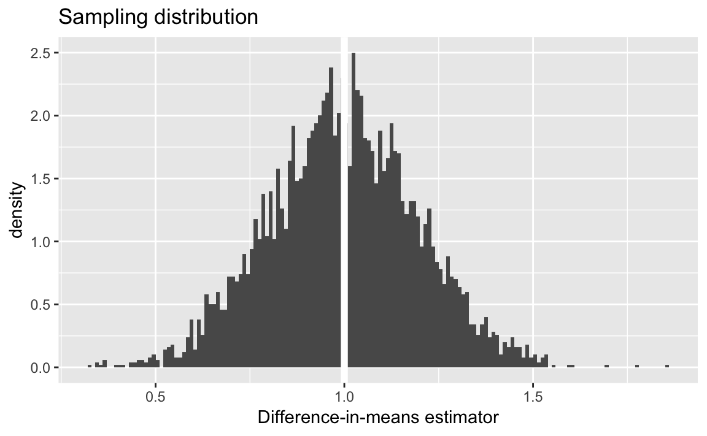
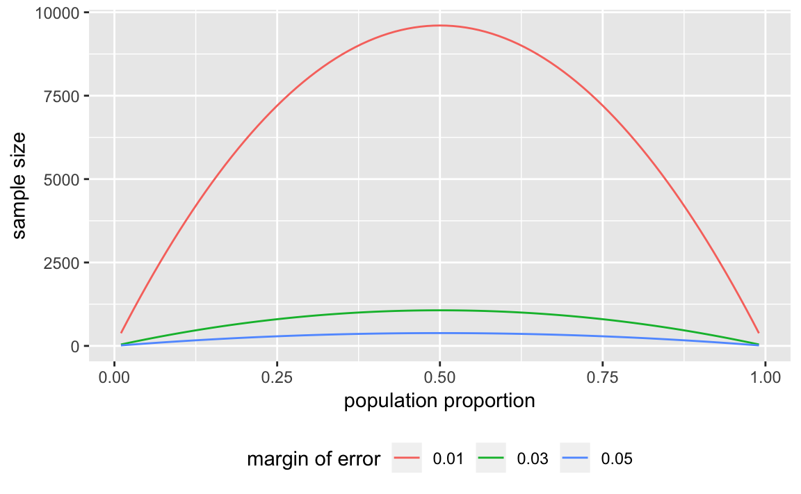
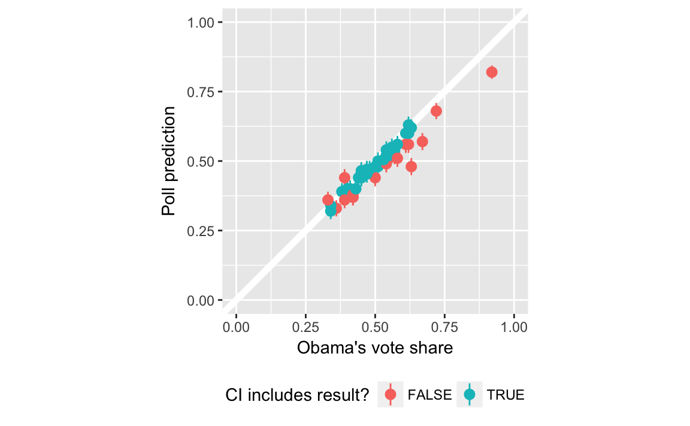
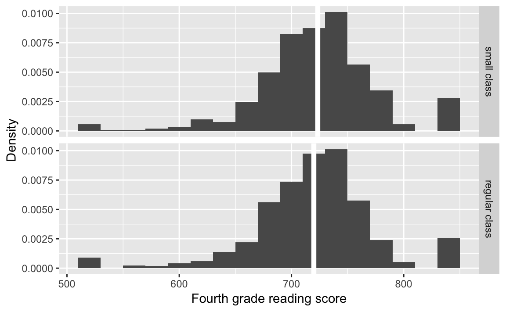
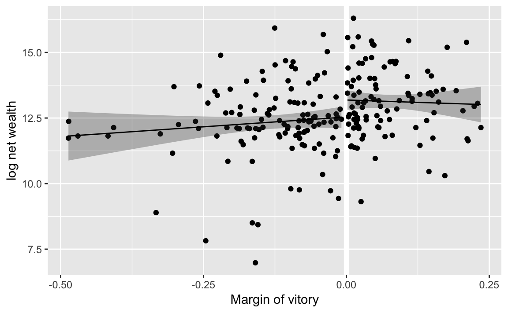

---
output: html_document
editor_options:
  chunk_output_type: console
---

# Uncertainty

## Prerequisites {-}

We will use these package in this chapter:

```r
library("tidyverse")
library("forcats")
library("lubridate")
library("stringr")
library("modelr")
library("broom")
library("purrr")
```

## Estimation

### Unbiasedness and Consistency

In these simulations, we draw a sample of size `n` from normal distributions with means `mu0` and `mu1` and standard deviations `sd0` and `sd1` respectively,

```r
n <- 100
mu0 <- 0
sd0 <- 1
mu1 <- 1
sd1 <- 1
smpl <- tibble(id = seq_len(n),
               # Y if not treated
               Y0 = rnorm(n, mean = mu0, sd = sd0),
               # Y if treated
               Y1 = rnorm(n, mean = mu1, sd = sd1),
               # individual treatment effects
               tau = Y1 - Y0)
```
The SATE is:

```r
SATE <- mean(smpl[["tau"]])
SATE
#> [1] 0.952
```

Simulations of RCTs. Write a function that takes the sample as an input `smpl`, then randomly assigns the treatment to each individual:

```r
sim_treat <- function(smpl) {
  n <- nrow(smpl)
  SATE <- mean(smpl[["tau"]])
  # indexes of obs receiving treatment
  idx <- sample(seq_len(n), floor(nrow(smpl) / 2), replace = FALSE)
  # treat variable are those receiving treatment, else 0
  smpl[["treat"]] <- as.integer(seq_len(nrow(smpl)) %in% idx)
  smpl %>%
    mutate(Y_obs = if_else(treat == 1L, Y1, Y0)) %>%
    group_by(treat) %>%
    summarise(Y_obs = mean(Y_obs)) %>%
    spread(treat, Y_obs) %>%
    rename(Y1_mean = `1`, Y0_mean = `0`) %>%
    mutate(diff_mean = Y1_mean - Y0_mean,
           est_error = diff_mean - SATE)
}
```

This returns a data frame with columns: `Y0_mean` (mean $Y$ for observations
not receiving the treatment), `Y1_mean` (mean $Y$ for observations receiving
the treatment), `diff` (difference in mean values between the two groups), and
`est_error` (difference between the estimated difference and the known SATE):


```r
sim_treat(smpl)
#> # A tibble: 1 x 4
#>   Y0_mean Y1_mean diff_mean est_error
#>     <dbl>   <dbl>     <dbl>     <dbl>
#> 1 -0.0570   0.875     0.932   -0.0207
```
Rerun this function `sims` times:

```r
sims <- 5000
sate_sims <- map_df(seq_len(sims), ~ sim_treat(smpl))
summary(sate_sims[["est_error"]])
#>    Min. 1st Qu.  Median    Mean 3rd Qu.    Max. 
#>  -0.484  -0.087  -0.002  -0.001   0.085   0.414
```

Simulate the PATE:

```r
PATE <- mu1 - mu0
```

```r
sim_pate <- function(n, mu0, mu1, sd0, sd1) {
  smpl <- tibble(Y0 = rnorm(n, mean = mu0, sd = sd0),
                 Y1 = rnorm(n, mean = mu1, sd = sd1),
                 tau = Y1 - Y0)
  # indexes of obs receiving treatment
  idx <- sample(seq_len(n), floor(nrow(smpl) / 2), replace = FALSE)
  # treat variable are those receiving treatment, else 0
  smpl[["treat"]] <- as.integer(seq_len(nrow(smpl)) %in% idx)
  smpl %>%
    mutate(Y_obs = if_else(treat == 1L, Y1, Y0)) %>%
    group_by(treat) %>%
    summarise(Y_obs = mean(Y_obs)) %>%
    spread(treat, Y_obs) %>%
    rename(Y1_mean = `1`, Y0_mean = `0`) %>%
    mutate(diff_mean = Y1_mean - Y0_mean,
           est_error = diff_mean - PATE)
}
```
Example of one simulation

```r
sim_pate(n, mu0, mu1, sd0, sd1)
#> # A tibble: 1 x 4
#>   Y0_mean Y1_mean diff_mean est_error
#>     <dbl>   <dbl>     <dbl>     <dbl>
#> 1  -0.109   0.925      1.03    0.0338
```


```r
pate_sims <-
  map_df(seq_len(sims), ~ sim_pate(n, mu0, mu1, sd0, sd1))
summary(pate_sims[["est_error"]])
#>    Min. 1st Qu.  Median    Mean 3rd Qu.    Max. 
#>  -0.677  -0.135  -0.004  -0.003   0.129   0.853
```

### Standard Error

Plot of the sampling distribution of the difference-in-means estimator:

```r
ggplot(pate_sims, aes(x = diff_mean, y = ..density..)) +
  geom_histogram(binwidth = 0.01, boundary = 1) +
  geom_vline(xintercept = PATE, colour = "white", size = 2) +
  ggtitle("Sampling distribution") +
  labs(x = "Difference-in-means estimator")
```




```r
sd(pate_sims[["diff_mean"]])
#> [1] 0.196
```

Simulate PATE with a standard error:

```r
sim_pate_se <- function(n, mu0, mu1, sd0, sd1) {
  # PATE - difference in means
  PATE <- mu1 - mu0
  # sample
  smpl <- tibble(Y0 = rnorm(n, mean = mu0, sd = sd0),
                 Y1 = rnorm(n, mean = mu1, sd = sd1),
                 tau = Y1 - Y0)
  # indexes of obs receiving treatment
  idx <- sample(seq_len(n), floor(nrow(smpl) / 2), replace = FALSE)
  # treat variable are those receiving treatment, else 0
  smpl[["treat"]] <- as.integer(seq_len(nrow(smpl)) %in% idx)
  # sample
  smpl %>%
    mutate(Y_obs = if_else(treat == 1L, Y1, Y0)) %>%
    group_by(treat) %>%
    summarise(mean = mean(Y_obs),
              var = var(Y_obs),
              nobs = n()) %>%
    summarise(diff_mean = diff(mean),
              se = sqrt(sum(var / nobs)),
              est_error = diff_mean - PATE)
}
```
Run a single simulation:

```r
sim_pate_se(n, mu0, mu1, sd0, sd1)
#> # A tibble: 1 x 3
#>   diff_mean    se est_error
#>       <dbl> <dbl>     <dbl>
#> 1      1.05 0.190    0.0539
```
Run `sims` simulations:

```r
sims <- 5000
pate_sims_se <-
  map_df(seq_len(sims), ~ sim_pate_se(n, mu0, mu1, sd0, sd1))
```
Standard deviation of difference-in-means

```r
sd(pate_sims_se[["diff_mean"]])
#> [1] 0.199
```
Mean of standard errors,

```r
mean(pate_sims_se[["se"]])
#> [1] 0.2
```

### Confidence Intervals

Calculate a $p\%$ confidence interval for the binomial distribution:

```r
# Sample size
n <- 1000
# point estimate
x_bar <- 0.6
# standard error
se <- sqrt(x_bar * (1 - x_bar) / n)
# Desired Confidence levels
levels <- c(0.99, 0.95, 0.90)
```


```r
tibble(level = levels) %>%
  mutate(
    ci_lower = x_bar - qnorm(1 - (1 - level) / 2) * se,
    ci_upper = x_bar + qnorm(1 - (1 - level) / 2) * se
  )
#> # A tibble: 3 x 3
#>   level ci_lower ci_upper
#>   <dbl>    <dbl>    <dbl>
#> 1  0.99    0.560    0.640
#> 2  0.95    0.570    0.630
#> 3  0.9     0.575    0.625
```

Calculate the coverage ratio of the 95% confidence interval in the PATE simulations.

```r
level <- 0.95
pate_sims_se %>%
  mutate(ci_lower = diff_mean - qnorm(1 - (1 - level) / 2) * se,
         ci_upper = diff_mean + qnorm(1 - (1 - level) / 2) * se,
         includes_pate = PATE > ci_lower & PATE < ci_upper) %>%
  summarise(coverage = mean(includes_pate))
#> # A tibble: 1 x 1
#>   coverage
#>      <dbl>
#> 1    0.948
```
To do this for multiple levels encapsulate the above code in a function with arguments `.data` (the data frame) and the confidence level, `level`:

```r
pate_sims_coverage <- function(.data, level = 0.95) {
  mutate(.data,
         ci_lower = diff_mean - qnorm(1 - (1 - level) / 2) * se,
         ci_upper = diff_mean + qnorm(1 - (1 - level) / 2) * se,
         includes_pate = PATE > ci_lower & PATE < ci_upper) %>%
    summarise(coverage = mean(includes_pate))
}

pate_sims_coverage(pate_sims_se, 0.95)
#> # A tibble: 1 x 1
#>   coverage
#>      <dbl>
#> 1    0.948
pate_sims_coverage(pate_sims_se, 0.99)
#> # A tibble: 1 x 1
#>   coverage
#>      <dbl>
#> 1    0.989
pate_sims_coverage(pate_sims_se, 0.90)
#> # A tibble: 1 x 1
#>   coverage
#>      <dbl>
#> 1    0.898
```


```r
p <- 0.6
n <- 10
alpha <- 0.05
sims <- 5000
```

Define a function that samples from a Bernoulli distribution, calculates its standard error, and returns a logical value as to whether it contains the true value:

```r
binom_ci_contains <- function(n, p, alpha = 0.05) {
  x <- rbinom(n, size = 1, prob = p)
  x_bar <- mean(x)
  se <- sqrt(x_bar * (1 - x_bar) / n)
  ci_lower <- x_bar - qnorm(1 - alpha / 2) * se
  ci_upper <- x_bar + qnorm(1 - alpha / 2) * se
  (ci_lower <= p) & (p <= ci_upper)
}
```

We can run this once for given sample size:

```r
n <- 10
binom_ci_contains(n, p)
#> [1] FALSE
```
Using `map_df` we can rerun it `sims` times and calculate the coverage proportion:

```r
mean(map_lgl(seq_len(sims), ~ binom_ci_contains(n, p)))
#> [1] 0.905
```

Encapsulate the above code in a function that calculates the coverage of a confidence interval with size, `n`, and success probability, `p`:


```r
binom_ci_coverage <- function(n, p, sims) {
  mean(map_lgl(seq_len(sims), ~ binom_ci_contains(n, p)))
}
```
Use `binom_ci_coverage` to calculate CI coverage for multiple values of the sample size:

```r
tibble(n = c(10L, 100L, 1000L)) %>%
  mutate(coverage = map_dbl(n, binom_ci_coverage, p = !!p, sims = !!sims))
#> # A tibble: 3 x 2
#>       n coverage
#>   <int>    <dbl>
#> 1    10    0.900
#> 2   100    0.943
#> 3  1000    0.948
```

### Margin of Error and Sample Size Calculation in Polls

Write a function to calculate the sample size needed for a given proportion.

```r
moe_pop_prop <- function(MoE) {
  tibble(p = seq(from = 0.01, to = 0.99, by = 0.01),
         n = 1.96 ^ 2 * p * (1 - p) / MoE ^ 2,
         MoE = MoE)
}
moe_pop_prop(0.01)
#> # A tibble: 99 x 3
#>       p     n   MoE
#>   <dbl> <dbl> <dbl>
#> 1  0.01  380.  0.01
#> 2  0.02  753.  0.01
#> 3  0.03 1118.  0.01
#> 4  0.04 1475.  0.01
#> 5  0.05 1825.  0.01
#> 6  0.06 2167.  0.01
#> # ... with 93 more rows
```
Then use [map_df](https://www.rdocumentation.org/packages/purrr/topics/map_df) to call this function for different margins of error, and return the entire thing as a data frame with columns: `n`, `p`, and `MoE`.

```r
MoE <- c(0.01, 0.03, 0.05)
props <- map_df(MoE, moe_pop_prop)
```
Since its a data frame, its easy to plot with [ggplot](https://www.rdocumentation.org/packages/ggplot2/topics/ggplot):

```r
ggplot(props, aes(x = p, y = n, colour = factor(MoE))) +
  geom_line() +
  labs(colour = "margin of error",
       x = "population proportion",
       y = "sample size") +
  theme(legend.position = "bottom")
```


[read_csv](https://www.rdocumentation.org/packages/readr/topics/read_csv) already recognizes the date columns, so we don't need to convert them.
The 2008 election was on Nov 11, 2008, so we'll store that in a variable.

```r
ELECTION_DATE <- ymd(20081104)
```
Load the final vote shares,

```r
data("pres08", package = "qss")
```
and polling data

```r
data("polls08", package = "qss")
```
We need to add an additional column to the `polls08` data frame which contains
the number of days until the election:

```r
polls08 <- polls08 %>%
  mutate(DaysToElection = as.integer(ELECTION_DATE - middate))
```
For each state calculate the mean of the latest polls,

```r
poll_pred <-
  polls08 %>%
  group_by(state) %>%
  # latest polls in the state
  filter(DaysToElection == min(DaysToElection)) %>%
  # take mean of latest polls and convert from 0-100 to 0-1
  summarise(Obama = mean(Obama) / 100)
# Add confidence itervals
# sample size
sample_size <- 1000
# confidence level
alpha <- 0.05
poll_pred <-
  poll_pred %>%
  mutate(se = sqrt(Obama * (1 - Obama) / sample_size),
         ci_lwr = Obama + qnorm(alpha / 2) * se,
         ci_upr = Obama + qnorm(1 - alpha / 2) * se)
# Add actual outcome
poll_pred <-
  left_join(poll_pred,
            select(pres08, state, actual = Obama),
            by = "state") %>%
  mutate(actual = actual / 100,
         covers = (ci_lwr <= actual) & (actual <= ci_upr))
poll_pred
#> # A tibble: 51 x 7
#>   state Obama     se ci_lwr ci_upr actual covers
#>   <chr> <dbl>  <dbl>  <dbl>  <dbl>  <dbl> <lgl> 
#> 1 AK    0.39  0.0154  0.360  0.420   0.38 TRUE  
#> 2 AL    0.36  0.0152  0.330  0.390   0.39 FALSE 
#> 3 AR    0.44  0.0157  0.409  0.471   0.39 FALSE 
#> 4 AZ    0.465 0.0158  0.434  0.496   0.45 TRUE  
#> 5 CA    0.6   0.0155  0.570  0.630   0.61 TRUE  
#> 6 CO    0.52  0.0158  0.489  0.551   0.54 TRUE  
#> # ... with 45 more rows
```

In the plot, color the point ranges by whether they include the election day outcome.

```r
ggplot(poll_pred, aes(x = actual, y = Obama,
                      ymin = ci_lwr, ymax = ci_upr,
                      colour = covers)) +
  geom_abline(intercept = 0, slope = 1, colour = "white", size = 2) +
  geom_pointrange() +
  scale_y_continuous("Poll prediction", limits = c(0, 1)) +
  scale_x_continuous("Obama's vote share", limits = c(0, 1)) +
  scale_colour_discrete("CI includes result?") +
  coord_fixed() +
  theme(legend.position = "bottom")
```



Proportion of polls with confidence intervals that include the election outcome?

```r
poll_pred %>%
  summarise(mean(covers))
#> # A tibble: 1 x 1
#>   `mean(covers)`
#>            <dbl>
#> 1          0.588
```


```r
poll_pred <-
  poll_pred %>%
  # calc bias
  mutate(bias = Obama - actual) %>%
  # bias corrected prediction, se, and CI
  mutate(Obama_bc = Obama - mean(bias),
         se_bc = sqrt(Obama_bc * (1 - Obama_bc) / sample_size),
         ci_lwr_bc = Obama_bc + qnorm(alpha / 2) * se_bc,
         ci_upr_bc = Obama_bc + qnorm(1 - alpha / 2) * se_bc,
         covers_bc = (ci_lwr_bc <= actual) & (actual <= ci_upr_bc))
poll_pred %>%
  summarise(mean(covers_bc))
#> # A tibble: 1 x 1
#>   `mean(covers_bc)`
#>               <dbl>
#> 1             0.765
```

### Analysis of Randomized Controlled Trials

Load the `STAR` data from the **qss** package,

```r
data("STAR", package = "qss")
```
Add meaningful labels to the `classtype` variable:

```r
STAR <- STAR %>%
  mutate(classtype = factor(classtype,
                            labels = c("small class", "regular class",
                                       "regular class with aid")))
```
Summarize scores by classroom type:

```r
classtype_means <-
  STAR %>%
  group_by(classtype) %>%
  summarise(g4reading = mean(g4reading, na.rm = TRUE))
```
Plot the distribution of scores by classroom type:

```r
classtypes_used <- c("small class", "regular class")
ggplot(filter(STAR,
              classtype %in% classtypes_used,
              !is.na(g4reading)),
       aes(x = g4reading, y = ..density..)) +
  geom_histogram(binwidth = 20) +
  geom_vline(data = filter(classtype_means, classtype %in% classtypes_used),
             mapping = aes(xintercept = g4reading),
             colour = "white", size = 2) +
  facet_grid(classtype ~ .) +
  labs(x = "Fourth grade reading score", y = "Density")

alpha <- 0.05
star_estimates <-
  STAR %>%
  filter(!is.na(g4reading)) %>%
  group_by(classtype) %>%
  summarise(n = n(),
            est = mean(g4reading),
            se = sd(g4reading) / sqrt(n)) %>%
  mutate(lwr = est + qnorm(alpha / 2) * se,
         upr = est + qnorm(1 - alpha / 2) * se)
star_estimates
#> # A tibble: 3 x 6
#>   classtype                  n   est    se   lwr   upr
#>   <fct>                  <int> <dbl> <dbl> <dbl> <dbl>
#> 1 small class              726  723.  1.91  720.  727.
#> 2 regular class            836  720.  1.84  716.  723.
#> 3 regular class with aid   791  721.  1.86  717.  724.

star_estimates %>%
  filter(classtype %in% c("small class", "regular class")) %>%
  # ensure that it is ordered small then regular
  arrange(desc(classtype)) %>%
  summarise(
    se = sqrt(sum(se ^ 2)),
    est = diff(est)
  ) %>%
  mutate(ci_lwr = est + qnorm(alpha / 2) * se,
         ci_up = est + qnorm(1 - alpha / 2) * se)
#> # A tibble: 1 x 4
#>      se   est ci_lwr ci_up
#>   <dbl> <dbl>  <dbl> <dbl>
#> 1  2.65  3.50  -1.70  8.70
```



Use we could use [spread](https://www.rdocumentation.org/packages/tidyr/topics/spread) and [gather](https://www.rdocumentation.org/packages/tidyr/topics/gather):


```r
star_ate <-
  star_estimates %>%
  filter(classtype %in% c("small class", "regular class")) %>%
  mutate(classtype = fct_recode(factor(classtype),
                                "small" = "small class",
                                "regular" = "regular class")) %>%
  select(classtype, est, se) %>%
  gather(stat, value, -classtype) %>%
  unite(variable, stat, classtype)  %>%
  spread(variable, value) %>%
  mutate(ate_est = est_small - est_regular,
         ate_se = sqrt(se_small ^ 2 + se_regular ^ 2),
         ci_lwr = ate_est + qnorm(alpha / 2) * ate_se,
         ci_upr = ate_est + qnorm(1 - alpha / 2) * ate_se)
star_ate
#> # A tibble: 1 x 8
#>   est_regular est_small se_regular se_small ate_est ate_se ci_lwr ci_upr
#>         <dbl>     <dbl>      <dbl>    <dbl>   <dbl>  <dbl>  <dbl>  <dbl>
#> 1        720.      723.       1.84     1.91    3.50   2.65  -1.70   8.70
```

### Analysis Based on Student's t-Distribution

Use [filter](https://www.rdocumentation.org/packages/dplyr/topics/filter) to subset.

```r
t.test(filter(STAR, classtype == "small class")$g4reading,
       filter(STAR, classtype == "regular class")$g4reading)
#> 
#> 	Welch Two Sample t-test
#> 
#> data:  filter(STAR, classtype == "small class")$g4reading and filter(STAR, classtype == "regular class")$g4reading
#> t = 1, df = 2000, p-value = 0.2
#> alternative hypothesis: true difference in means is not equal to 0
#> 95 percent confidence interval:
#>  -1.70  8.71
#> sample estimates:
#> mean of x mean of y 
#>       723       720
```
The function [t.test](https://www.rdocumentation.org/packages/stat/topics/t.test) can also take a formula as its first parameter.

```r
t.test(g4reading ~ classtype,
       data = filter(STAR, classtype %in% c("small class", "regular class")))
#> 
#> 	Welch Two Sample t-test
#> 
#> data:  g4reading by classtype
#> t = 1, df = 2000, p-value = 0.2
#> alternative hypothesis: true difference in means is not equal to 0
#> 95 percent confidence interval:
#>  -1.70  8.71
#> sample estimates:
#>   mean in group small class mean in group regular class 
#>                         723                         720
```

## Hypothesis Testing

### Tea-Testing Experiment


```r
# Number of cups of tea
cups <- 4
# Number guessed correctly
k <- c(0, seq_len(cups))
true <-  tibble(correct = k * 2,
                n = choose(cups, k) * choose(cups, cups - k)) %>%
  mutate(prob = n / sum(n))
true
#> # A tibble: 5 x 3
#>   correct     n   prob
#>     <dbl> <dbl>  <dbl>
#> 1       0     1 0.0143
#> 2       2    16 0.229 
#> 3       4    36 0.514 
#> 4       6    16 0.229 
#> 5       8     1 0.0143

sims <- 1000
guess <- tibble(guess = c("M", "T", "T", "M", "M", "T", "T", "M"))
randomize_tea <- function(df) {
  # randomize the order of teas
  assignment <- sample_frac(df, 1) %>%
    rename(actual = guess)
  bind_cols(df, assignment) %>%
    summarise(correct = sum(guess == actual))
}
approx <-
  map_df(seq_len(sims), ~ randomize_tea(guess)) %>%
  count(correct) %>%
  mutate(prob = n / sum(n))
left_join(select(approx, correct, prob_sim = prob),
          select(true, correct, prob_exact = prob),
          by = "correct") %>%
  mutate(diff = prob_sim - prob_exact)
#> # A tibble: 5 x 4
#>   correct prob_sim prob_exact     diff
#>     <dbl>    <dbl>      <dbl>    <dbl>
#> 1       0    0.011     0.0143 -0.00329
#> 2       2    0.234     0.229   0.00543
#> 3       4    0.486     0.514  -0.0283 
#> 4       6    0.253     0.229   0.0244 
#> 5       8    0.016     0.0143  0.00171
```

### The General Framework

The test functions like [fisher.test](https://www.rdocumentation.org/packages/stat/topics/fisher.test) do not work particularly well with data frames, and expect vectors or matrices as input, so tidyverse functions are less directly applicable

```r
# all guesses correct
x <- tribble(~Guess, ~Truth, ~Number,
             "Milk", "Milk", 4L,
             "Milk", "Tea", 0L,
             "Tea", "Milk", 0L,
             "Tea", "Tea", 4L)
x
#> # A tibble: 4 x 3
#>   Guess Truth Number
#>   <chr> <chr>  <int>
#> 1 Milk  Milk       4
#> 2 Milk  Tea        0
#> 3 Tea   Milk       0
#> 4 Tea   Tea        4
# 6 correct guesses
y <- x %>%
  mutate(Number = c(3L, 1L, 1L, 3L))
y
#> # A tibble: 4 x 3
#>   Guess Truth Number
#>   <chr> <chr>  <int>
#> 1 Milk  Milk       3
#> 2 Milk  Tea        1
#> 3 Tea   Milk       1
#> 4 Tea   Tea        3
# Turn into a 2x2 table for fisher.test
select(spread(x, Truth, Number), -Guess)
#> # A tibble: 2 x 2
#>    Milk   Tea
#>   <int> <int>
#> 1     4     0
#> 2     0     4
# Use spread to make it a 2 x 2 table
fisher.test(select(spread(x, Truth, Number), -Guess),
            alternative = "greater")
#> 
#> 	Fisher's Exact Test for Count Data
#> 
#> data:  select(spread(x, Truth, Number), -Guess)
#> p-value = 0.01
#> alternative hypothesis: true odds ratio is greater than 1
#> 95 percent confidence interval:
#>    2 Inf
#> sample estimates:
#> odds ratio 
#>        Inf
fisher.test(select(spread(y, Truth, Number), -Guess))
#> 
#> 	Fisher's Exact Test for Count Data
#> 
#> data:  select(spread(y, Truth, Number), -Guess)
#> p-value = 0.5
#> alternative hypothesis: true odds ratio is not equal to 1
#> 95 percent confidence interval:
#>    0.212 621.934
#> sample estimates:
#> odds ratio 
#>       6.41
```

### One-Sample Tests


```r
n <- 1018
x_bar <- 550 / n
se <- sqrt(0.5 * 0.5 / n) # standard deviation of sampling distribution
# upper red area in the figure
upper <- pnorm(x_bar, mean = 0.5, sd = se, lower.tail = FALSE)
# lower red area in the figure; identical to the upper area
lower <- pnorm(0.5 - (x_bar - 0.5), mean = 0.5, sd = se)
# two side p value
upper + lower
#> [1] 0.0102
2 * upper
#> [1] 0.0102
# one sided p value
upper
#> [1] 0.00508
z_score <- (x_bar - 0.5) / se
z_score
#> [1] 2.57
pnorm(z_score, lower.tail = FALSE) # one-sided p-value
#> [1] 0.00508
2 * pnorm(z_score, lower.tail = FALSE) # two-sided p-value
#> [1] 0.0102
# 99% confidence interval contains 0.5
c(x_bar - qnorm(0.995) * se, x_bar + qnorm(0.995) * se)
#> [1] 0.500 0.581
# 95% confidence interval does not contain 0.5
c(x_bar - qnorm(0.975) * se, x_bar + qnorm(0.975) * se)
#> [1] 0.510 0.571
# no continuity correction to get the same p-value as above
prop.test(550, n = n, p = 0.5, correct = FALSE)
#> 
#> 	1-sample proportions test without continuity correction
#> 
#> data:  550 out of n, null probability 0.5
#> X-squared = 7, df = 1, p-value = 0.01
#> alternative hypothesis: true p is not equal to 0.5
#> 95 percent confidence interval:
#>  0.510 0.571
#> sample estimates:
#>    p 
#> 0.54
# with continuity correction
prop.test(550, n = n, p = 0.5)
#> 
#> 	1-sample proportions test with continuity correction
#> 
#> data:  550 out of n, null probability 0.5
#> X-squared = 6, df = 1, p-value = 0.01
#> alternative hypothesis: true p is not equal to 0.5
#> 95 percent confidence interval:
#>  0.509 0.571
#> sample estimates:
#>    p 
#> 0.54
prop.test(550, n = n, p = 0.5, conf.level = 0.99)
#> 
#> 	1-sample proportions test with continuity correction
#> 
#> data:  550 out of n, null probability 0.5
#> X-squared = 6, df = 1, p-value = 0.01
#> alternative hypothesis: true p is not equal to 0.5
#> 99 percent confidence interval:
#>  0.499 0.581
#> sample estimates:
#>    p 
#> 0.54
```


```r
# two-sided one-sample t-test
t.test(STAR$g4reading, mu = 710)
#> 
#> 	One Sample t-test
#> 
#> data:  STAR$g4reading
#> t = 10, df = 2000, p-value <2e-16
#> alternative hypothesis: true mean is not equal to 710
#> 95 percent confidence interval:
#>  719 723
#> sample estimates:
#> mean of x 
#>       721
```

### Two-sample tests

The ATE estimates are stored in a data frame, `star_ate`. Note that the [dplyr](https://cran.r-project.org/package=dplyr) function [transmute](https://www.rdocumentation.org/packages/dplyr/topics/transmute) is like `mutate`, but only returns the variables specified in the function.

```r
star_ate %>%
  transmute(p_value_1sided = pnorm(-abs(ate_est),
                                   mean = 0, sd = ate_se),
            p_value_2sided = 2 * pnorm(-abs(ate_est), mean = 0,
                                   sd = ate_se))
#> # A tibble: 1 x 2
#>   p_value_1sided p_value_2sided
#>            <dbl>          <dbl>
#> 1         0.0935          0.187

t.test(g4reading ~ classtype,
  data = filter(STAR, classtype %in% c("small class", "regular class")))
#> 
#> 	Welch Two Sample t-test
#> 
#> data:  g4reading by classtype
#> t = 1, df = 2000, p-value = 0.2
#> alternative hypothesis: true difference in means is not equal to 0
#> 95 percent confidence interval:
#>  -1.70  8.71
#> sample estimates:
#>   mean in group small class mean in group regular class 
#>                         723                         720
```
or

```r
t.test(filter(STAR, classtype == "small class")$g4reading,
       filter(STAR, classtype == "regular class")$g4reading)
#> 
#> 	Welch Two Sample t-test
#> 
#> data:  filter(STAR, classtype == "small class")$g4reading and filter(STAR, classtype == "regular class")$g4reading
#> t = 1, df = 2000, p-value = 0.2
#> alternative hypothesis: true difference in means is not equal to 0
#> 95 percent confidence interval:
#>  -1.70  8.71
#> sample estimates:
#> mean of x mean of y 
#>       723       720
```


```r
data("resume", package = "qss")
x <- resume %>%
  count(race, call) %>%
  spread(call, n) %>%
  ungroup()
x
#> # A tibble: 2 x 3
#>   race    `0`   `1`
#>   <chr> <int> <int>
#> 1 black  2278   157
#> 2 white  2200   235
prop.test(as.matrix(select(x, -race)), alternative = "greater")
#> 
#> 	2-sample test for equality of proportions with continuity
#> 	correction
#> 
#> data:  as.matrix(select(x, -race))
#> X-squared = 20, df = 1, p-value = 2e-05
#> alternative hypothesis: greater
#> 95 percent confidence interval:
#>  0.0188 1.0000
#> sample estimates:
#> prop 1 prop 2 
#>  0.936  0.903
```

Assign sample sizes and proportions, then calculate point estimates, standard error, z-statistic and one-sided p-value.


```r
n0 <- sum(resume$race == "black")
n1 <- sum(resume$race == "white")

p <- mean(resume$call)
p0 <- mean(filter(resume, race == "black")$call)
p1 <- mean(filter(resume, race == "white")$call)

est <- p1 - p0
est
#> [1] 0.032

se <- sqrt(p * (1 - p) * (1 / n0 + 1 / n1))
se
#> [1] 0.0078

zstat <- est / se
zstat
#> [1] 4.11

pnorm(-abs(zstat))
#> [1] 1.99e-05
```

The only thing that changed is using [filter](https://www.rdocumentation.org/packages/dplyr/topics/filter) for selecting the groups.

### Power Analysis

Set the parameters: the sample size,

```r
n <- 250
```
the population proportional under the alternative data generating process,

```r
p_star <- 0.48
```
the null hypothesis,

```r
p <- 0.5
```
the p-value,

```r
alpha <- 0.05
```
and

```r
cr_value <- qnorm(1 - alpha / 2)
```
The standard errors under the hypothetical data generating process is

```r
se_star <- sqrt(p_star * (1 - p_star) / n)
```
and the standard error under the null is

```r
se <- sqrt(p * (1 - p) / n)
```
The power for this test is

```r
pnorm(p - cr_value * se, mean = p_star, sd = se_star) +
    pnorm(p + cr_value * se, mean = p_star, sd = se_star,
          lower.tail = FALSE)
#> [1] 0.0967
```

The parameters (sample sizes and proportions) are

```r
n1 <- 500
n0 <- 500
p1_star <- 0.05
p0_star <- 0.1
```
Calculate the overall call back rate as a weighted average,

```r
p <- (n1 * p1_star + n0 * p0_star) / (n1 + n0)
```
the standard error under the null,

```r
se <- sqrt(p * (1 - p) * (1 / n1 + 1 / n0))
```
the standard error under the hypothetical data generating process,

```r
se.star <- sqrt(p1_star * (1 - p1_star) / n1 + p0_star * (1 - p0_star) / n0)
```

```r
pnorm(-cr_value * se, mean = p1_star - p0_star, sd = se.star) +
    pnorm(cr_value * se, mean = p1_star - p0_star, sd = se.star,
          lower.tail = FALSE)
#> [1] 0.852
```

```r
power.prop.test(n = 500, p1 = 0.05, p2 = 0.1, sig.level = 0.05)
#> 
#>      Two-sample comparison of proportions power calculation 
#> 
#>               n = 500
#>              p1 = 0.05
#>              p2 = 0.1
#>       sig.level = 0.05
#>           power = 0.852
#>     alternative = two.sided
#> 
#> NOTE: n is number in *each* group
```

```r
power.prop.test(p1 = 0.05, p2 = 0.1, sig.level = 0.05, power = 0.9)
#> 
#>      Two-sample comparison of proportions power calculation 
#> 
#>               n = 581
#>              p1 = 0.05
#>              p2 = 0.1
#>       sig.level = 0.05
#>           power = 0.9
#>     alternative = two.sided
#> 
#> NOTE: n is number in *each* group
```

```r
power.t.test(n = 100, delta = 0.25, sd = 1, type = "one.sample")
#> 
#>      One-sample t test power calculation 
#> 
#>               n = 100
#>           delta = 0.25
#>              sd = 1
#>       sig.level = 0.05
#>           power = 0.697
#>     alternative = two.sided
```

```r
power.t.test(power = 0.9, delta = 0.25, sd = 1, type = "one.sample")
#> 
#>      One-sample t test power calculation 
#> 
#>               n = 170
#>           delta = 0.25
#>              sd = 1
#>       sig.level = 0.05
#>           power = 0.9
#>     alternative = two.sided
```

```r
power.t.test(delta = 0.25, sd = 1, type = "two.sample",
             alternative = "one.sided", power = 0.9)
#> 
#>      Two-sample t test power calculation 
#> 
#>               n = 275
#>           delta = 0.25
#>              sd = 1
#>       sig.level = 0.05
#>           power = 0.9
#>     alternative = one.sided
#> 
#> NOTE: n is number in *each* group
```

## Linear Regression Model with Uncertainty

### Linear Regression as a Generative Model

Load the minimum wage date included with the **qss** package:

```r
data("minwage", package = "qss")
```

```r
minwage <- mutate(minwage,
                  fullPropBefore = fullBefore / (fullBefore + partBefore),
                  fullPropAfter = fullAfter / (fullAfter + partAfter),
                  NJ = as.integer(location == "PA"))
```

```r
fit_minwage <- lm(fullPropAfter ~ -1 + NJ + fullPropBefore +
                    wageBefore + chain, data = minwage)
fit_minwage
#> 
#> Call:
#> lm(formula = fullPropAfter ~ -1 + NJ + fullPropBefore + wageBefore + 
#>     chain, data = minwage)
#> 
#> Coefficients:
#>              NJ   fullPropBefore       wageBefore  chainburgerking  
#>         -0.0542           0.1688           0.0813          -0.0614  
#>        chainkfc        chainroys      chainwendys  
#>         -0.0966          -0.1522          -0.1659
fit_minwage1 <- lm(fullPropAfter ~ NJ + fullPropBefore +
                     wageBefore + chain, data = minwage)
fit_minwage1
#> 
#> Call:
#> lm(formula = fullPropAfter ~ NJ + fullPropBefore + wageBefore + 
#>     chain, data = minwage)
#> 
#> Coefficients:
#>    (Intercept)              NJ  fullPropBefore      wageBefore  
#>        -0.0614         -0.0542          0.1688          0.0813  
#>       chainkfc       chainroys     chainwendys  
#>        -0.0352         -0.0908         -0.1045
gather_predictions(slice(minwage, 1), fit_minwage, fit_minwage1) %>%
  select(model, pred)
#>          model  pred
#> 1  fit_minwage 0.271
#> 2 fit_minwage1 0.271
```

### Inference about coefficients

Use the [tidy](https://www.rdocumentation.org/packages/broom/topics/tidy) function to return the coefficients, including confidence intervals, as a data frame:

```r
data("women", package = "qss")
fit_women <- lm(water ~ reserved, data = women)
summary(fit_women)
#> 
#> Call:
#> lm(formula = water ~ reserved, data = women)
#> 
#> Residuals:
#>    Min     1Q Median     3Q    Max 
#> -23.99 -14.74  -7.86   2.26 316.01 
#> 
#> Coefficients:
#>             Estimate Std. Error t value Pr(>|t|)    
#> (Intercept)    14.74       2.29    6.45  4.2e-10 ***
#> reserved        9.25       3.95    2.34     0.02 *  
#> ---
#> Signif. codes:  0 '***' 0.001 '**' 0.01 '*' 0.05 '.' 0.1 ' ' 1
#> 
#> Residual standard error: 33.4 on 320 degrees of freedom
#> Multiple R-squared:  0.0169,	Adjusted R-squared:  0.0138 
#> F-statistic: 5.49 on 1 and 320 DF,  p-value: 0.0197
tidy(fit_women)
#>          term estimate std.error statistic  p.value
#> 1 (Intercept)    14.74      2.29      6.45 4.22e-10
#> 2    reserved     9.25      3.95      2.34 1.97e-02
```

You need to set `conf.int = TRUE` for [tidy](https://www.rdocumentation.org/packages/broom/topics/tidy.lm) to include the confidence interval:

```r
summary(fit_minwage)
#> 
#> Call:
#> lm(formula = fullPropAfter ~ -1 + NJ + fullPropBefore + wageBefore + 
#>     chain, data = minwage)
#> 
#> Residuals:
#>     Min      1Q  Median      3Q     Max 
#> -0.4862 -0.1813 -0.0281  0.1513  0.7509 
#> 
#> Coefficients:
#>                 Estimate Std. Error t value Pr(>|t|)   
#> NJ               -0.0542     0.0332   -1.63   0.1034   
#> fullPropBefore    0.1688     0.0566    2.98   0.0031 **
#> wageBefore        0.0813     0.0389    2.09   0.0374 * 
#> chainburgerking  -0.0614     0.1755   -0.35   0.7266   
#> chainkfc         -0.0966     0.1793   -0.54   0.5904   
#> chainroys        -0.1522     0.1832   -0.83   0.4066   
#> chainwendys      -0.1659     0.1853   -0.90   0.3711   
#> ---
#> Signif. codes:  0 '***' 0.001 '**' 0.01 '*' 0.05 '.' 0.1 ' ' 1
#> 
#> Residual standard error: 0.244 on 351 degrees of freedom
#> Multiple R-squared:  0.635,	Adjusted R-squared:  0.628 
#> F-statistic: 87.2 on 7 and 351 DF,  p-value: <2e-16
tidy(fit_minwage, conf.int = TRUE)
#>              term estimate std.error statistic p.value conf.low conf.high
#> 1              NJ  -0.0542    0.0332    -1.633 0.10343 -0.11953    0.0111
#> 2  fullPropBefore   0.1688    0.0566     2.981 0.00307  0.05744    0.2801
#> 3      wageBefore   0.0813    0.0389     2.090 0.03737  0.00478    0.1579
#> 4 chainburgerking  -0.0614    0.1755    -0.350 0.72657 -0.40648    0.2837
#> 5        chainkfc  -0.0966    0.1793    -0.539 0.59044 -0.44919    0.2560
#> 6       chainroys  -0.1522    0.1832    -0.831 0.40664 -0.51238    0.2080
#> 7     chainwendys  -0.1659    0.1853    -0.895 0.37115 -0.53031    0.1985
```

### Inference about predictions


```r
data("MPs", package = "qss")
MPs_labour <- filter(MPs, party == "labour")
MPs_tory <- filter(MPs, party == "tory")
labour_fit1 <- lm(ln.net ~ margin, data = filter(MPs_labour, margin < 0))
labour_fit2 <- lm(ln.net ~ margin, data = filter(MPs_labour, margin > 0))
tory_fit1 <- lm(ln.net ~ margin, data = filter(MPs_tory, margin < 0))
tory_fit2 <- lm(ln.net ~ margin, data = filter(MPs_tory, margin > 0))
```
Predictions at the threshold.
The [broom](https://cran.r-project.org/package=broom) function [augment](https://www.rdocumentation.org/packages/broom/topics/augment) will return prediction fitted values and standard errors for each value, but not the confidence intervals themselves (we'd have to multiply the correct t-distribution with degrees of freedom.)
So instead, we'll directly use the [predict](https://www.rdocumentation.org/packages/stats/topics/predict.lm) function:

```r
tory_y0 <-
  predict(tory_fit1, interval = "confidence",
          newdata = tibble(margin = 0)) %>% as_tibble()
tory_y0
#> # A tibble: 1 x 3
#>     fit   lwr   upr
#>   <dbl> <dbl> <dbl>
#> 1  12.5  12.1  13.0
tory_y1 <-
  predict(tory_fit2, interval = "confidence",
          newdata = tibble(margin = 0)) %>% as_tibble()
tory_y1
#> # A tibble: 1 x 3
#>     fit   lwr   upr
#>   <dbl> <dbl> <dbl>
#> 1  13.2  12.8  13.6
```
Alternatively, using `augment` (and assuming a normal distribution since the number of observations is so large its not worth worrying about the t-distribution):

```r
tory_y0 <-
  augment(tory_fit1, newdata = tibble(margin = 0)) %>%
  mutate(lwr = .fitted + qnorm(0.025) * .se.fit,
         upr = .fitted + qnorm(0.975) * .se.fit)
tory_y0
#>   margin .fitted .se.fit  lwr upr
#> 1      0    12.5   0.214 12.1  13
tory_y1 <-
  augment(tory_fit2, newdata = tibble(margin = 0)) %>%
  mutate(lwr = .fitted + qnorm(0.025) * .se.fit,
         upr = .fitted + qnorm(0.975) * .se.fit)
tory_y1
#>   margin .fitted .se.fit  lwr  upr
#> 1      0    13.2   0.192 12.8 13.6
```


```r
y1_range <- data_grid(filter(MPs_tory, margin <= 0), margin)
tory_y0 <- augment(tory_fit1, newdata = y1_range)
y2_range <- data_grid(filter(MPs_tory, margin >= 0), margin)
tory_y1 <- augment(tory_fit2, newdata = y2_range)
```


```r
ggplot() +
  geom_ref_line(v = 0) +
  geom_point(aes(y = ln.net, x = margin), data = MPs_tory) +
  # plot losers
  geom_ribbon(aes(x = margin,
                  ymin = .fitted + qnorm(0.025) * .se.fit,
                  ymax = .fitted + qnorm(0.975) * .se.fit),
              data = tory_y0, alpha = 0.3) +
  geom_line(aes(x = margin, y = .fitted), data = tory_y0) +
  # plot winners
  geom_ribbon(aes(x = margin,
                  ymin = .fitted + qnorm(0.025) * .se.fit,
                  ymax = .fitted + qnorm(0.975) * .se.fit),
              data = tory_y1, alpha = 0.3) +
  geom_line(aes(x = margin, y = .fitted), data = tory_y1) +
  labs(x = "Margin of vitory", y = "log net wealth")
```



```r
tory_y1 <- augment(tory_fit1, newdata = tibble(margin = 0))
tory_y1
#>   margin .fitted .se.fit
#> 1      0    12.5   0.214
tory_y0 <- augment(tory_fit2, newdata = tibble(margin = 0))
tory_y0
#>   margin .fitted .se.fit
#> 1      0    13.2   0.192
summary(tory_fit1)
#> 
#> Call:
#> lm(formula = ln.net ~ margin, data = filter(MPs_tory, margin < 
#>     0))
#> 
#> Residuals:
#>    Min     1Q Median     3Q    Max 
#> -5.320 -0.472 -0.035  0.663  3.580 
#> 
#> Coefficients:
#>             Estimate Std. Error t value Pr(>|t|)    
#> (Intercept)   12.538      0.214   58.54   <2e-16 ***
#> margin         1.491      1.291    1.15     0.25    
#> ---
#> Signif. codes:  0 '***' 0.001 '**' 0.01 '*' 0.05 '.' 0.1 ' ' 1
#> 
#> Residual standard error: 1.43 on 119 degrees of freedom
#> Multiple R-squared:  0.0111,	Adjusted R-squared:  0.00277 
#> F-statistic: 1.33 on 1 and 119 DF,  p-value: 0.251
summary(tory_fit2)
#> 
#> Call:
#> lm(formula = ln.net ~ margin, data = filter(MPs_tory, margin > 
#>     0))
#> 
#> Residuals:
#>    Min     1Q Median     3Q    Max 
#> -3.858 -0.877  0.001  0.830  3.126 
#> 
#> Coefficients:
#>             Estimate Std. Error t value Pr(>|t|)    
#> (Intercept)   13.188      0.192   68.69   <2e-16 ***
#> margin        -0.728      1.982   -0.37     0.71    
#> ---
#> Signif. codes:  0 '***' 0.001 '**' 0.01 '*' 0.05 '.' 0.1 ' ' 1
#> 
#> Residual standard error: 1.29 on 100 degrees of freedom
#> Multiple R-squared:  0.00135,	Adjusted R-squared:  -0.00864 
#> F-statistic: 0.135 on 1 and 100 DF,  p-value: 0.714
```

Since we aren't doing anything more with these values, there isn't much benefit in keeping them in data frames.

```r
# standard error
se_diff <- sqrt(tory_y0$.se.fit ^ 2 + tory_y1$.se.fit ^ 2)
se_diff
#> [1] 0.288
# point estimate
diff_est <- tory_y1$.fitted - tory_y0$.fitted
diff_est
#> [1] -0.65
# confidence interval
CI <- c(diff_est - se_diff * qnorm(0.975),
        diff_est + se_diff * qnorm(0.975))
CI
#> [1] -1.2134 -0.0859
# hypothesis test
z_score <- diff_est / se_diff
# two sided p value
p_value <- 2 * pnorm(abs(z_score), lower.tail = FALSE)
p_value
#> [1] 0.0239
```
